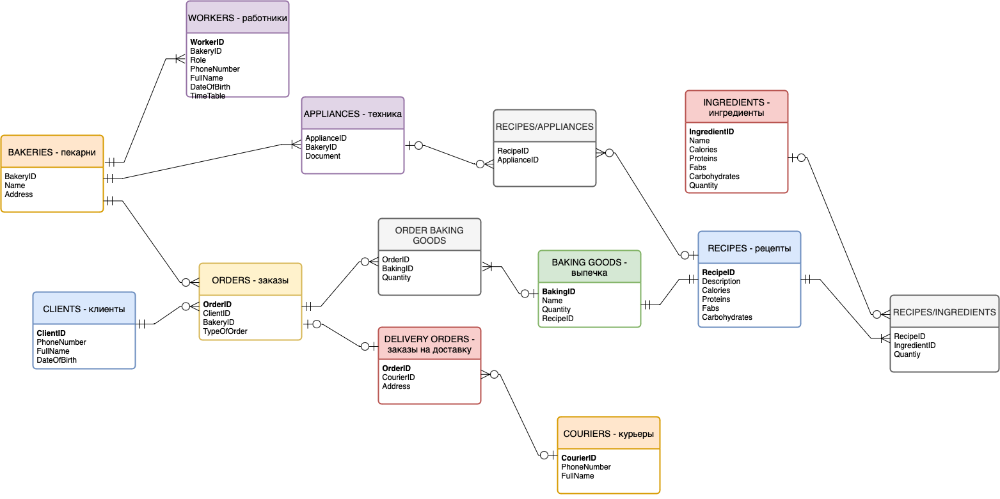
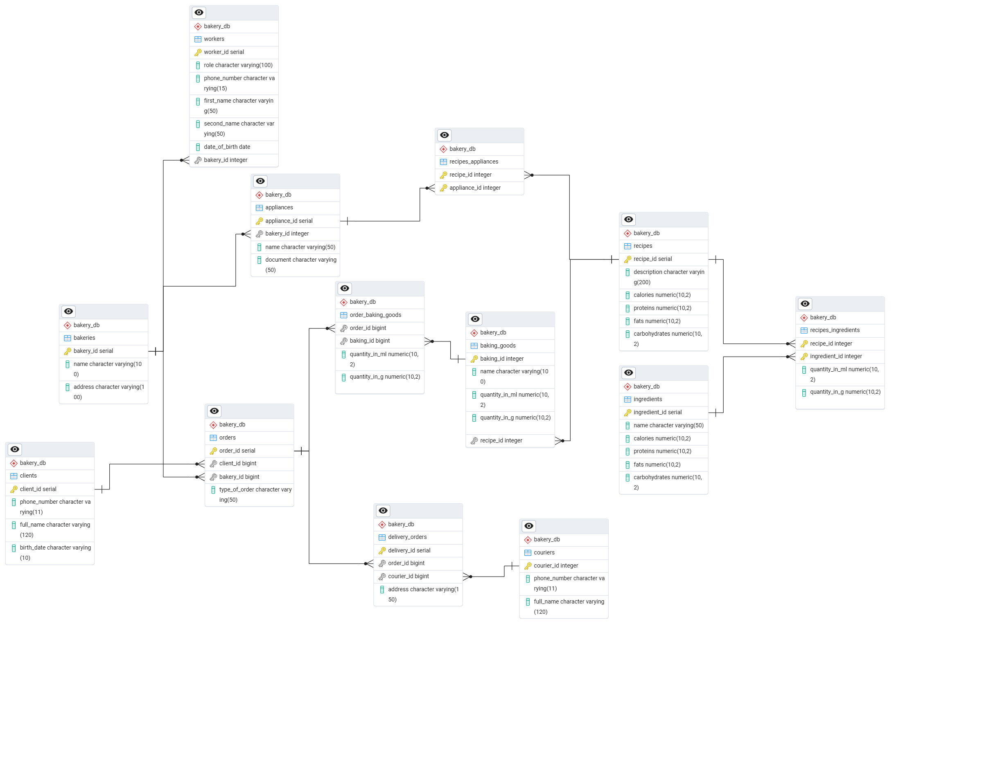

# BakeryDB
**BakeryDB** — это проект реляционной базы данных, разработанный для управления информацией сети пекарень. Система обеспечивает хранение и структурирование всех ключевых данных, включая сведения о клиентах, персонале, заказах, курьерах, рецептурах, ингредиентах и оборудовании.

### Сущности, включенные в эту БД:
- Пекарни 
- Работники
- Заказы
- Клиенты
- Выпечка (в наличии в пекарне)
- Ингредиенты (в наличии в пекарне)
- Заказы на доставку
- Техника 
- Рецепты
- Курьеры

 ### С помощью этой базы данных можно:
 
-  Хранить информацию о заказах в каждой пекарне;
-  Вести учет оставшихся продуктов;
-  Перенаправлять заказы на доставку;
-  Вносить данные о новых сотрудниках;
-  Анализоровать информацию о клиентах и их заказах;
-  Высчитывать калорийность определенной выпечки по ее рецепту и ингредиентам.

### Схема базы данных

### Схема базы данных PgAdmin

