1.COUNT()

а)Количество всех заказов
```
select count(*) as order_amount from bakery_db.orders;
```
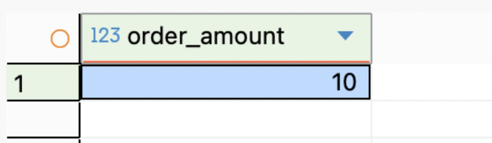
б) Количество всех работников
```
SELECT COUNT(*) AS всего_работников
FROM bakery_db.workers;
```


2. SUM()

а) Общий вес всех товаров
```
SELECT SUM(size) AS общий_вес_товаров
FROM bakery_db.baking_goods;
```
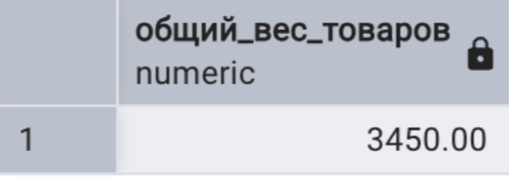

б) Общая сумма калорий всех ингредиентов
```
SELECT SUM(calories) AS общая_сумма_калорий
FROM bakery_db.ingredients;
```
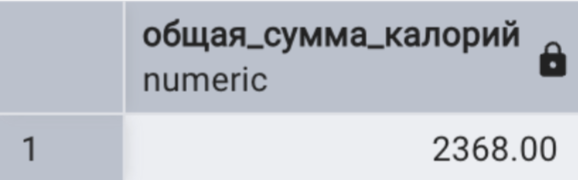

3. AVG

а) Средняя калорийность ингредиентов
```
SELECT Round(AVG(calories), 2) AS средняя_калорийность
FROM bakery_db.ingredients;
```
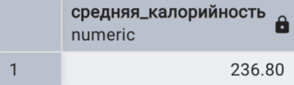

б) Средний вес товаров
```
SELECT ROUND(AVG(size)) AS средний_вес_товаров
FROM bakery_db.baking_goods;
```
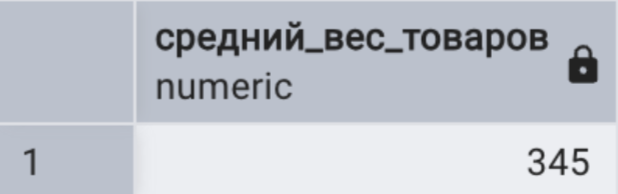
4. MIN

а) самый младший работник
```
SELECT MIN(date_of_birth) AS самый_молодой
FROM bakery_db.workers;
```


б) минимальный вес товара
```
SELECT MIN(size) AS минимальный_вес_товара
FROM bakery_db.baking_goods;
```


5. MAX

а) самый старщий работник
```
SELECT MAX(date_of_birth) AS самый_старший
FROM bakery_db.workers;
```


б) максимальный вес товара
```
SELECT MAX(size) AS максимальный_вес_товара
FROM bakery_db.baking_goods;
```
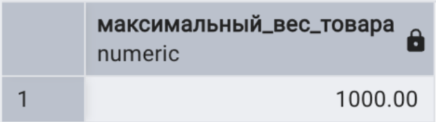

6. STRING_AGG

а) список всех ингредиентов через запятую
```
SELECT STRING_AGG(name, ', ') AS все_ингредиенты
FROM bakery_db.ingredients;
```


б)Список названий пекарен через точку с запятой
```
SELECT STRING_AGG(name, '; ') AS все_пекарни
FROM bakery_db.bakeries;
```


7.GROUP BY

a) Количество заказов у каждого клиента
```
select bakery_db.clients.client_id, count(*) as order_amount from bakery_db.clients
inner join bakery_db.orders on bakery_db.clients.client_id = bakery_db.orders.client_id
group by bakery_db.clients.client_id;
```
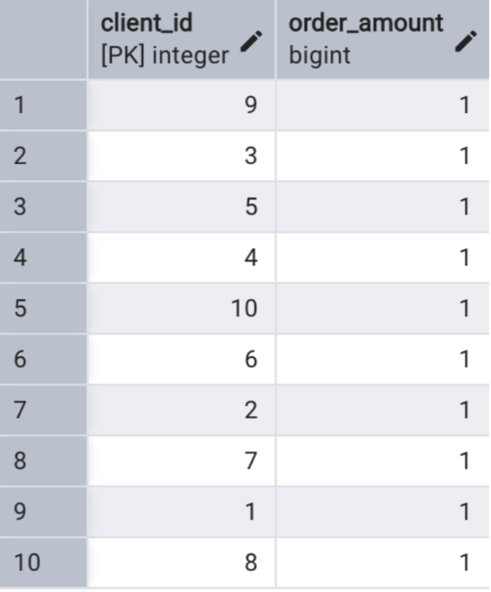

б) количество работников по должностям
```
SELECT 
    role AS должность,
    COUNT(*) AS количество
FROM bakery_db.workers
GROUP BY role
ORDER BY количество DESC;
```
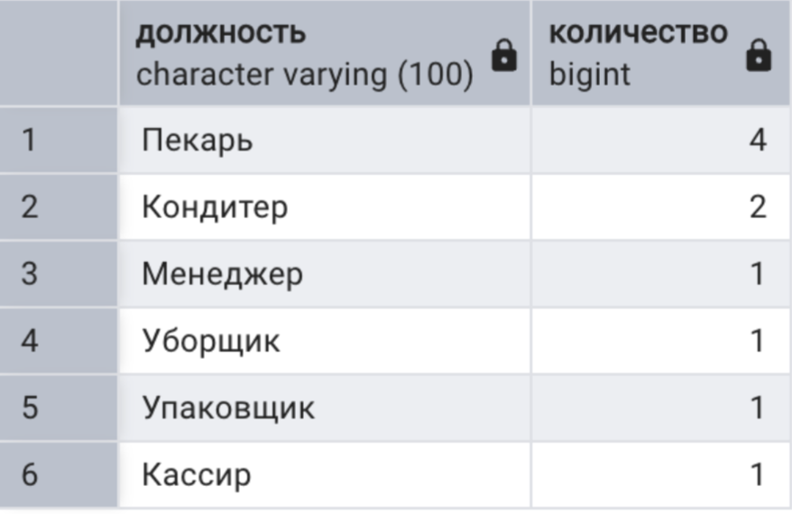

8. HAVING

а) должности с более чем 1 работником
```
SELECT 
    role AS должность,
    COUNT(*) AS количество
FROM bakery_db.workers
GROUP BY role
HAVING COUNT(*) > 1
ORDER BY количество DESC;
```


б) заказы с более чем одной выпечкой
```
select
order_id AS номер_заказа,
count(*) AS количество_выпечки
from  bakery_db.orders o
inner join  bakery_db.order_baking_goods bg on bg.order_id = o.order_id
group by order_id
having (count(*) > 1);
```
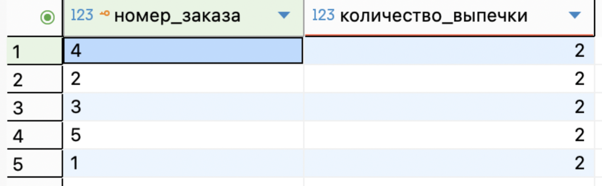

9. GROUPING SETS

a) Сколько изделий продано по пекарням и определенному типу заказа, только по пекарне, и только по определенному типу заказа
```
SELECT
    b.name AS пекарня,
    o.type_of_order AS тип_заказа,
    COUNT(bg.baking_id) AS количество_позиций
FROM bakery_db.orders o
JOIN bakery_db.bakeries b ON o.bakery_id = b.bakery_id
JOIN bakery_db.order_baking_goods bg ON o.order_id = bg.order_id
GROUP BY GROUPING SETS (
    (b.name, o.type_of_order),
    (b.name),    
    (o.type_of_order)                     
)
```
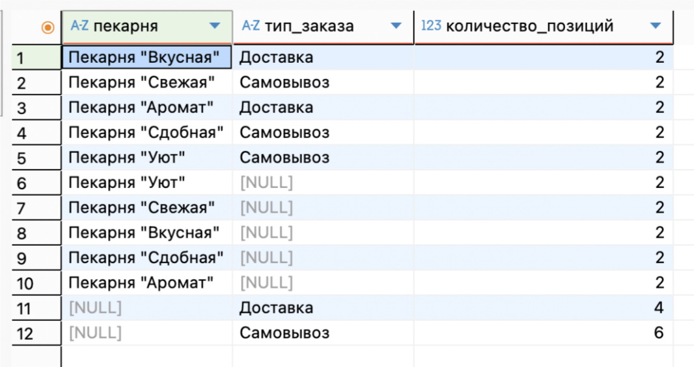

б) Сколько всего заказов у клиента, сколько определенных заказов у клиента - на доставку и на самовывоз
```
SELECT
   CONCAT( c.last_name, ' ',c.first_name) AS клиент,
    o.type_of_order AS тип_заказа,
    COUNT(o.order_id) AS количество_заказов
FROM bakery_db.orders o
JOIN bakery_db.clients c ON o.client_id = c.client_id
GROUP BY GROUPING SETS (
    (CONCAT( c.last_name, ' ',c.first_name), o.type_of_order), 
    (CONCAT( c.last_name, ' ',c.first_name))                 
);
```
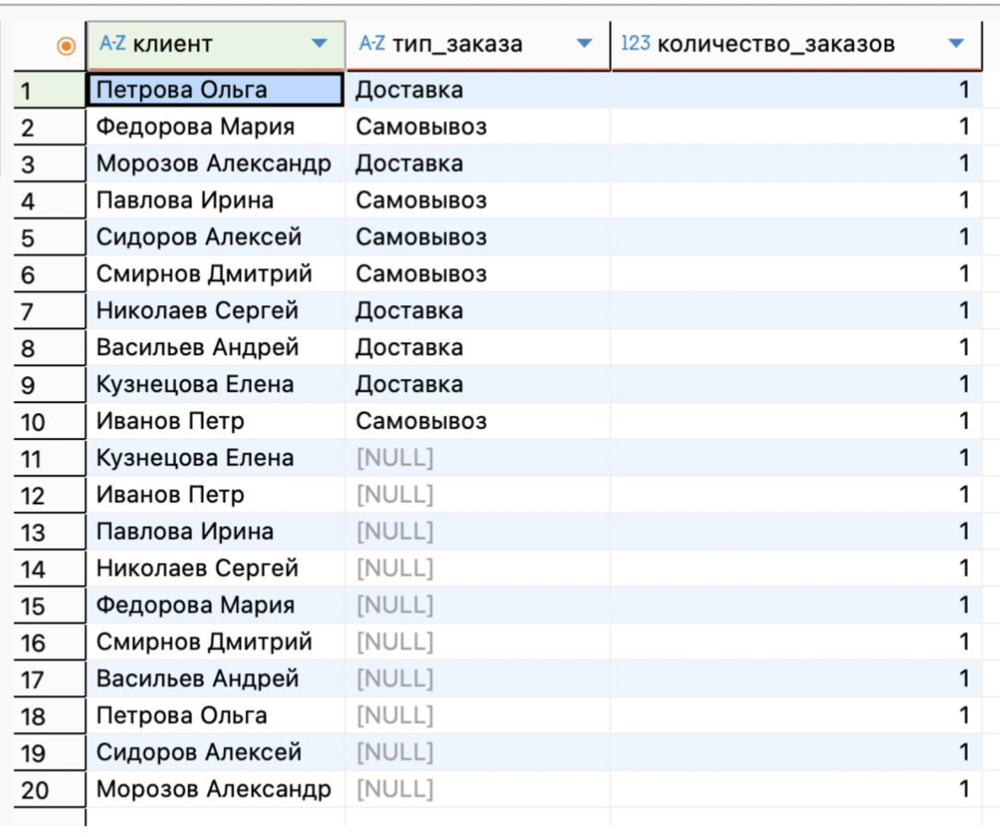


10. ROLLUP

а)Вывести количество заказов клиента, заказов клиента в определенной пекарне, всего заказов клиентов
```
 SELECT  CONCAT( c.last_name, ' ', c.first_name) AS клиент,
    b.name AS пекарня,
    COUNT(o.order_id) AS количество_заказов
FROM bakery_db.orders o
JOIN bakery_db.clients c ON o.client_id = c.client_id
JOIN bakery_db.bakeries b ON o.bakery_id = b.bakery_id
GROUP BY ROLLUP (CONCAT( c.last_name, ' ', c.first_name), b.name) ;
```
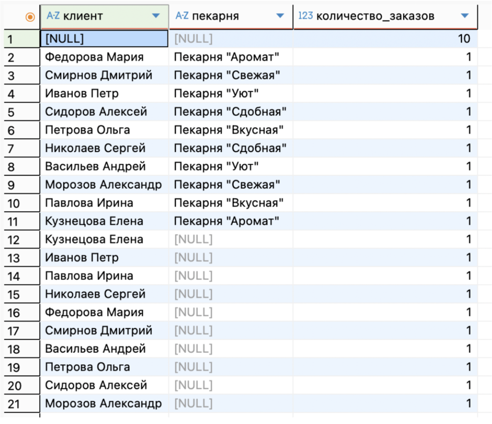

б) Вывести количество заказов у доставщика в определенной пекарне, у доставщика, и сколько всего заказов у доставщиков
```
SELECT
    CONCAT( c.last_name,' ',c.first_name) AS доставщик,
    b.name AS пекарня,
    COUNT(d.delivery_id) AS количество_доставок
FROM bakery_db.delivery_orders d
JOIN bakery_db.orders o ON d.order_id = o.order_id
JOIN bakery_db.couriers c ON d.courier_id = c.courier_id
JOIN bakery_db.bakeries b ON o.bakery_id = b.bakery_id
GROUP BY ROLLUP ( CONCAT( c.last_name,' ',c.first_name), b.name);
```
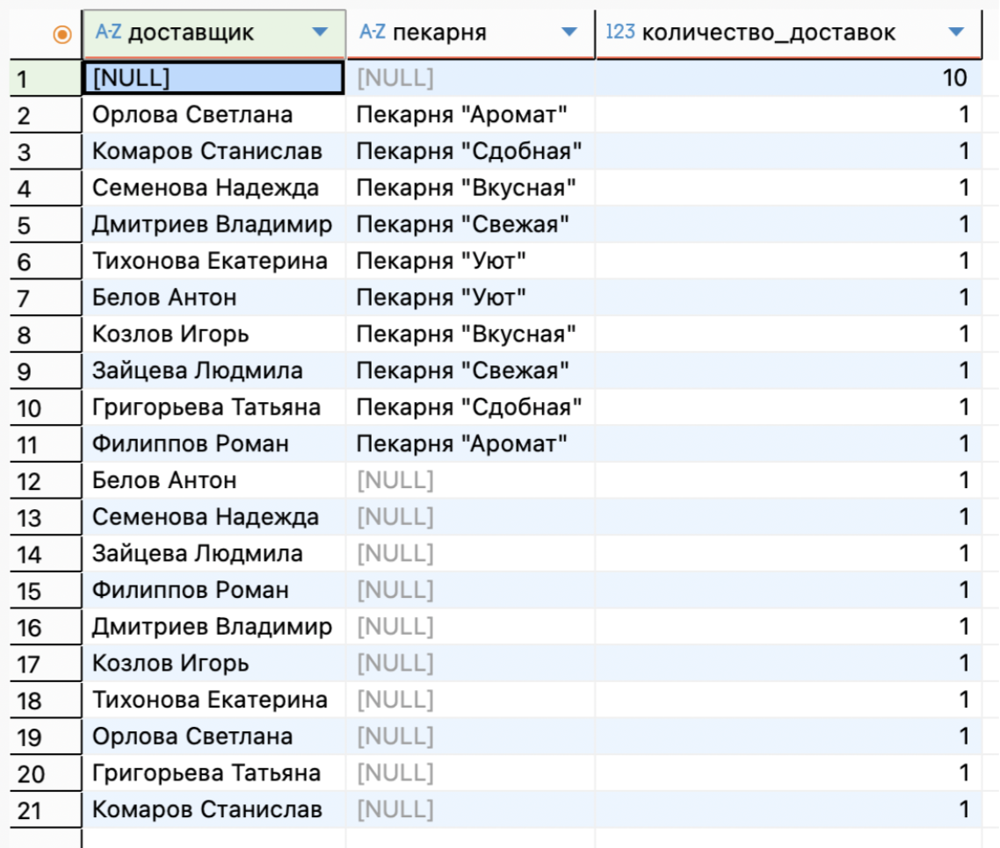

11. CUBE

a) Считает суммарную выручку (цена * количество) всего, по выпечке,  по пекарне, по выпечке и по каждой пекарне
```
   SELECT  b.name AS пекарня,
    o.type_of_order AS тип_заказа,
    bg.name AS изделие,
    SUM(obg.quantity * bg.price) AS выручка
FROM bakery_db.orders o
JOIN bakery_db.bakeries b ON o.bakery_id = b.bakery_id
JOIN bakery_db.order_baking_goods obg ON o.order_id = obg.order_id
JOIN bakery_db.baking_goods bg ON obg.baking_id = bg.baking_id
GROUP BY CUBE (b.name, bg.name);
```
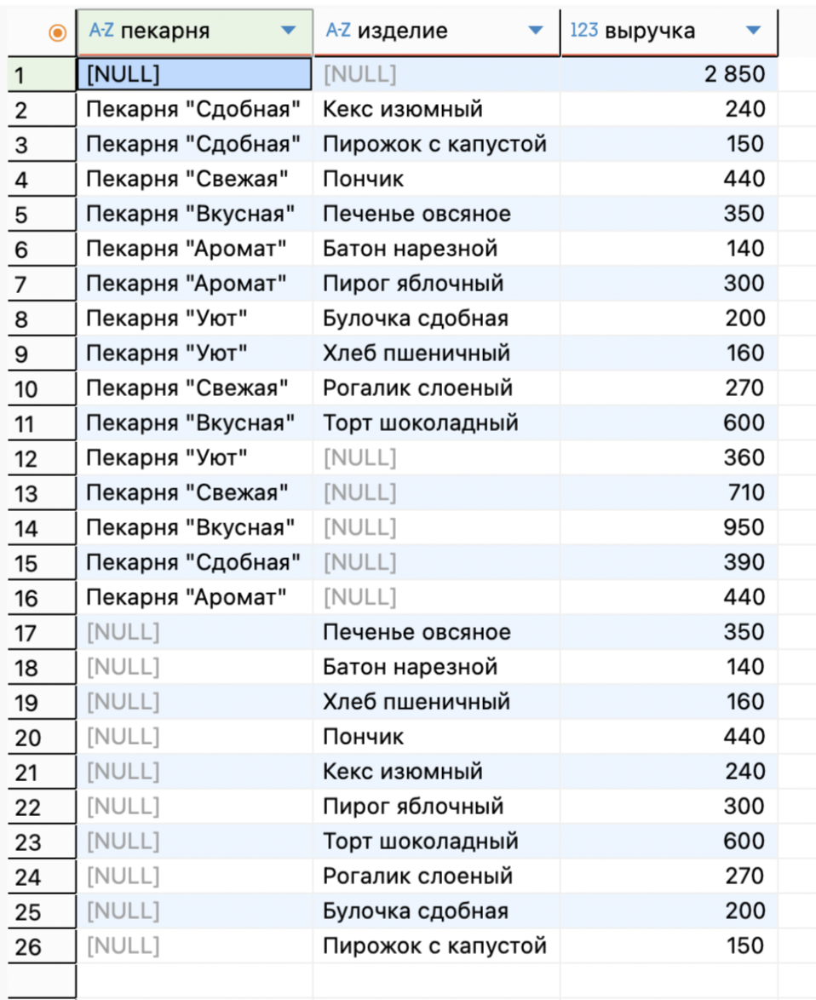

б) Посчитать количество доставок по курьерам и пекарням:
по каждому курьеру и каждой пекарне
по каждому курьеру (все пекарни)
по каждой пекарне (все курьеры)
общий итог
```

SELECT
      CONCAT( c.last_name,' ',c.first_name) AS доставщик,
    b.name AS пекарня,
    COUNT(d.delivery_id) AS количество_доставок
FROM bakery_db.delivery_orders d
JOIN bakery_db.couriers c ON d.courier_id = c.courier_id
JOIN bakery_db.orders o ON d.order_id = o.order_id
JOIN bakery_db.bakeries b ON o.bakery_id = b.bakery_id
GROUP BY CUBE (  CONCAT( c.last_name,' ',c.first_name), b.name);
```

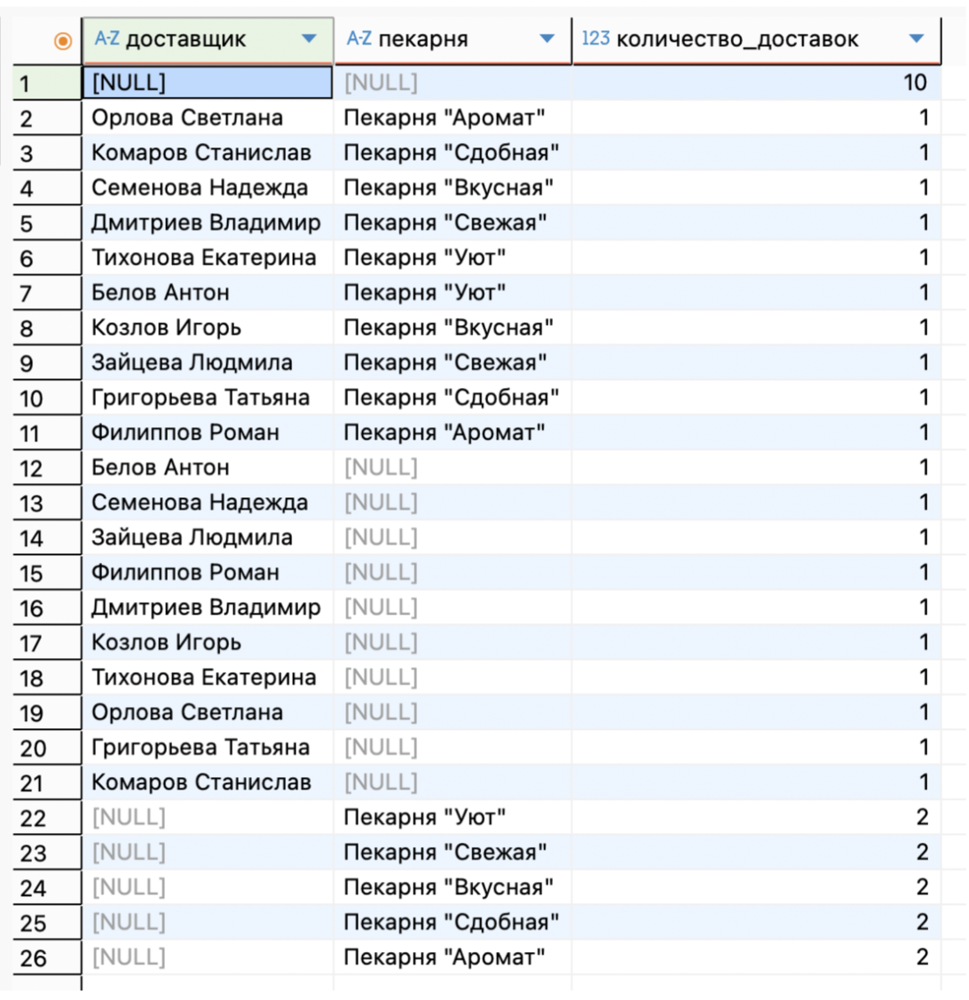
