# CTE, Оконные функции и операции с множествами

## CTE - 5 примеров

### Список всех пекарен

```sql
WITH bakeries_list AS (
   SELECT bakery_id, name
   FROM bakery_db.bakeries
)
SELECT * FROM bakeries_list;
```

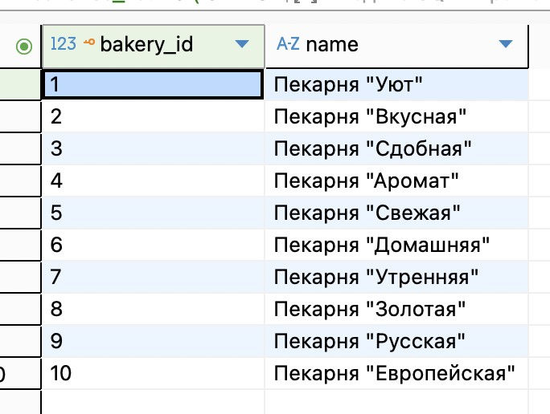

### Список всех работников с ролями

```sql
WITH workers_list AS (
   SELECT first_name, second_name, role
   FROM bakery_db.workers
)
SELECT * FROM workers_list;
```

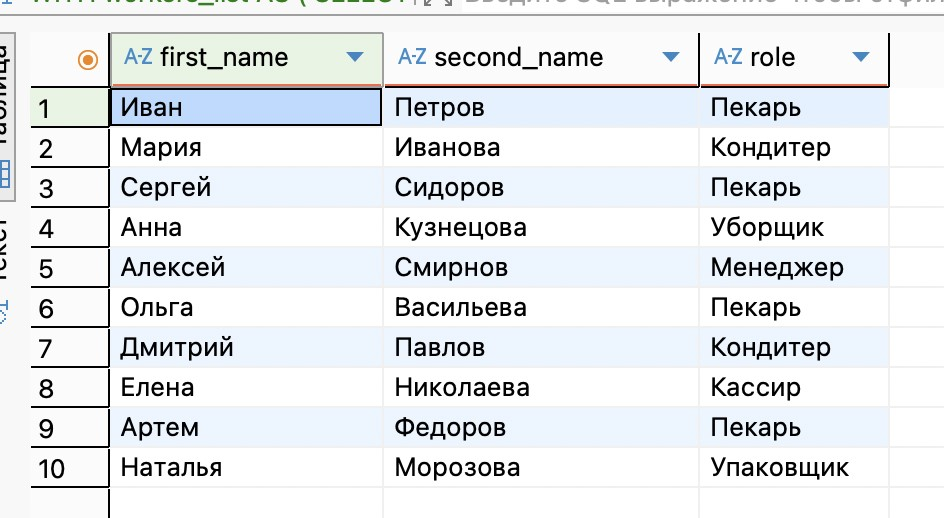

### Все рецепты

```sql
WITH recipes_list AS (
   SELECT recipe_id, description
   FROM bakery_db.recipes
)
SELECT * FROM recipes_list;
```

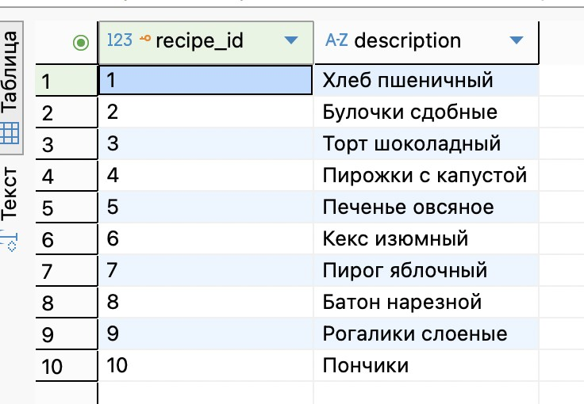

### Все изделия с ценой

```sql
WITH baking_list AS (
   SELECT name, price
   FROM bakery_db.baking_goods
)
SELECT * FROM baking_list;
```

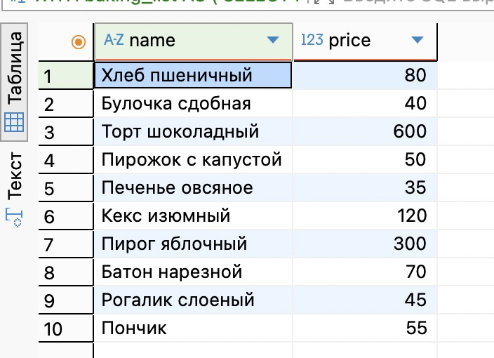

### Все пекари

```sql
WITH bakers AS (
   SELECT first_name, second_name, role
   FROM bakery_db.workers
   WHERE role = 'Пекарь'
)
SELECT * FROM bakers;
```

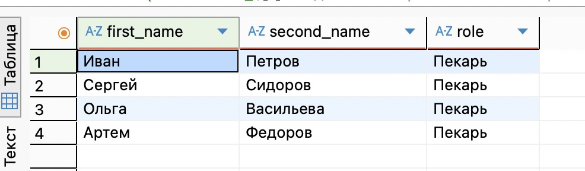

## UNION

### Список названий всех ингредиентов и названий всех рецептов

```sql
SELECT name AS title
FROM bakery_db.ingredients
UNION
SELECT description AS title
FROM bakery_db.recipes;
```

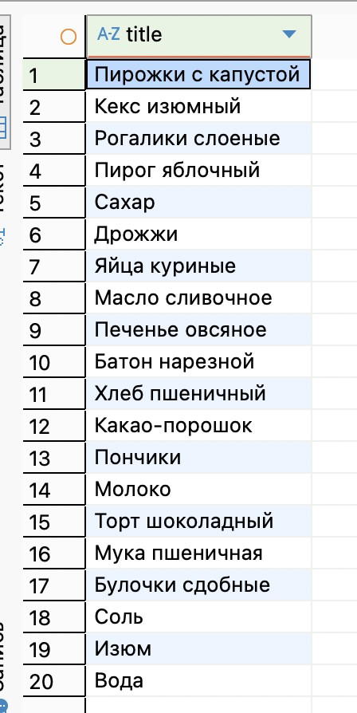

### Список имен всех работников - обычных работников и доставщиков

```sql
SELECT first_name as worker_name
FROM bakery_db.workers
UNION
SELECT first_name as worker_name
FROM bakery_db.couriers;
```

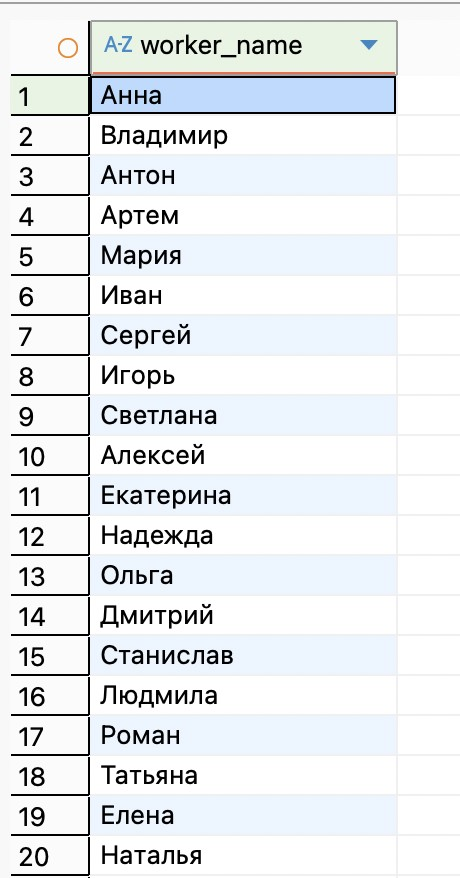

### Список всех уникальных имен

```sql
SELECT first_name
FROM bakery_db.workers
UNION
SELECT first_name
FROM bakery_db.couriers
UNION
SELECT first_name
FROM bakery_db.workers;
```

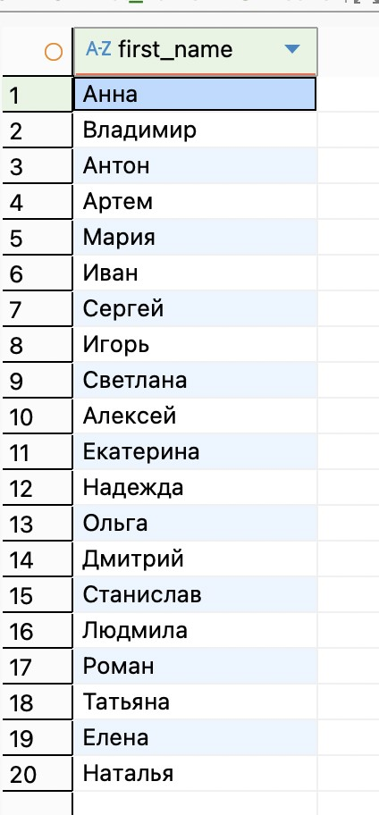

## INTERSECT

### Тезки - имена которые есть у клиентов и у курьеров

```sql
SELECT first_name
FROM bakery_db.clients
INTERSECT
SELECT first_name
FROM bakery_db.couriers;
```

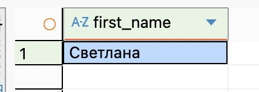

### Фамилии - одинаковые среди работников

```sql
SELECT second_name
FROM bakery_db.workers
INTERSECT
SELECT last_name
FROM bakery_db.couriers;
```

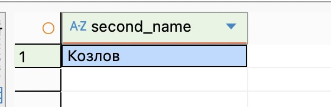

### Одинаковый день рождения у работников и у клиентов

```sql
SELECT date_of_birth
FROM bakery_db.workers
INTERSECT
SELECT birth_date
FROM bakery_db.clients;
```


## EXCEPT - 3 примера

### Ингредиенты, которые не используются ни в одном рецепте

```sql
SELECT ingredient_id, name
FROM bakery_db.ingredients
EXCEPT
SELECT DISTINCT i.ingredient_id, i.name
FROM bakery_db.ingredients i
JOIN bakery_db.recipes_ingredients ri ON i.ingredient_id = ri.ingredient_id;
```


### Работники, которые не являются пекарями

```sql
SELECT 
    worker_id,
    role
FROM bakery_db.workers

EXCEPT

SELECT 
    worker_id,
    role
FROM bakery_db.workers 
WHERE role = 'Пекарь';
```

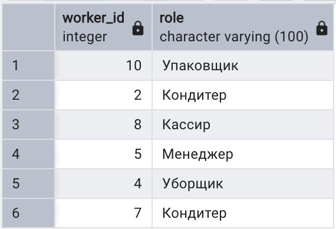

### Клиенты, которые делали только заказы на доставку

```sql
SELECT
    c.client_id,
    c.first_name,
    c.last_name
FROM bakery_db.clients c
WHERE c.client_id IN (
    SELECT client_id 
    FROM bakery_db.orders 
    
    EXCEPT
    
    SELECT client_id 
    FROM bakery_db.orders 
    WHERE type_of_order = 'Самовывоз'
)
ORDER BY c.last_name, c.first_name;
```

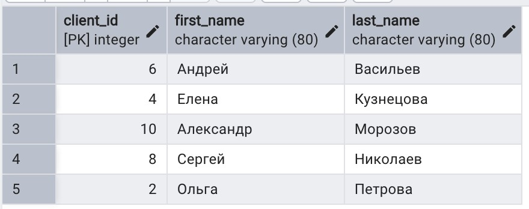

## PARTITION BY

### ID пекарни с количеством работников

```sql
SELECT
   bakery_id,
   COUNT(*) OVER (PARTITION BY bakery_id) AS total_workers
FROM bakery_db.workers;
```

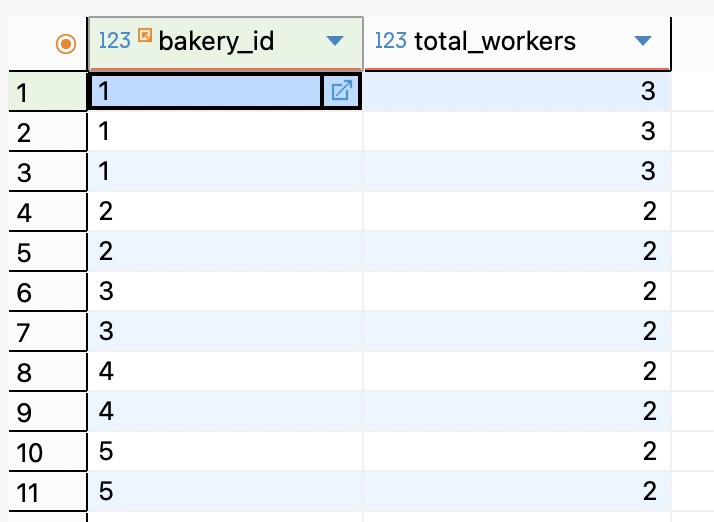

### Количество изделий с той же ценой

```sql
SELECT
   price,
   name,
   COUNT(*) OVER (PARTITION BY price) AS same_price_count
FROM bakery_db.baking_goods;
```

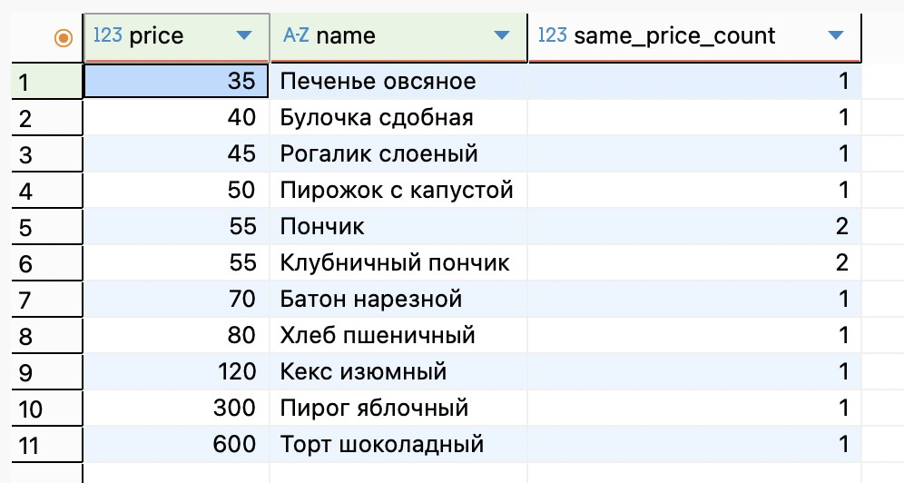

## PARTITION BY + ORDER BY

### Нумерация работников внутри каждой пекарни

```sql
SELECT
   bakery_id,
   first_name,
   second_name,
   ROW_NUMBER() OVER (PARTITION BY bakery_id ORDER BY first_name) AS worker_number
FROM bakery_db.workers;
```

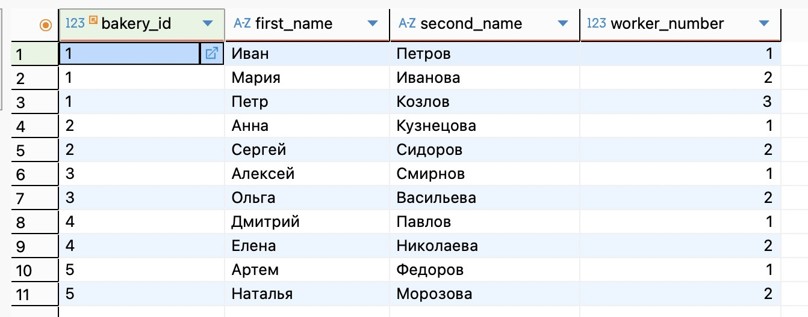

### Рейтинг работников по дате рождения в каждой пекарне

```sql
SELECT
   bakery_id,
   first_name,
   second_name,
   date_of_birth,
   RANK() OVER (
       PARTITION BY bakery_id
       ORDER BY date_of_birth
   ) AS age_rank
FROM bakery_db.workers;
```

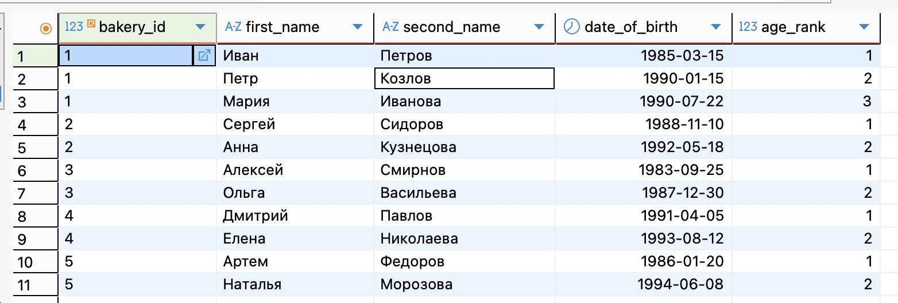

## ROWS

### Средняя цена трёх соседних изделий

```sql
SELECT
   name AS baking_name,
   price,
   AVG(price) OVER (
       ORDER BY price
       ROWS BETWEEN 1 PRECEDING AND 1 FOLLOWING
   ) AS avg_nearby_prices
FROM bakery_db.baking_goods;
```

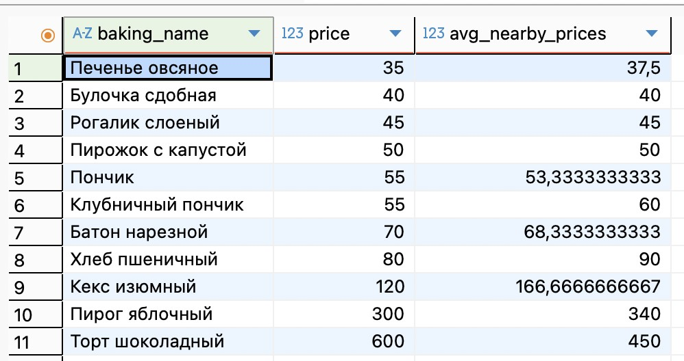

### Сумма цен текущего и предыдущего изделия

```sql
SELECT
   name AS baking_name,
   price,
   SUM(price) OVER (
       ORDER BY price
       ROWS BETWEEN 1 PRECEDING AND CURRENT ROW
   ) AS sum_with_previous
FROM bakery_db.baking_goods;
```

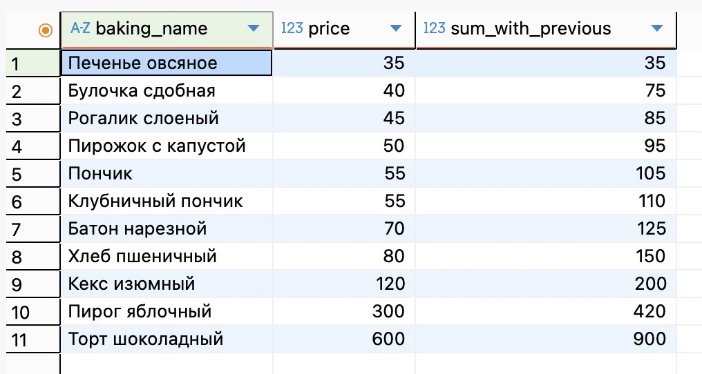

## RANGE - Ранжирующие функции

### DENSE_RANK() - ранг товаров по весу

```sql
SELECT 
    baking_id,
    name,
    size,
    DENSE_RANK() OVER (ORDER BY size ASC) as size_rank
FROM bakery_db.baking_goods
ORDER BY size_rank;
```

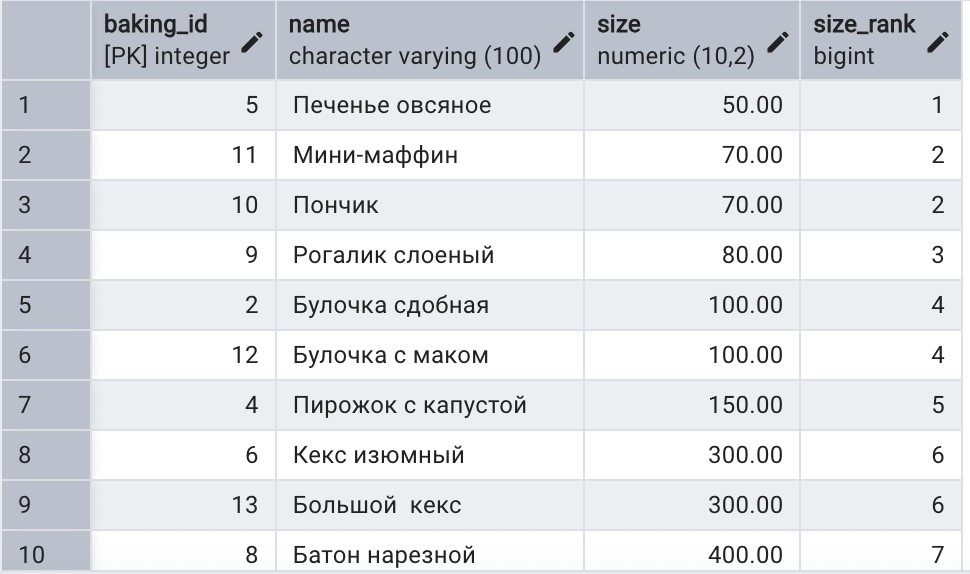

### ROW_NUMBER - нумерация выпечки по весу

```sql
SELECT
    baking_id,
    name,
    size,
    ROW_NUMBER() OVER (ORDER BY size ASC) as rank_by_weight
FROM bakery_db.baking_goods;
```

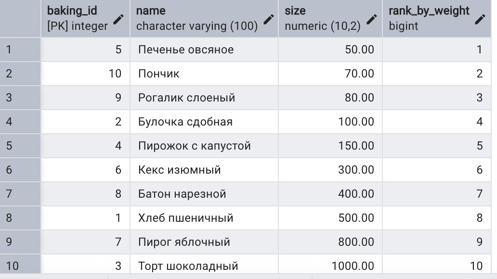

### RANK() - ранг работников по возрасту

```sql
SELECT
    worker_id,
    first_name,
    second_name,
    date_of_birth,
    RANK() OVER (ORDER BY date_of_birth ASC) as age_dense_rank
FROM bakery_db.workers;
```

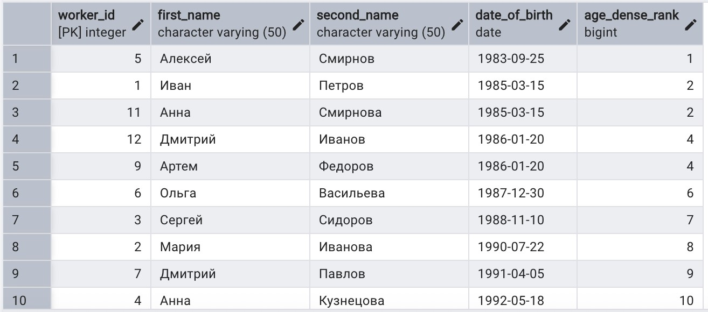

## Функции смещения

### LAG - предыдущий заказ каждого клиента

```sql
SELECT
   o.order_id,
   c.first_name,
   c.last_name,
   o.type_of_order,
   LAG(o.order_id) OVER (PARTITION BY o.client_id ORDER BY o.order_id) as prev_order_id,
   o.order_id - LAG(o.order_id) OVER (PARTITION BY o.client_id ORDER BY o.order_id) as order_id_diff
FROM bakery_db.orders o
JOIN bakery_db.clients c ON o.client_id = c.client_id
ORDER BY c.client_id, o.order_id;
```

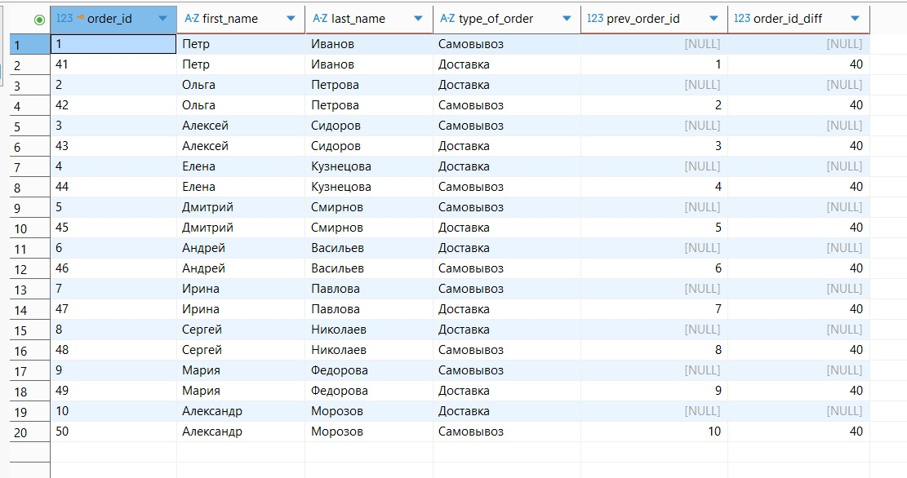

### LEAD - следующий заказ для доставки курьером

```sql
SELECT
   d.delivery_id,
   c.first_name || ' ' || c.last_name AS courier_name,
   o.order_id,
   LEAD(o.order_id) OVER (PARTITION BY d.courier_id ORDER BY o.order_id) AS next_order_id,
   LEAD(d.address) OVER (PARTITION BY d.courier_id ORDER BY o.order_id) AS next_delivery_address
FROM bakery_db.delivery_orders d
JOIN bakery_db.orders o ON d.order_id = o.order_id
JOIN bakery_db.couriers c ON d.courier_id = c.courier_id
ORDER BY d.courier_id, o.order_id;
```


### FIRST_VALUE - первый заказ на доставку каждого клиента

```sql
SELECT
   o.order_id,
   c.first_name,
   c.last_name,
   o.type_of_order,
   FIRST_VALUE(o.order_id) OVER (PARTITION BY o.client_id ORDER BY o.order_id) AS first_order_id
FROM bakery_db.orders o
JOIN bakery_db.clients c ON o.client_id = c.client_id
WHERE o.type_of_order = 'Доставка'
ORDER BY c.client_id, o.order_id;
```


### LAST_VALUE - ID последнего заказа

```sql
SELECT
   o.order_id,
   c.first_name,
   c.last_name,
   o.type_of_order,
   LAST_VALUE(o.order_id) OVER (
       PARTITION BY o.client_id
       ORDER BY o.order_id
       ROWS BETWEEN UNBOUNDED PRECEDING AND UNBOUNDED FOLLOWING
   ) AS last_order_id
FROM bakery_db.orders o
JOIN bakery_db.clients c ON o.client_id = c.client_id
ORDER BY c.client_id, o.order_id;
```

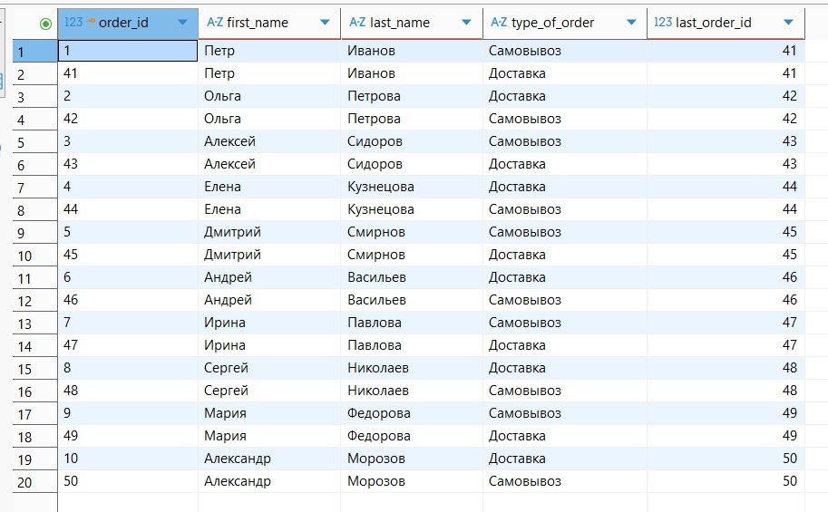
