# Процедуры и функции
### Процедуры
1) Создание нового заказа на доставку клиента в определенной пекарне
 ```
CREATE OR REPLACE PROCEDURE create_delivery_order(
	p_client_id INT,
    p_bakery_id INT
)
LANGUAGE plpgsql
AS $$
BEGIN
	INSERT INTO bakery_db.orders (client_id, bakery_id, type_of_order) 
	VALUES (p_client_id, p_bakery_id, 'Доставка');
END;
$$;

-- Вызываем процедуру
CALL create_delivery_order(1, 5);

-- Проверяем результат
SELECT * FROM bakery_db.orders WHERE client_id = 1;
```
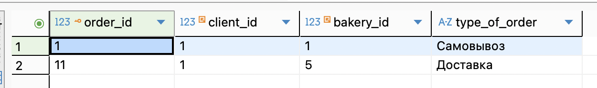
    
2) Процедура добавления изделия в заказ
  ```
CREATE OR REPLACE PROCEDURE add_good_in_order(
	p_order_id INT,
    p_baking_id INT,
    p_quantity INT,
    p_unit_id INT
)
LANGUAGE plpgsql
AS $$
BEGIN
	INSERT INTO bakery_db.order_baking_goods (order_id, baking_id, quantity, unit_id) 
	VALUES (p_order_id, p_baking_id, p_quantity, p_unit_id);
END;
$$;

-- Вызываем процедуру
CALL add_good_in_order(1, 3, 10, 1);

- - Проверяем результат
SELECT * FROM bakery_db.order_baking_goods WHERE order_id = 1;
 ```

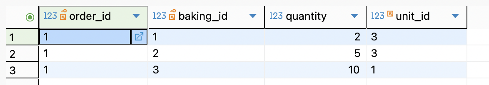
3) Процедура добавления нового изделия

  ```

CREATE OR REPLACE PROCEDURE add_new_baking_good(
 	p_description VARCHAR,
    p_name VARCHAR,
    p_size NUMERIC,
    p_unit_id INT,
    p_price INT
)
LANGUAGE plpgsql
AS $$
DECLARE
    v_recipe_id INT;
BEGIN
	INSERT INTO bakery_db.recipes (description)
    VALUES (p_description)
    RETURNING recipe_id INTO v_recipe_id;
	
	INSERT INTO bakery_db.baking_goods (name, size, unit_id, recipe_id, price)
    VALUES (p_name, p_size, p_unit_id, v_recipe_id, p_price);
END;
$$;

-- Вызываем процедуру
call add_new_baking_good('Классический рецепт сырников', 'Сырники', 200, 1, 280);

-- Проверяем результат
SELECT * FROM bakery_db.baking_goods where name = 'Сырники';

 ```
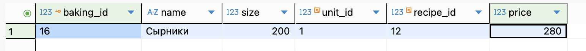

Просмотр всех процедур
```
SELECT routine_name, routine_type FROM information_schema.routines
WHERE routine_type = 'PROCEDURE' AND routine_schema = 'public';
```
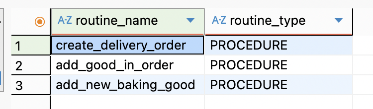

### Функции
1) Определение, калорийный ли ингредиент
 ```
CREATE OR REPLACE FUNCTION is_high_calorie_ingredient(p_ingredient_id INT)
RETURNS BOOLEAN
LANGUAGE plpgsql
AS $$
BEGIN
    RETURN (
        SELECT calories > 300
        FROM bakery_db.ingredients
        WHERE ingredient_id = p_ingredient_id
    );
END;
$$;

SELECT is_high_calorie_ingredient(1);
 ```


2) Количество заказов у клиента
  ```
CREATE OR REPLACE FUNCTION quantity_of_orders(p_client_id INT)
RETURNS INT
LANGUAGE plpgsql
AS $$
BEGIN
    RETURN (
        SELECT COUNT(*)
        FROM bakery_db.orders
        WHERE client_id = p_client_id
    );
END;
$$;
 ```
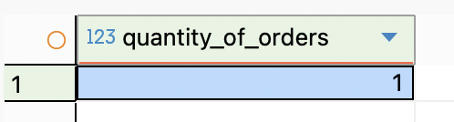

3) Вывод полного имени клиента
 ```
CREATE OR REPLACE FUNCTION get_client_full_name(p_client_id INT)
RETURNS VARCHAR
LANGUAGE plpgsql
AS $$
BEGIN
    RETURN (
		SELECT CONCAT(last_name,' ', first_name,' ', middle_name)
		FROM bakery_db.clients
		WHERE client_id = p_client_id
	);
END;
$$;

select get_client_full_name(3);
 ```
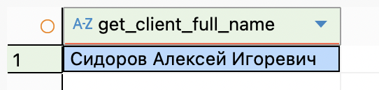

### Функции с переменными

1) Вывод полной суммы заказа
 ```
CREATE OR REPLACE FUNCTION get_order_total(
    p_order_id INT
)
RETURNS INT
LANGUAGE plpgsql
AS $$
DECLARE
    v_total INT;
BEGIN
    SELECT SUM(og.quantity * bg.price)
    INTO v_total
    FROM bakery_db.order_baking_goods og
    JOIN bakery_db.baking_goods bg
        ON og.baking_id = bg.baking_id
    WHERE og.order_id = p_order_id;

    RETURN v_total;
END;
$$;

select get_order_total(5);
 ```
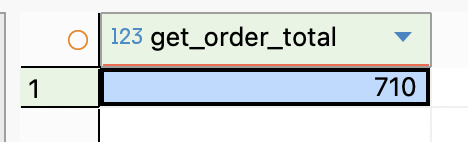

2) Проверка - у клиента день рождения в этом месяце
  ```
CREATE OR REPLACE FUNCTION is_birthday_this_month(
    p_client_id INT
)
RETURNS BOOLEAN
LANGUAGE plpgsql
AS $$
DECLARE
    v_birth_date DATE;
BEGIN
    SELECT birth_date
    INTO v_birth_date
    FROM bakery_db.clients
    WHERE client_id = p_client_id;

    IF v_birth_date IS NULL THEN
        RETURN FALSE;
    END IF;

    RETURN EXTRACT(MONTH FROM v_birth_date) = EXTRACT(MONTH FROM CURRENT_DATE);
END;
$$;
-- Пример
SELECT *
FROM bakery_db.clients
WHERE EXTRACT(MONTH FROM birth_date) = EXTRACT(MONTH FROM CURRENT_DATE);
 ```
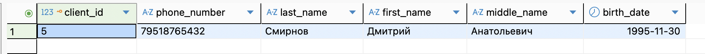

3) Получение самого популярного изделия по пекарне
 ```
CREATE OR REPLACE FUNCTION get_bakery_top_good(p_bakery_id INT)
RETURNS VARCHAR
LANGUAGE plpgsql
AS $$
DECLARE
    v_top_good VARCHAR;
BEGIN
    SELECT bg.name
    INTO v_top_good
    FROM bakery_db.baking_goods bg
    JOIN bakery_db.order_baking_goods obg
        ON bg.baking_id = obg.baking_id
    JOIN bakery_db.orders o
        ON obg.order_id = o.order_id
    WHERE o.bakery_id = p_bakery_id
    GROUP BY bg.baking_id, bg.name
    ORDER BY SUM(obg.quantity) DESC
    LIMIT 1;

    RETURN v_top_good;
END;
$$;

SELECT get_bakery_top_good(2);
 ```
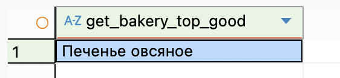

Просмотр всех функций
```
SELECT routine_name, routine_type FROM information_schema.routines
WHERE routine_type = 'FUNCTION' AND routine_schema = 'public';
```
 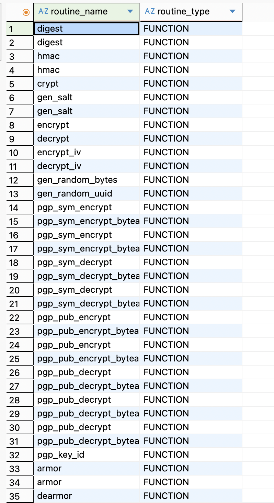
  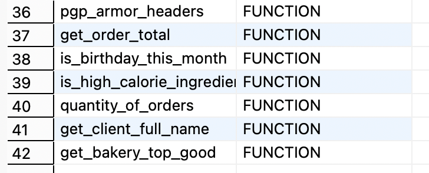
    
### Блок DO 

1) Добавляем нового клиента
 ```
do $$
begin 
	if not exists (select 1 from bakery_db.clients where phone_number = '89398083129') then 
	insert into bakery_db.clients(phone_number, last_name, first_name, middle_name)
	values ('89398083129', 'Вафина', 'Адиля', 'Абдулкадыровна');
	end if;
end $$ language plpgsql;

 ```
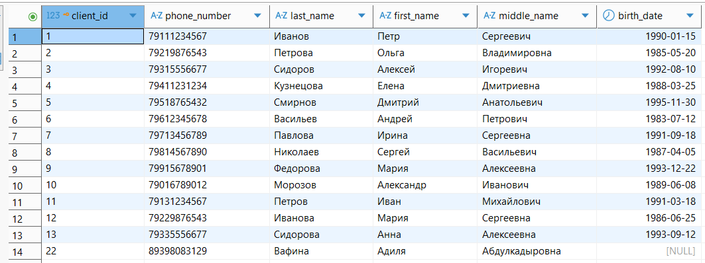
2) Добавляем технику (только если существует нужная пекарня)
  ```
do $$
begin 
	if exists (select 1 from bakery_db.bakeries where bakery_id = 7) then 
	insert into bakery_db.appliances(bakery_id, name, document)
	values (7, 'Миксер', 'Гарантия');
	end if;
end $$ language plpgsql;

 ```
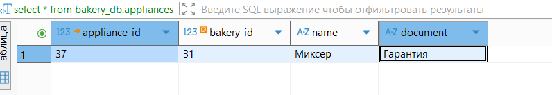
3) Добавляем новый ингредиент
 ```
do $$
begin 
	if not exists (select 1 from bakery_db.ingredients where name = 'Творог') then 
	insert into bakery_db.ingredients(name, calories, proteins, fats, carbohydrates)
	values ('Творог', 159, 18, 0.5, 3.3);
	end if;
end $$ language plpgsql;
 ```
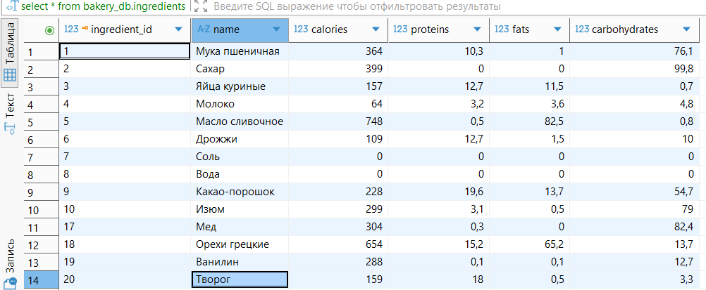
### IF

1) Определяем совершеннолетний ли клиент с id = 12
 ```
DO $$
DECLARE
    client_age int;
BEGIN
    SELECT EXTRACT(YEAR FROM AGE(birth_date)) INTO client_age
    FROM bakery_db.clients
    WHERE client_id = 12;

    IF client_age >= 18 THEN
        RAISE NOTICE 'Клиент совершеннолетний: возраст %', client_age;
    ELSE
        RAISE NOTICE 'Клиент несовершеннолетний: возраст %', client_age;
    END IF;
END $$ LANGUAGE plpgsql;

 ```
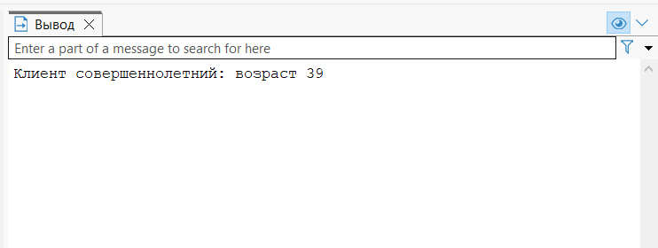
### CASE

1) Распределяем клиентов по поколенеиям
 ```
DO $$
DECLARE
    rec record;
    generation text;
BEGIN
    FOR rec IN SELECT client_id, birth_date FROM bakery_db.clients LOOP

        generation := CASE
            WHEN rec.birth_date BETWEEN DATE '1946-01-01' AND DATE '1964-12-31' THEN 'Бумеры'
            WHEN rec.birth_date BETWEEN DATE '1965-01-01' AND DATE '1980-12-31' THEN 'Поколение X'
            WHEN rec.birth_date BETWEEN DATE '1981-01-01' AND DATE '1996-12-31' THEN 'Миллениалы'
            WHEN rec.birth_date BETWEEN DATE '1997-01-01' AND DATE '2012-12-31' THEN 'Поколение Z'
            WHEN rec.birth_date >= DATE '2013-01-01' THEN 'Поколение Alpha'
            ELSE 'Неизвестно'
        END;

        RAISE NOTICE 'Клиент % → %', rec.client_id, generation;

    END LOOP;
END $$ LANGUAGE plpgsql;
 ```
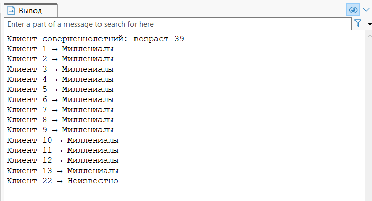

### WHILE

1) Применяем скидки по категориям (повседневный или праздничный)
 ```
DO $$
DECLARE
    category TEXT;
    discount_rate NUMERIC;
    product_id INT := 1;
    max_id INT;
BEGIN
    SELECT MAX(baking_id) INTO max_id FROM bakery_db.baking_goods;
    
    WHILE product_id <= max_id LOOP
        -- Определяем категорию и скидку
        SELECT 
            CASE 
                WHEN name LIKE '%Торт%' OR name LIKE '%Пирог%' THEN 'праздничный'
                WHEN name LIKE '%Хлеб%' OR name LIKE '%Батон%' THEN 'повседневный'
                ELSE 'прочее'
            END INTO category
        FROM bakery_db.baking_goods WHERE baking_id = product_id;
        
        discount_rate := CASE 
            WHEN category = 'праздничный' THEN 0.15  -- 15% скидка
            WHEN category = 'повседневный' THEN 0.10 -- 10% скидка
            ELSE 0.05                                -- 5% скидка
        END;
        
        UPDATE bakery_db.baking_goods 
        SET price = price * (1 - discount_rate)
        WHERE baking_id = product_id;
        
        RAISE NOTICE 'Товар ID %: применена скидка %', product_id, discount_rate;
        product_id := product_id + 1;
    END LOOP;
END $$;
 ```

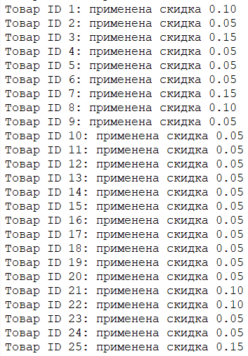

2) Определяем весовую категорию товара
  ```
DO $$
DECLARE 
    id INT := 1;
    total INT;
    product_size INT;
    category TEXT;
BEGIN
    SELECT MAX(baking_id) INTO total FROM bakery_db.baking_goods;

    WHILE id <= total LOOP
        SELECT size INTO product_size 
        FROM bakery_db.baking_goods 
        WHERE baking_id = id;
        
        IF product_size <= 100 THEN
            category := 'Малый';
        ELSIF product_size <= 300 THEN
            category := 'Средний';
        ELSIF product_size <= 600 THEN
            category := 'Крупный';
        ELSE
            category := 'Очень крупный';
        END IF;
        
        RAISE NOTICE 'Товар ID %: %', id, category;
        
        id := id + 1;
    END LOOP;
END $$;
 ```
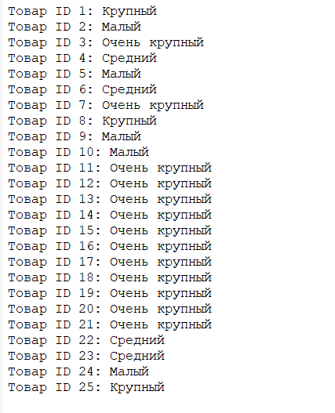

### EXCEPTION

1) Пытаемся вывести несуществующий рецепт
 ```
 DO $$
DECLARE
    v_recipe_id INT := 999;
    v_description TEXT;
BEGIN
    SELECT description INTO STRICT v_description
    FROM bakery_db.recipes
    WHERE recipe_id = v_recipe_id;

    RAISE NOTICE 'Рецепт найден: %', v_description;

EXCEPTION
    WHEN NO_DATA_FOUND THEN
        RAISE NOTICE 'Рецепт с ID=% не существует.', v_recipe_id;
    WHEN OTHERS THEN
        RAISE NOTICE 'Неизвестная ошибка при поиске рецепта ID=%: %', v_recipe_id, SQLERRM;
END $$ LANGUAGE plpgsql;

 ```
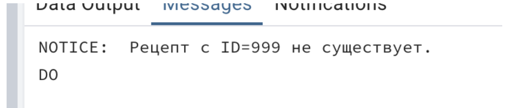
2) Пытаемся добавить заказ на несуществующее изделие (например, baking_id = 999)

  ```
DO $$
BEGIN
    INSERT INTO bakery_db.order_baking_goods (order_id, baking_id, quantity, unit_id)
    VALUES (1, 999, 2, 3);  
EXCEPTION
    WHEN foreign_key_violation THEN
        RAISE NOTICE 'Ошибка: хлебобулочное изделие с ID=999 не найдено в каталоге.';
    WHEN OTHERS THEN
        RAISE NOTICE 'Произошла неожиданная ошибка при добавлении позиции в заказ.';
END $$ LANGUAGE plpgsql;

 ```
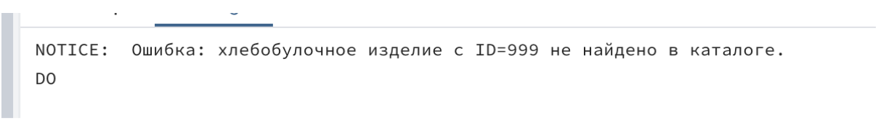

### RAISE

1) Выводим количество курьеров и клиентов в системе
 ```
DO $$
DECLARE
    client_count INT;
    courier_count INT;
BEGIN
    SELECT COUNT(*) INTO client_count FROM bakery_db.clients;
    SELECT COUNT(*) INTO courier_count FROM bakery_db.couriers;

    RAISE NOTICE 'В базе данных % клиентов и % курьеров.', client_count, courier_count;
END $$ LANGUAGE plpgsql;

 ```
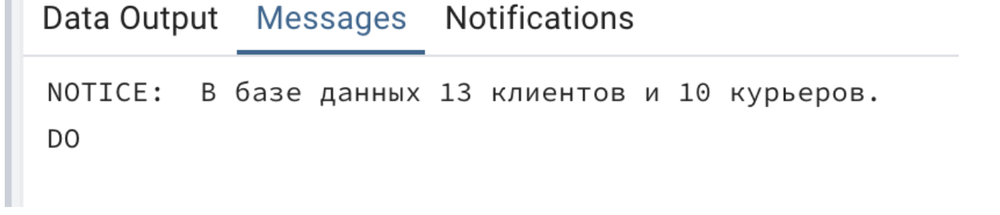
2) Пытаемся изменить номер телефона несуществующего курьера
  ```
DO $$
DECLARE
    v_courier_id INT := 999;
    v_new_phone VARCHAR(11) := '79991234567';
    affected_rows INT;
BEGIN
    UPDATE bakery_db.couriers
    SET phone_number = v_new_phone
    WHERE courier_id = v_courier_id;

    GET DIAGNOSTICS affected_rows = ROW_COUNT;

    IF affected_rows = 0 THEN
        RAISE EXCEPTION 'Курьер с ID=% не найден. Обновление невозможно.', v_courier_id;
    END IF;

    RAISE NOTICE 'Телефон курьера % успешно обновлён.', v_courier_id;

EXCEPTION
    WHEN OTHERS THEN
        RAISE NOTICE 'Не удалось обновить данные курьера с ID=%.', v_courier_id;
END $$ LANGUAGE plpgsql;

 ```
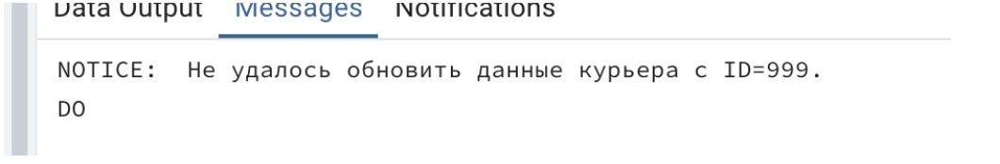

