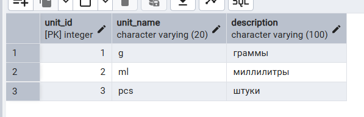
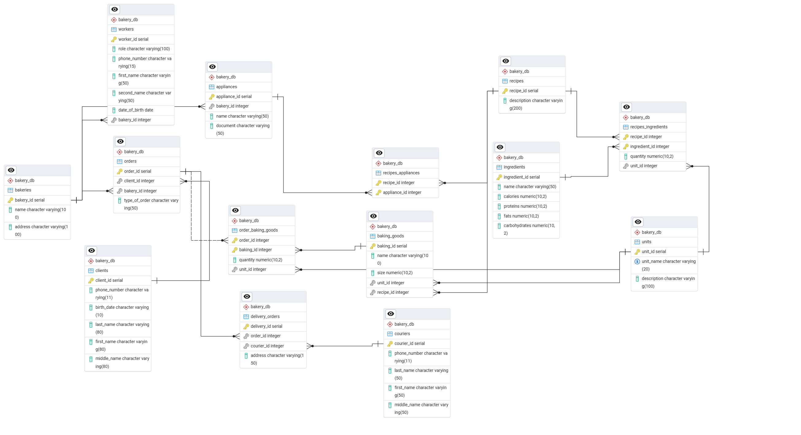

## 1 -  Нарушение атомарности (1 НФ) – два разных поля для одного смыслового признака (количества) в таблицах recipes_ingredients,  baking_goods, order_baking_goods:
   
**Решение** – создание таблицы для хранения единиц:

### units

CREATE TABLE bakery_db.units (  
    unit_id SERIAL PRIMARY KEY, 
    unit_name VARCHAR(20) NOT NULL UNIQUE, -- например, "g", "ml", "pcs" 
    description VARCHAR(100) 
); 
 
INSERT INTO bakery_db.units (unit_name, description) VALUES 
('g', 'граммы'), 
('ml', 'миллилитры'), 
('pcs', 'штуки'); 

### baking_goods

CREATE TABLE bakery_db.baking_goods ( 
    baking_id SERIAL PRIMARY KEY, 
    name VARCHAR(100) NOT NULL, 
    size NUMERIC(10,2) NOT NULL, 
    unit_id INT NOT NULL, 
    recipe_id INT NOT NULL 
); 

ALTER TABLE bakery_db.baking_goods 
    ADD CONSTRAINT fk_baking_goods_recipe 
        FOREIGN KEY (recipe_id) 
        REFERENCES bakery_db.recipes(recipe_id) 
        ON DELETE CASCADE; 

ALTER TABLE bakery_db.baking_goods 
    ADD CONSTRAINT fk_baking_goods_unit 
        FOREIGN KEY (unit_id) 
        REFERENCES bakery_db.units(unit_id) 
        ON DELETE RESTRICT; 

### recipes_ingredients

CREATE TABLE bakery_db.recipes_ingredients ( 
    recipe_id INT NOT NULL, 
    ingredient_id INT NOT NULL, 
    quantity NUMERIC(10,2) NOT NULL, 
    unit_id INT NOT NULL, 
    PRIMARY KEY (recipe_id, ingredient_id) 
); 

ALTER TABLE bakery_db.recipes_ingredients 
    ADD CONSTRAINT fk_recipes_ingredients_recipe 
        FOREIGN KEY (recipe_id) 
        REFERENCES bakery_db.recipes(recipe_id) 
        ON DELETE CASCADE; 

ALTER TABLE bakery_db.recipes_ingredients 
    ADD CONSTRAINT fk_recipes_ingredients_ingredient 
        FOREIGN KEY (ingredient_id) 
        REFERENCES bakery_db.ingredients(ingredient_id) 
        ON DELETE CASCADE; 

ALTER TABLE bakery_db.recipes_ingredients 
    ADD CONSTRAINT fk_recipes_ingredients_unit 
        FOREIGN KEY (unit_id) 
        REFERENCES bakery_db.units(unit_id) 
        ON DELETE RESTRICT; 

### order_baking_goods

CREATE TABLE bakery_db.order_baking_goods ( 
    order_id INT NOT NULL, 
    baking_id INT NOT NULL, 
    quantity NUMERIC(10,2) NOT NULL, 
    unit_id INT NOT NULL, 
    PRIMARY KEY (order_id, baking_id) 
);

ALTER TABLE bakery_db.order_baking_goods 
    ADD CONSTRAINT fk_order_baking_goods_order 
        FOREIGN KEY (order_id) 
        REFERENCES bakery_db.orders(order_id) 
        ON DELETE CASCADE; 

ALTER TABLE bakery_db.order_baking_goods 
    ADD CONSTRAINT fk_order_baking_goods_baking 
        FOREIGN KEY (baking_id) 
        REFERENCES bakery_db.baking_goods(baking_id) 
        ON DELETE CASCADE; 

ALTER TABLE bakery_db.order_baking_goods 
    ADD CONSTRAINT fk_order_baking_goods_unit 
        FOREIGN KEY (unit_id) 
        REFERENCES bakery_db.units(unit_id) 
        ON DELETE RESTRICT; 

## 2 - Поле full_name в clients и couriers не атомарно (1 НФ). 

###  Решение: Разбиваем на три поля — фамилию, имя, отчество.

ALTER TABLE bakery_db.clients 
ADD COLUMN last_name VARCHAR(80), 
ADD COLUMN first_name VARCHAR(80), 
ADD COLUMN middle_name VARCHAR(80); 

UPDATE bakery_db.clients 
SET last_name = split_part(full_name, ' ', 1), 
first_name = split_part(full_name, ' ', 2), 
middle_name = split_part(full_name, ' ', 3); 

ALTER TABLE bakery_db.clients DROP COLUMN full_name; 

ALTER TABLE bakery_db.couriers 
    ADD COLUMN last_name VARCHAR(50), 
    ADD COLUMN first_name VARCHAR(50), 
    ADD COLUMN middle_name VARCHAR(50); 

UPDATE bakery_db.couriers 
SET last_name = split_part(full_name, ' ', 1), 
    first_name = split_part(full_name, ' ', 2), 
    middle_name = NULLIF(split_part(full_name, ' ', 3), ''); 

ALTER TABLE bakery_db.couriers 
    DROP COLUMN full_name; 

## 3 - В таблице recipes хранятся поля calories, proteins, fats, carbohydrates, которые представляют собой агрегированные показатели, вычисляемые из состава ингредиентов. Это создаёт транзитивную зависимость (через recipes_ingredients → ingredients), нарушающую 3НФ.
Кроме того, это вызывает риск дублирования и несогласованности данных — если изменить ингредиенты, калорийность рецепта может измениться, но значения в таблице recipes останутся прежними.

### Решение – не хранить нутриенты в recipes, а вычислять их динамически из состава и ингредиентов.

ALTER TABLE bakery_db.recipes 
    DROP COLUMN IF EXISTS calories, 
    DROP COLUMN IF EXISTS proteins, 
    DROP COLUMN IF EXISTS fats, 
    DROP COLUMN IF EXISTS carbohydrates; 

