# SQL-запросы по темам

## 1. Выборка всех данных из таблицы

### а) Все данные из таблицы delivery_orders
SELECT *
FROM bakery_db.delivery_orders;

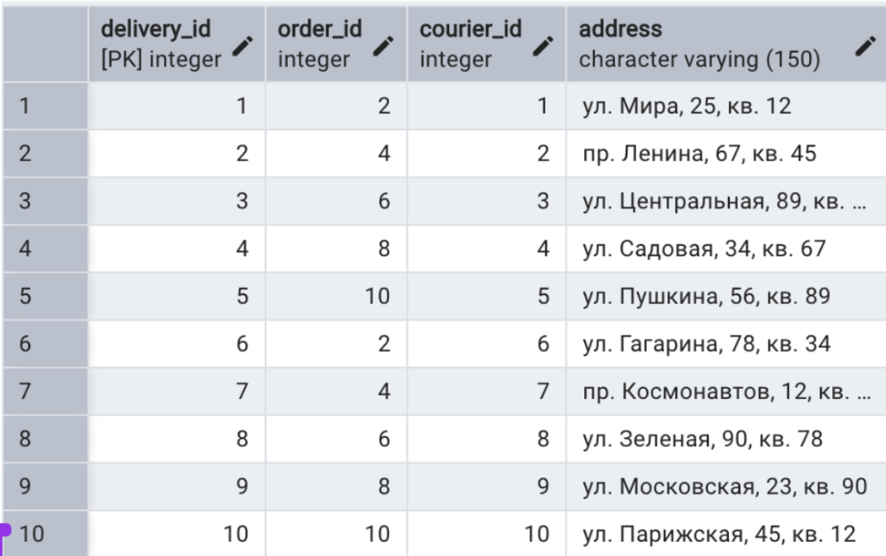

### б) Все данные из таблицы baking_goods
SELECT *
FROM bakery_db.baking_goods;

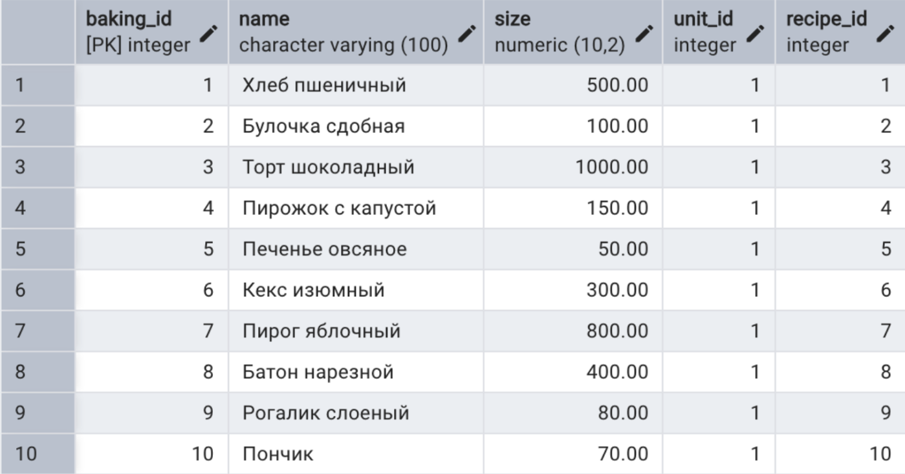

## 2. Выборка отдельных столбцов

### а) Названия и адреса пекарен из таблицы bakeries
SELECT name, address
FROM bakery_db.bakeries;

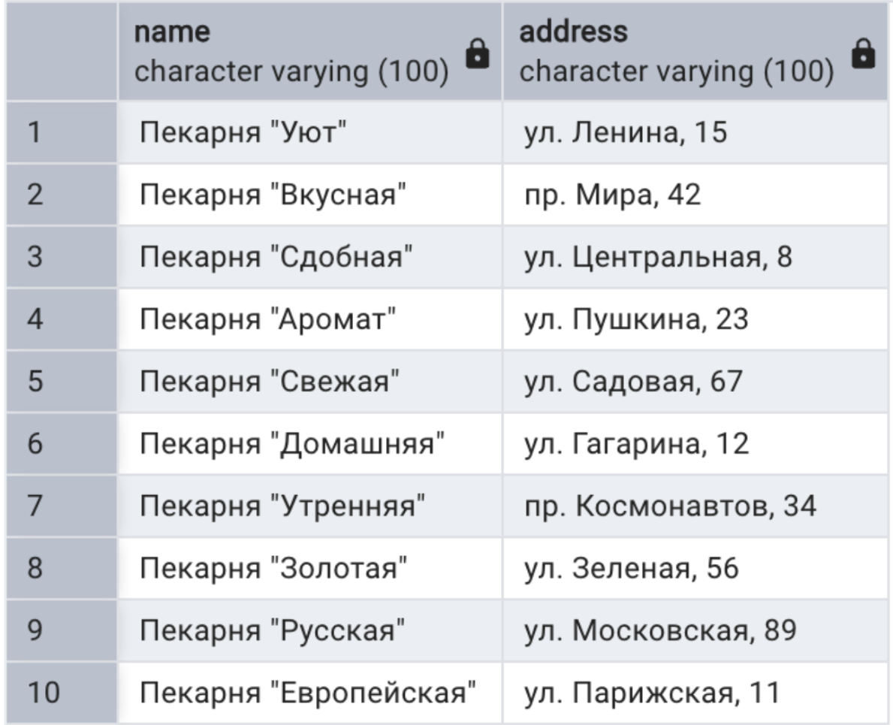

### б) Имена, фамилии и должности работников из таблицы workers
SELECT first_name, second_name, role
FROM bakery_db.workers;

## 3. Присвоение новых имен столбцам

### а)
SELECT 
    last_name AS Фамилия,
    first_name AS Имя,
    phone_number AS Телефон
FROM bakery_db.clients;

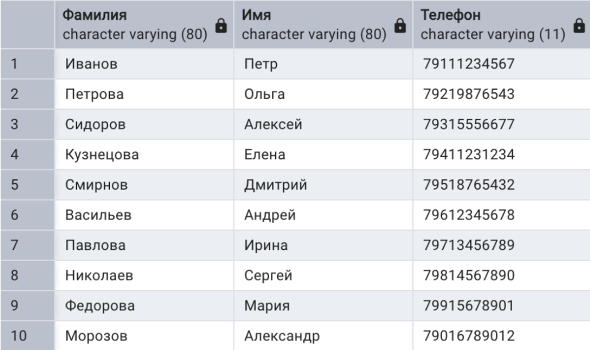

### б)
SELECT 
    name,
    calories AS Калории,
    proteins AS Белки,
    fats AS Жиры,
    carbohydrates AS Углеводы
FROM bakery_db.ingredients;

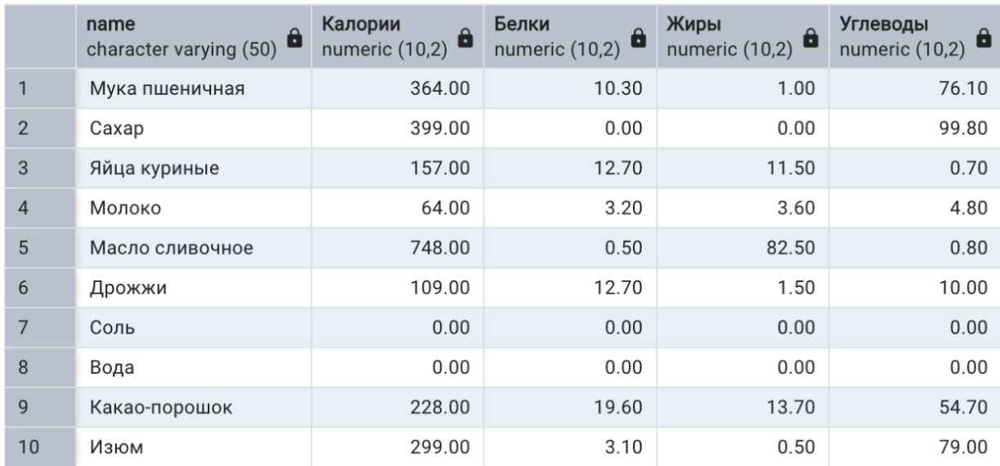

## 4. Выборка с вычисляемым столбцом

### а)
**SELECT ingredient_id, name, 
	CONCAT(calories, '/', proteins, '/', fats, '/', carbohydrates) AS cpfc
FROM bakery_db.ingredients;**

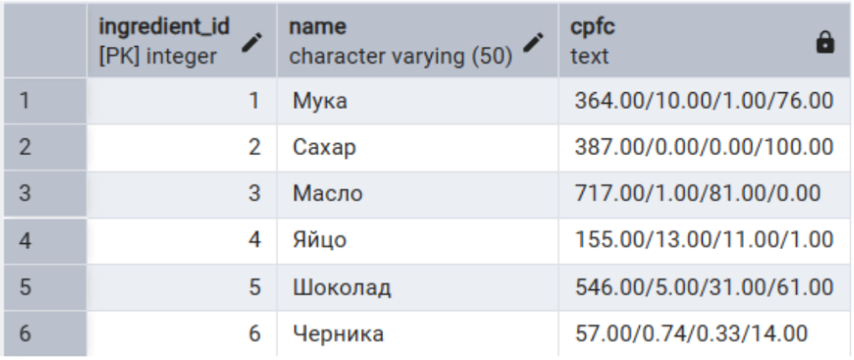

### б)
**SELECT client_id, phone_number, birth_date,
    (CASE WHEN (birth_date LIKE '%10-14') THEN 'yes' ELSE 'no' END) AS has_discount
FROM bakery_db.clients;**

## 5. Математические функции

### а) Минимальный/максимальный вес с погрешностью 0.05
SELECT baking_id, name, 
(size - size*0.05) AS minimum_size,
(size + size*0.05) AS maximum_size,
unit_id, recipe_id
FROM bakery_db.baking_goods;

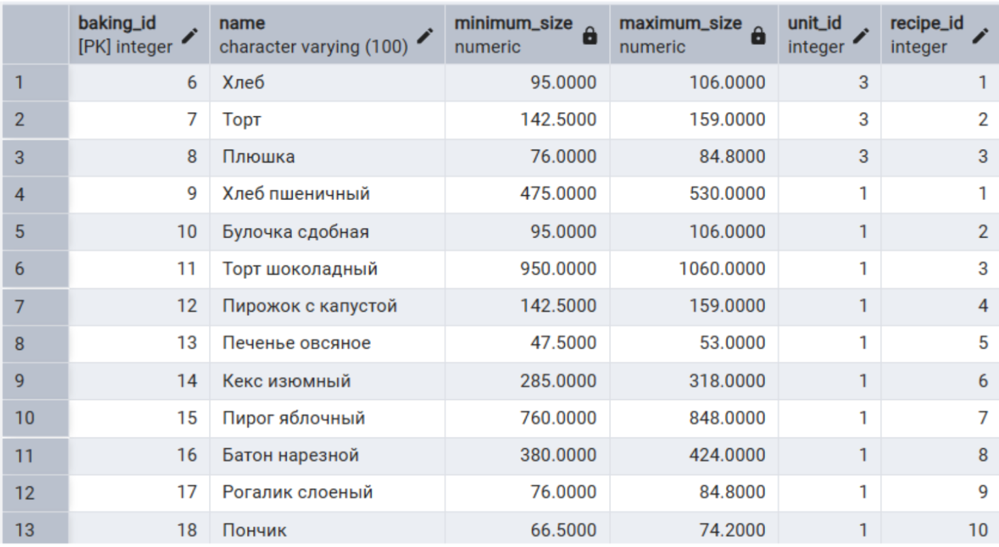

### б) Скидка 5% за каждую 2-ю позицию
SELECT order_id, baking_id,
     (quantity % 2 * 5) AS discount
FROM bakery_db.order_baking_goods;

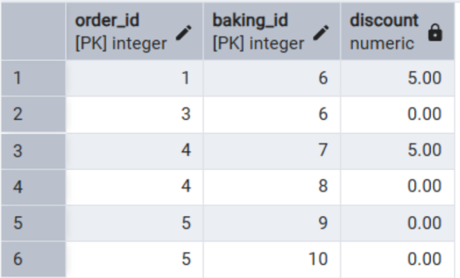

## 6. Логические функции

### а) Определение категории ингредиентов по калорийности
**SELECT 
    name AS ингредиент,
    calories AS калории,
    CASE 
        WHEN calories > 300 THEN 'Высококалорийный'
        WHEN calories > 100 THEN 'Среднекалорийный' 
        ELSE 'Низкокалорийный'
    END AS категория
FROM bakery_db.ingredients;**

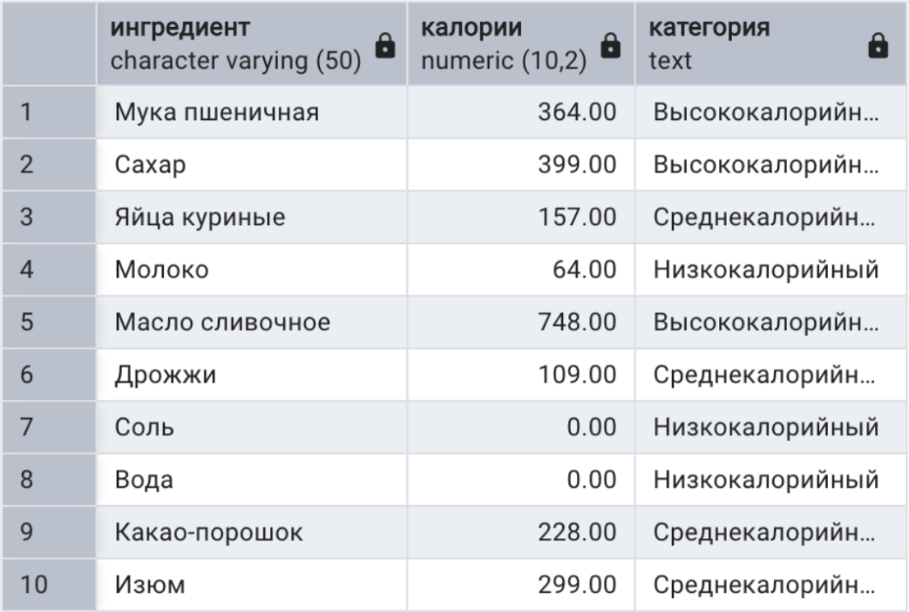

### б) Классификация работников по возрасту
SELECT 
    first_name AS Имя,
    second_name AS Фамилия,
    date_of_birth AS Дата_рождения,
    CASE 
        WHEN EXTRACT(YEAR FROM AGE(date_of_birth)) > 35 THEN 'Опытный'
        WHEN EXTRACT(YEAR FROM AGE(date_of_birth)) > 20 THEN 'Средний возраст'
        ELSE 'Молодой'
    END AS Возрастная_категория
FROM bakery_db.workers;

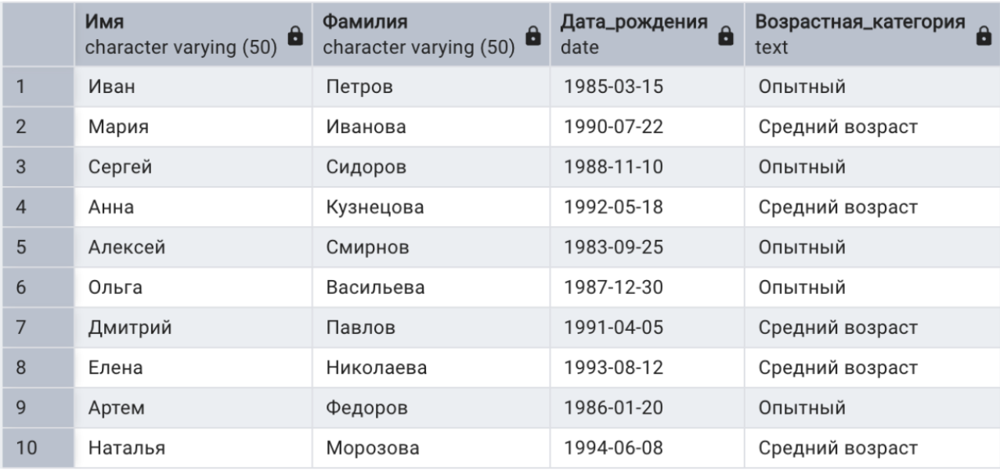

## 7. Выборка данных по условию

### а) Высококалорийные ингредиенты
SELECT 
    name AS ингредиент,
    calories AS калории
FROM bakery_db.ingredients
WHERE calories > 300;

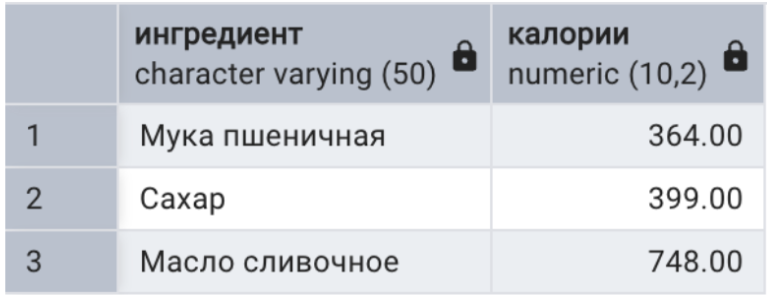

### б) Работники определенной пекарни
SELECT 
    first_name AS имя,
    second_name AS фамилия,
    role AS должность
FROM bakery_db.workers
WHERE bakery_id = 2;

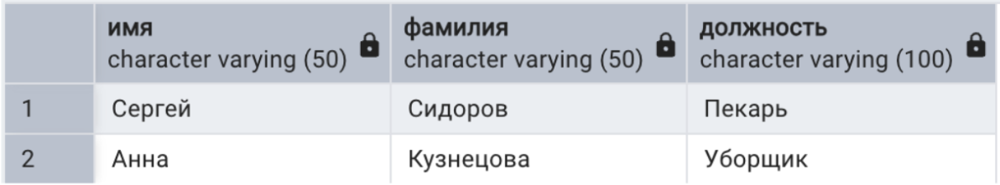

## 8. Логические операции

### а) Работники-пекари или кондитеры
SELECT 
    first_name AS имя,
    second_name AS фамилия, 
    role AS должность
FROM bakery_db.workers
WHERE role = 'Пекарь' OR role = 'Кондитер';

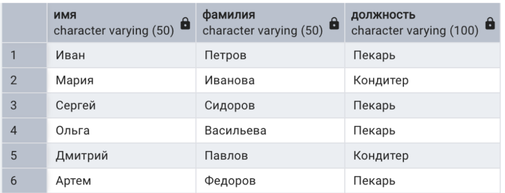

### б) Ингредиенты с высокой пищевой ценностью
SELECT 
    name AS ингредиент,
    calories AS калории,
    proteins AS белки,
    fats AS жиры
FROM bakery_db.ingredients
WHERE calories > 150 AND fats < 20 AND proteins > 5;

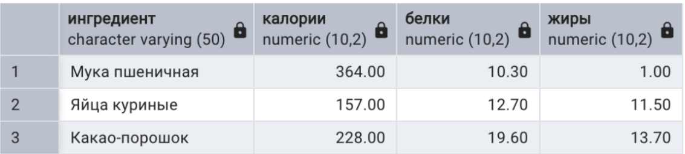

## 9. Операторы BETWEEN, IN

### а) Товары с весом от 100 до 500
SELECT 
    name, size
FROM bakery_db.baking_goods
WHERE size BETWEEN 100 AND 500;

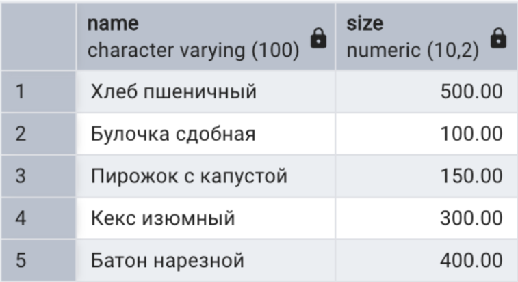

### б) Определенные хлебобулочные изделия
SELECT 
    name AS изделие,
    size AS вес,
    unit_id AS единица_измерения
FROM bakery_db.baking_goods
WHERE name IN ('Хлеб пшеничный', 'Булочка сдобная', 'Печенье овсяное');

## 10. Сортировка

### а) Сортировка ингредиентов по убыванию калорийности
SELECT 
    name AS ингредиент,
    calories AS калории
FROM bakery_db.ingredients
ORDER BY calories DESC;

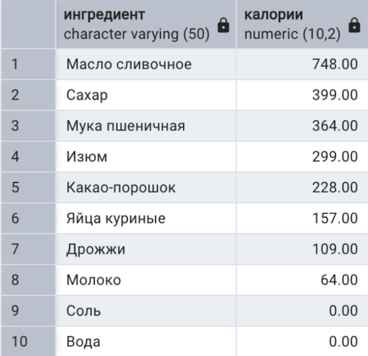

### б) Сортировка работников по фамилии
SELECT 
    first_name AS имя,
    second_name AS фамилия,
    role AS должность
FROM bakery_db.workers
ORDER BY second_name;

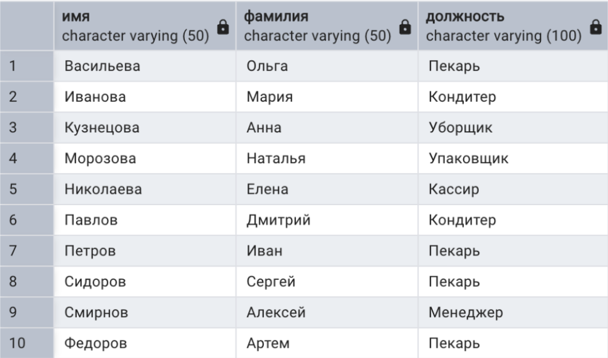

## 11. LIKE

### а) Клиенты с фамилией на “ов” 
SELECT 
    last_name AS фамилия,
    first_name AS имя,
    phone_number AS телефон
FROM bakery_db.clients
WHERE last_name LIKE '%ов';

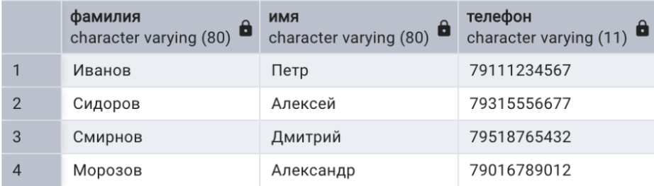

### б) Товары, название которых начинается на “Пир”
SELECT name, size
FROM bakery_db.baking_goods
WHERE name LIKE 'Пир%';

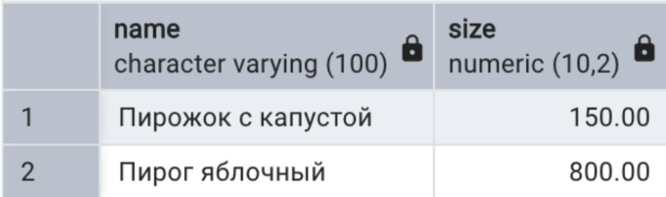

## 12. Уникальные элементы столбца

### а) Уникальные должности работников
SELECT DISTINCT role AS должность
FROM bakery_db.workers;

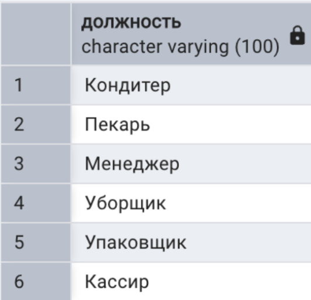

### б) Уникальные названия техники
SELECT DISTINCT name AS техника
FROM bakery_db.appliances;

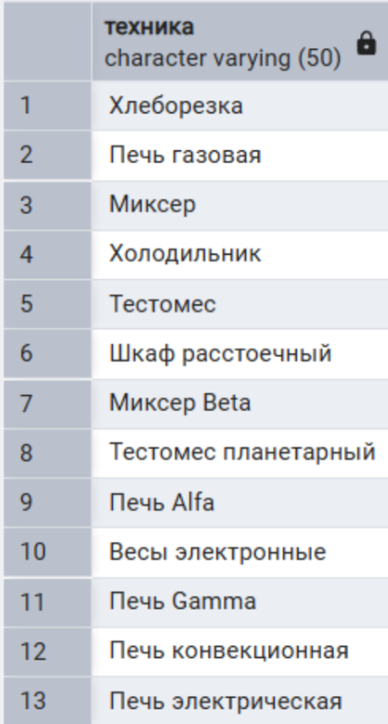

## 13. Ограничение количества строк

### а) 3 самых калорийных ингредиента
SELECT 
    name AS ингредиент,
    calories AS калории
FROM bakery_db.ingredients
ORDER BY calories DESC
LIMIT 3;

### б) 5 самых молодых работников
SELECT 
    first_name AS имя,
    second_name AS фамилия,
    date_of_birth AS дата_рождения
FROM bakery_db.workers
ORDER BY date_of_birth DESC
LIMIT 5;
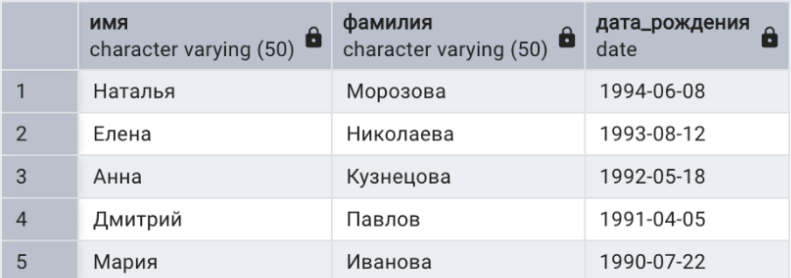

## 14. INNER JOIN

### а) Работники с id, должностями и пекарнями
SELECT worker_id, role, bakeries.address FROM bakery_db.workers
INNER JOIN bakery_db.bakeries ON workers.bakery_id = bakeries.bakery_id;

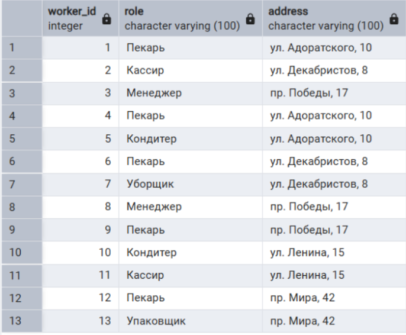

### б) Доставки с курьерами
SELECT delivery_id, order_id, couriers.phone_number, couriers.first_name FROM bakery_db.delivery_orders
INNER JOIN bakery_db.couriers ON delivery_orders.courier_id = couriers.courier_id;

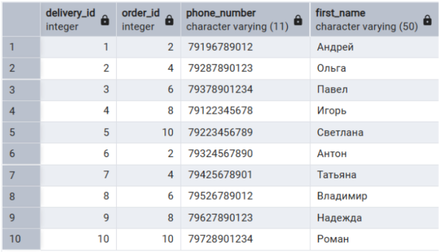

## 15. LEFT / RIGHT OUTER JOIN

### а) Все рецепты и связанные ингредиенты
SELECT recipes.recipe_id, description, recipes_ingredients.ingredient_id, recipes_ingredients.quantity FROM bakery_db.recipes
LEFT JOIN bakery_db.recipes_ingredients ON recipes.recipe_id = recipes_ingredients.recipe_id;

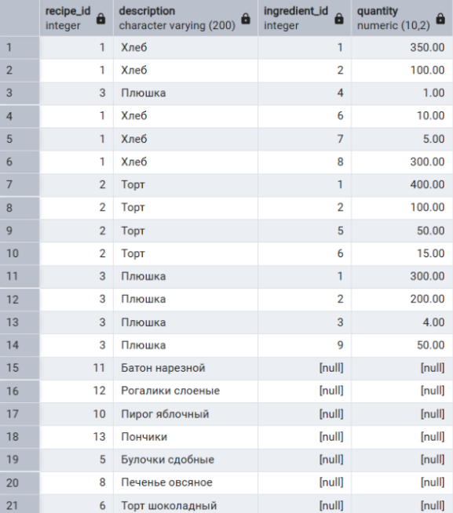

### б) Все кухонные приборы с адресом пекарни
SELECT bakeries.bakery_id, bakeries.address, appliances.name FROM bakery_db.bakeries
RIGHT JOIN bakery_db.appliances ON bakeries.bakery_id = appliances.bakery_id;

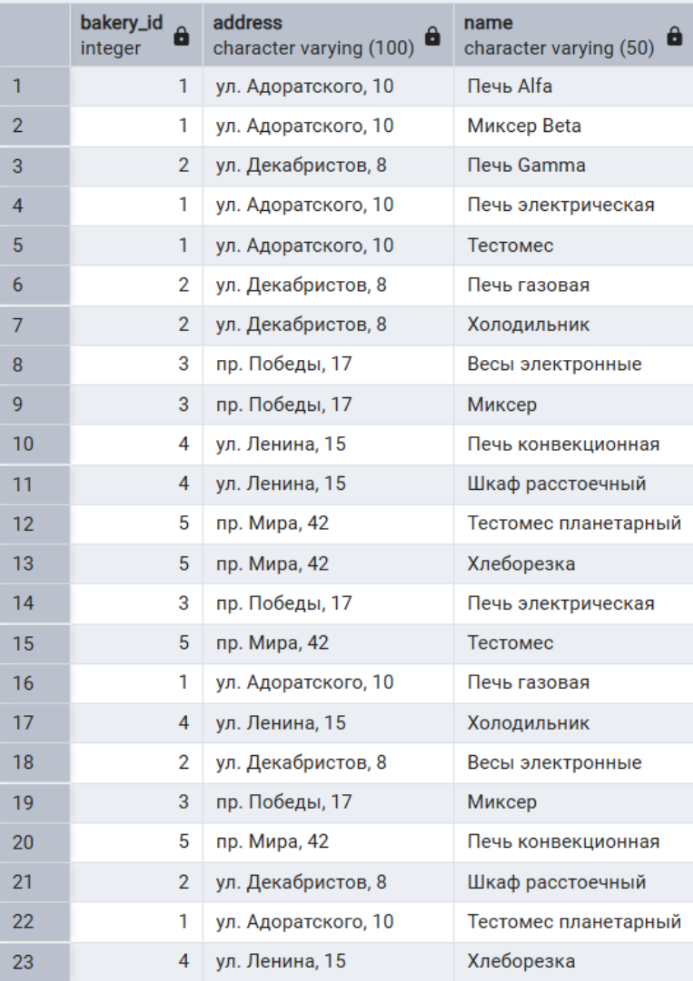

## 16. CROSS JOIN

### а) Все ингредиенты × все единицы измерения
SELECT 
    i.ingredient_id,
    i.name AS ingredient_name,
    u.unit_id,
    u.unit_name
FROM bakery_db.ingredients i
CROSS JOIN bakery_db.units u;
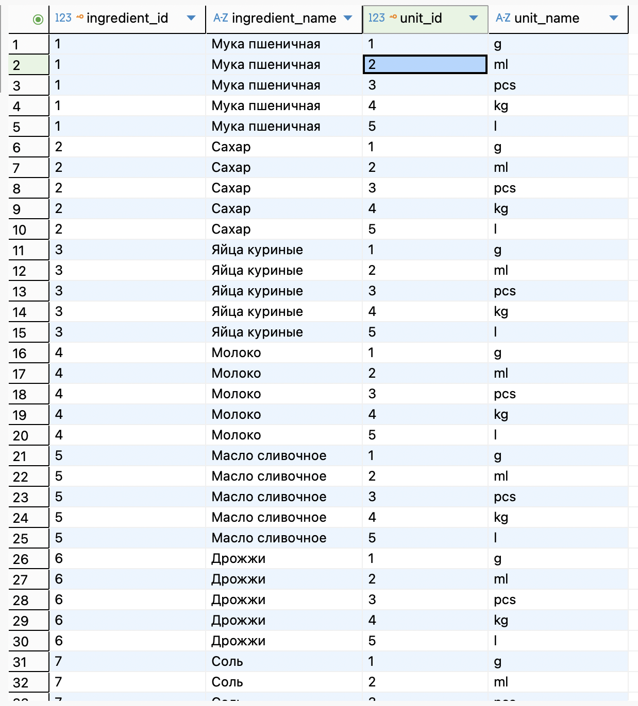

### б) Все рецепты × все пекарни с оборудованием - проверить, какие рецепты можно приготовить в какой пекарне, если учитывать наличие оборудования.
SELECT 
    i.ingredient_id,
    i.name AS ingredient_name,
    u.unit_id,
    u.unit_name
FROM bakery_db.ingredients i
CROSS JOIN bakery_db.units u;
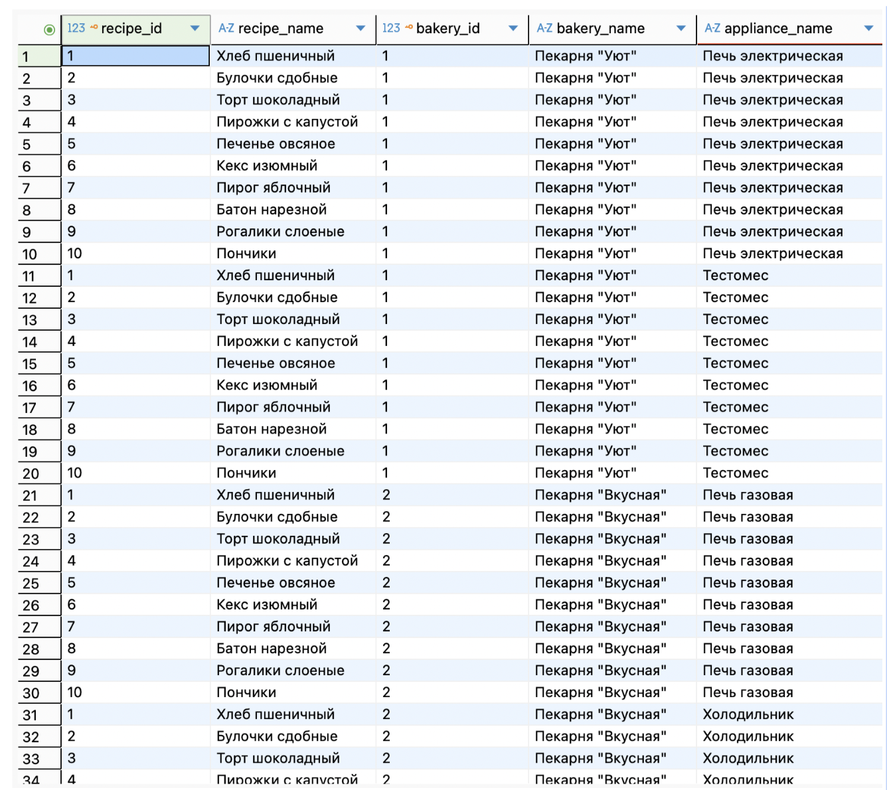

## 17. Запросы из нескольких таблиц

### а) Показывает клиента с адресом на доставку, id, номером телефона, именем и номером телефона курьера

SELECT clients.client_id, clients.first_name, clients.phone_number AS client_number, delivery_orders.address, couriers.phone_number AS courier_number FROM bakery_db.clients
INNER JOIN bakery_db.orders ON orders.client_id = clients.client_id
INNER JOIN bakery_db.delivery_orders ON orders.order_id = delivery_orders.order_id
INNER JOIN bakery_db.couriers ON delivery_orders.courier_id = couriers.courier_id

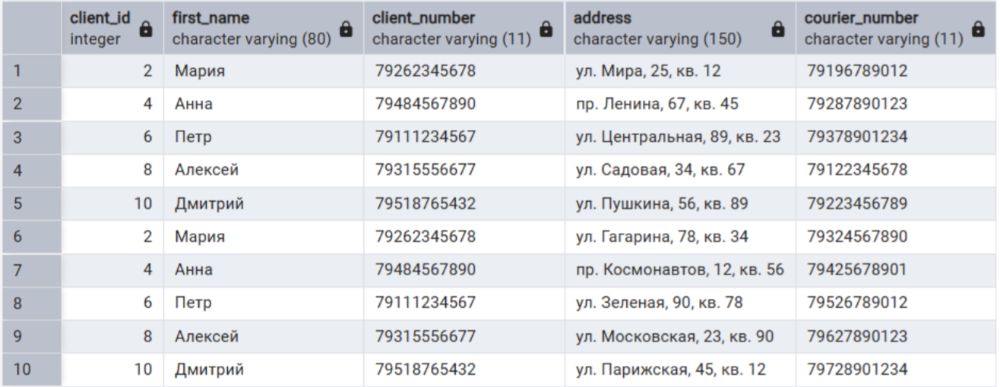

### б) Для каждого рецепта выводит все ингредиенты с количеством и единицей измерения
SELECT 
    r.recipe_id,
    r.description AS recipe_name,
    i.name AS ingredient_name,
    ri.quantity,
    u.unit_name
FROM bakery_db.recipes r
INNER JOIN bakery_db.recipes_ingredients ri ON r.recipe_id = ri.recipe_id
INNER JOIN bakery_db.ingredients i ON ri.ingredient_id = i.ingredient_id
INNER JOIN bakery_db.units u ON ri.unit_id = u.unit_id;
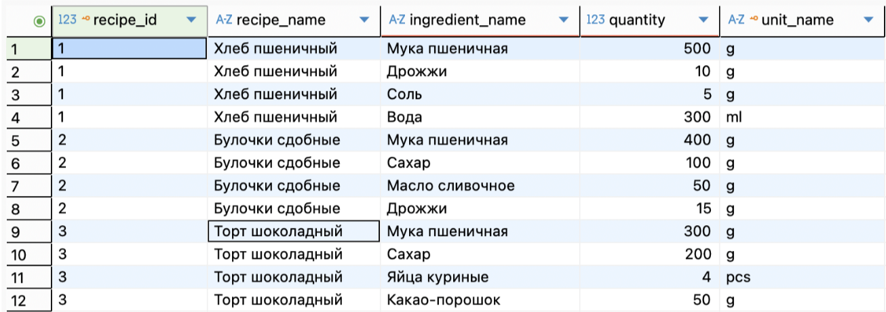
