# Подзапросы
### SELECT
1) Вычисляем кол-во работников для каждой роли
   ```
    SELECT DISTINCT w1.role,
        (SELECT COUNT(*)
        FROM bakery_db.workers w2
        WHERE w2.role = w1.role) as employee_count
    FROM bakery_db.workers w1;
    ```
    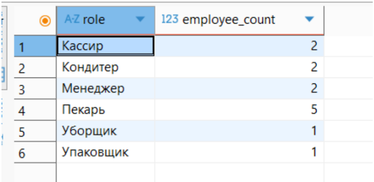
2) Распределение ролей работников по пекарням
   ```
   SELECT DISTINCT workers1.role,
    (SELECT COUNT(DISTINCT workers2.bakery_id)
    FROM workers workers2
    WHERE workers2.role = workers1.role) as bakeries_count
    FROM workers workers1;
   ```
   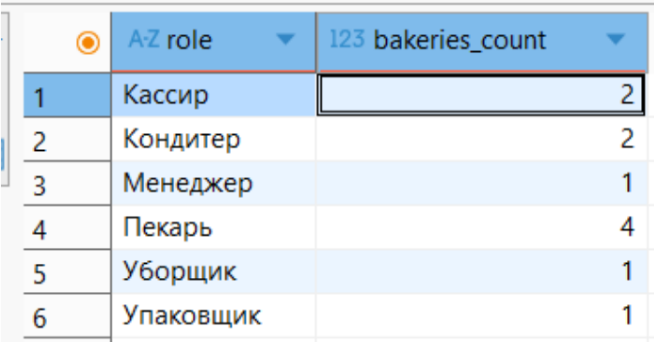

   

3) Самый молодой работник в каждой роли
    ```
    SELECT DISTINCT workers1.role,
      (SELECT MAX(workers2.date_of_birth)
       FROM workers workers2
       WHERE workers2.role = workers1.role) as youngest_birthdate
       FROM workers workers1;
    ```
    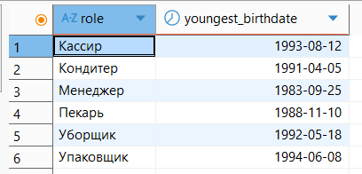

### FROM
1) Вычисляем кол-во заказов на доставку у каждого клиента

    ```
    SELECT "идентификатор_клиента", "кол-во заказов"
    FROM ( SELECT clients.client_id AS "идентификатор_клиента", COUNT(DISTINCT orders.order_id) AS "кол-во заказов"
    FROM clients
    INNER JOIN orders ON clients.client_id = orders.client_id
    INNER JOIN delivery_orders ON orders.order_id = delivery_orders.order_id
    GROUP BY clients.client_id
    );
    ```
    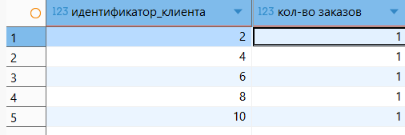

	

2) Вычисляем в скольких рецептах используется ингредиент
    ```
    SELECT "название_ингредиента", "количество_рецептов"
    FROM (SELECT ingredients.name AS "название_ингредиента",
    COUNT(recipes_ingredients.recipe_id) AS "количество_рецептов"
    FROM bakery_db.ingredients
    INNER JOIN recipes_ingredients  ON ingredients.ingredient_id = recipes_ingredients.ingredient_id
    GROUP BY ingredients.ingredient_id, ingredients.name
    );
    ```
    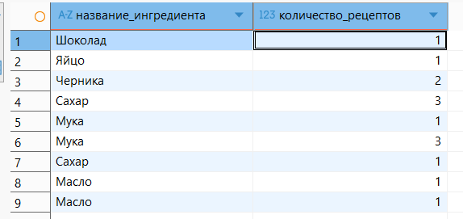


3) Вычисляем кол-во работников по каждой роли
    ```
    SELECT "роль", "количество_работников"
    FROM (SELECT role AS "роль",
    COUNT(*) AS "количество_работников"
    FROM bakery_db.workers
    GROUP BY role
    );
    ```
    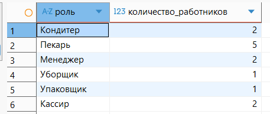


### WHERE 
1) Выпечка с максимальным весом

    ```
    SELECT baking_id, name, size FROM bakery_db.baking_goods
    WHERE size = (SELECT distinct MAX(size) FROM bakery_db.baking_goods);
    ```
    

2) В какую пекарню был сделан последний заказ клиента с id = 3
    ```
	SELECT name, address
    FROM bakeries
    where bakery_id = (select MAX(order_id) from bakery_db.orders where client_id = 3);
    ```
    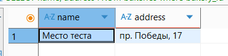
3) Самый большой заказ (по кол-ву позиций)
    ```
    SELECT order_id, quantity
    FROM bakery_db.order_baking_goods
    where quantity = (select max(quantity) from bakery_db.order_baking_goods);
    ```
    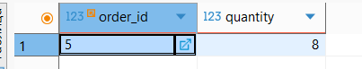

	
### HAVING
1) Пекарни с названиями короче максимального
	```
    SELECT name, address, LENGTH(name) as name_length
    FROM bakeries
    GROUP BY name, address
    HAVING LENGTH(name) < (SELECT MAX(LENGTH(name)) FROM bakeries);
    ```
    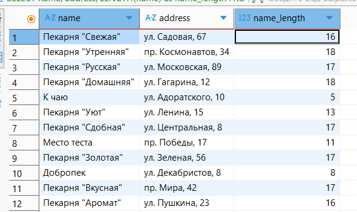

2) Пекарни с ID из определенного диапазона
	```
	SELECT bakery_id, name, address
    FROM bakeries
    GROUP BY bakery_id, name, address
    HAVING bakery_id IN (SELECT bakery_id FROM bakeries WHERE bakery_id BETWEEN 3 AND 8);
    ```
    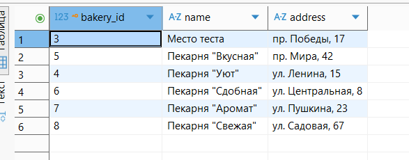
3) Пекарни с самым длинным названием
	```
	SELECT name, address, LENGTH(name) as name_length
    FROM bakeries
    GROUP BY name, address
    HAVING LENGTH(name) = (SELECT MAX(LENGTH(name)) FROM bakeries);
    ```
 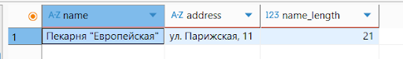
### IN
1) Клиенты, которые делали заказ в пекарне №2
    ```
    SELECT client_id, first_name, phone_number
    FROM bakery_db.clients
    WHERE client_id IN (
    SELECT DISTINCT client_id
    FROM bakery_db.orders
    WHERE bakery_id = 2);
    ```
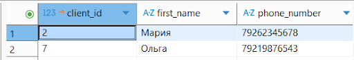
2) Выпечка требующая запекания
    ```
	SELECT baking_id, name  FROM bakery_db.baking_goods
	WHERE baking_id IN(SELECT baking_id
        FROM bakery_db.baking_goods
        INNER JOIN bakery_db.recipes ON baking_goods.recipe_id = recipes.recipe_id
        INNER JOIN bakery_db.recipes_appliances ON recipes.recipe_id = recipes_appliances.recipe_id
        INNER JOIN bakery_db.appliances ON recipes_appliances.appliance_id = appliances.appliance_id
        WHERE appliances.name LIKE '%Печь%');
    ```
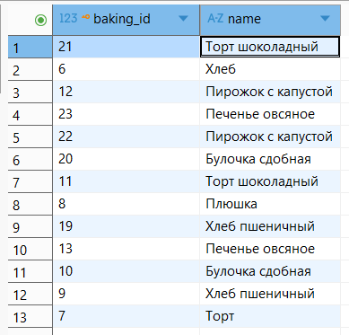

3) Занятые курьеры
    ```
    SELECT COURIER_ID, FIRST_NAME
    FROM BAKERY_DB.COURIERS
    WHERE COURIER_ID IN (SELECT COURIER_ID FROM BAKERY_DB.DELIVERY_ORDERS);
    ```
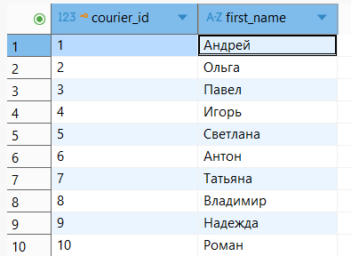

### ALL
1) Проверка, что все клиенты совершеннолетние
    ```
    SELECT 18 <= ALL(
    SELECT EXTRACT(YEAR FROM AGE(CURRENT_DATE, birth_date::DATE))
    FROM bakery_db.clients
    );
    ```
   

2) Проверка, что все работники совершеннолетние

    ```
    SELECT 18 <= ALL(
    SELECT EXTRACT(YEAR FROM AGE(CURRENT_DATE, date_of_birth::DATE))
    FROM bakery_db.workers
    );
    ```
   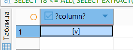
3) Минимальные по жиру ингредиенты

    ```
    SELECT ingredient_id
    from bakery_db.ingredients
    where fats <=  all(SELECT fats
    from bakery_db.ingredients);
    ```
   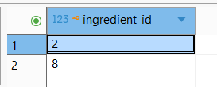


### ANY
1) Есть хотя-бы 1 клиент младше  25

    ```
    SELECT 25 > ANY(
    SELECT EXTRACT(YEAR FROM AGE(CURRENT_DATE, birth_date::DATE))
    FROM bakery_db.clients
    );
    ```
   
2) Проверка есть ли пекарь

    ```
    SELECT 'Пекарь' = ANY(
    SELECT role
    FROM bakery_db.workers
    );
    ```
   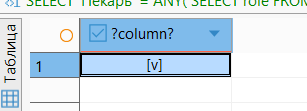


3) Проверка, есть ли хотя бы 1 заказ в пекарню с id=1


    ```
    select 1 = ANY(select bakery_id from bakery_db.orders);
    ```

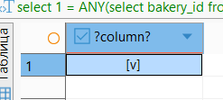


### EXISTS
1) На какую выпечку сделаны заказы

    ```
    SELECT * from bakery_db.baking_goods
    WHERE EXISTS
    (SELECT * FROM bakery_db.order_baking_goods WHERE order_baking_goods.baking_id  = baking_goods.baking_id );
    ```
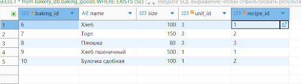

2) Ищет, есть ли среди техники дрель

    ```
    select * from appliances
    where exists (select document from bakery_db.appliances where name = 'Дрель');
    ```
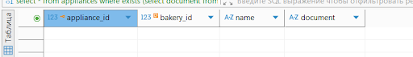

3) Какие клиенты сделали заказ на доставку

    ```
    select * from bakery_db.clients
    where exists (select * from bakery_db.orders where (clients.client_id = orders.client_id) and type_of_order = 'Доставка');
    ```
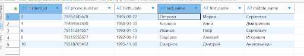


### СРАВНЕНИЕ ПО НЕСКОЛЬКИМ СТОЛБЦАМ
1) Вся техника из пекарни с id = 5

    ```
    SELECT a1.appliance_id, a1.name, a1.bakery_id
    FROM appliances a1
    WHERE (a1.name, a1.bakery_id) IN (
    SELECT a2.name, a2.bakery_id
    FROM appliances a2
    WHERE a2.bakery_id = 5
    );
    ```
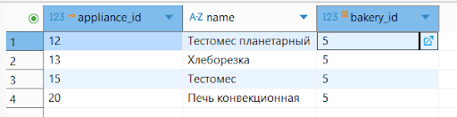


2) Клиенты родившиеся в 1992 году

    ```
    SELECT c1.client_id, c1.first_name
    FROM bakery_db.clients c1
    WHERE (c1.client_id, c1.first_name) IN (
    SELECT c2.client_id, c2.first_name
    FROM bakery_db.clients c2
    WHERE c2.birth_date like '1992%'
    );
    ```

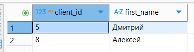


3) Курьеры, чья фамилия начинается на “К”

    ```
    SELECT c1.courier_id, c1.first_name, c1.last_name
    FROM bakery_db.couriers c1
    WHERE (c1.courier_id, c1.first_name) IN (
    SELECT c2.courier_id, c2.first_name
    FROM bakery_db.couriers c2
    WHERE c2.last_name  like 'К%'
    );
    ```

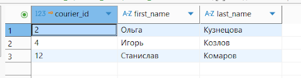

### КОРРЕЛИРОВАННЫЕ ПОДЗАПРОСЫ

1) Находим кол-во заказов для каждого клиента

    ```
    SELECT first_name, last_name, (
    SELECT COUNT(*)
    FROM orders
    WHERE orders.client_id = clients.client_id
    ) AS order_count
    FROM clients;
    ```
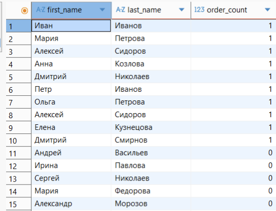


2) Кол-во работников в каждой пекарне

    ```
    SELECT bakery_id, name, (
    SELECT COUNT(*)
    FROM workers
    WHERE workers.bakery_id = bakeries.bakery_id
    ) AS worker_count
    FROM bakeries;
    ```

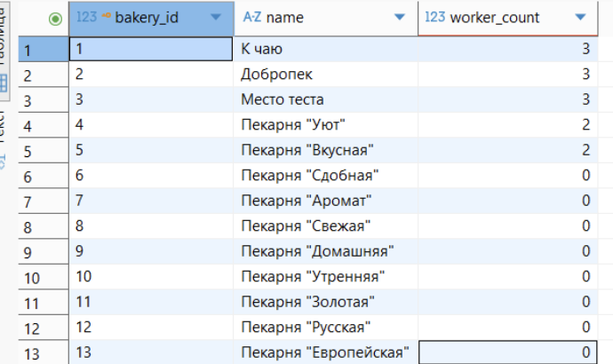


3) Средний возраст работников по ролям 
	
    ```
    SELECT DISTINCT role, (
    SELECT AVG(EXTRACT(YEAR FROM AGE(CURRENT_DATE, date_of_birth)))
    FROM workers w2
    WHERE w2.role = w1.role) AS avg_age
    FROM workers w1;
    ```
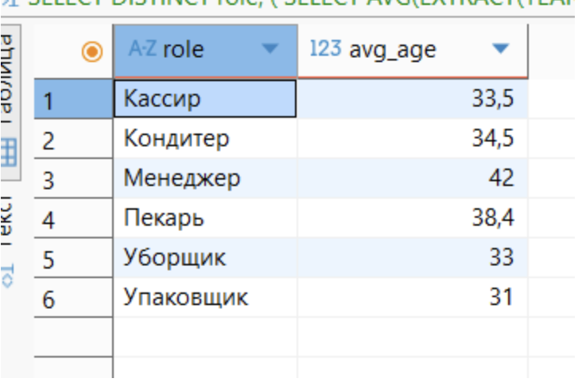


4) Кол-во различных рецептов для каждого клиента

    ```
    SELECT ingredient_id, name, (
    SELECT COUNT(DISTINCT recipe_id)
    FROM recipes_ingredients
    WHERE recipes_ingredients.ingredient_id = ingredients.ingredient_id
    ) AS used_in_recipes
    FROM ingredients;
    ```
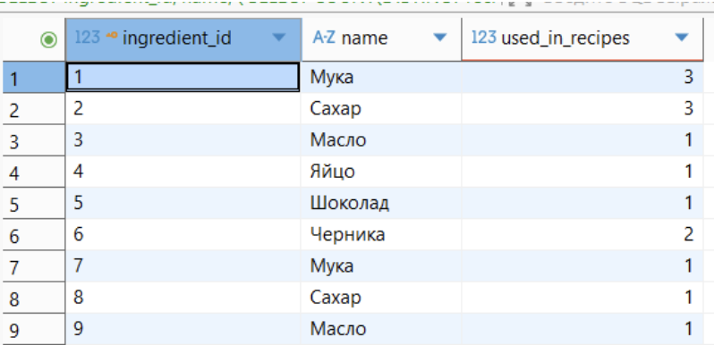


5) Суммарное количество ингредиента во всех рецептах:

    ```
    SELECT ingredient_id, name, (
    SELECT SUM(quantity)
    FROM recipes_ingredients
    WHERE ingredient_id = ingredients.ingredient_id
    GROUP BY ingredient_id
    ) AS total_quantity_in_recipes
    FROM ingredients;
    ```
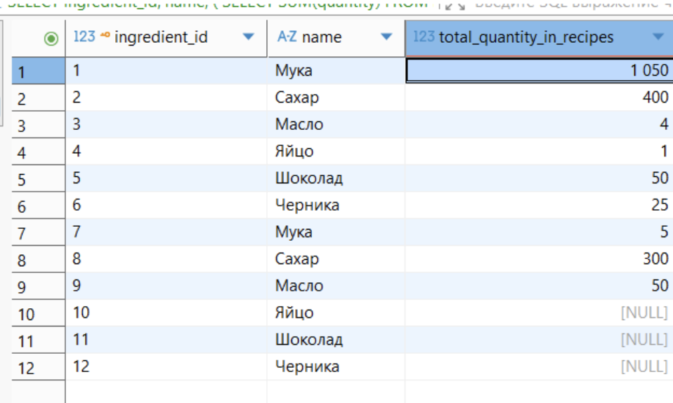


