# Транзакции

### Запросы с COMMIT
1) Добавляет клиента и оформляет на него заказ
 ``` sql
BEGIN;
INSERT INTO bakery_db.clients(phone_number, last_name, middle_name, first_name, birth_date) VALUES ('89083356464', 'Галимзянова', 'Адиля', 'Айдаровна', '10.01.2007');
UPDATE bakery_db.orders SET client_id = 15 WHERE order_id = 50;
COMMIT;
```
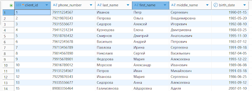
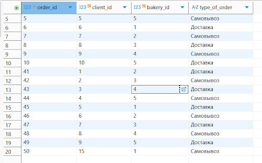

2) Перенаправляем работника в новую пекарню
 ``` sql
	BEGIN;
INSERT INTO bakery_db.bakeries(name, address) VALUES ('Жар свежар', 'ул Баумана');
UPDATE bakery_db.workers SET bakery_id = 12 WHERE worker_id = 6;
COMMIT; 
```
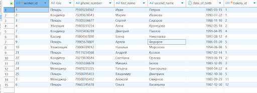
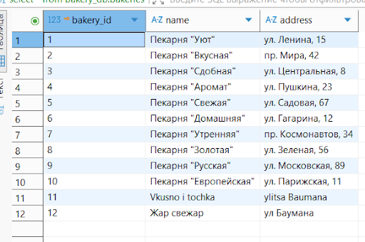
### Запросы с **ROLLBACK**
3) Добавляет клиента и оформляет на него заказ
``` sql
BEGIN;
INSERT INTO bakery_db.clients(phone_number, last_name, middle_name, first_name, birth_date) VALUES('89083356464', 'Галимзянова', 'Адиля', 'Айдаровна', '10.01.2007');
UPDATE bakery_db.orders SET client_id = 15 WHERE order_id = 50;
ROLLBACK;

```
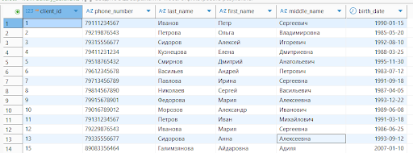
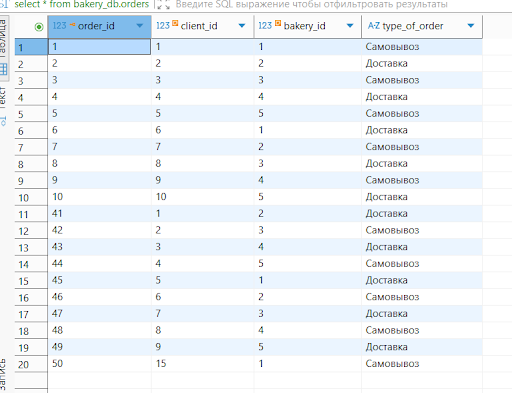

4) Перенаправляем работника в новую пекарню
 ``` sql
BEGIN;
INSERT INTO bakery_db.bakeries(name, address) VALUES('Жар свежар', 'ул Баумана');
UPDATE bakery_db.workers SET bakery_id = 12 WHERE worker_id = 6;
ROLLBACK;
```
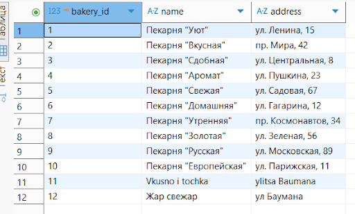


### Транзакции с ошибкой
5)
 ``` sql
BEGIN;
INSERT INTO bakery_db.clients(phone_number, last_name, middle_name, first_name, birth_date) VALUES ('89083356464', 'Галимзянова', 'Адиля', 'Айдаровна', '10.01.2007');
UPDATE bakery_db.orders SET client_id = 7.5 WHERE order_id = 50;
ROLLBACK;
```

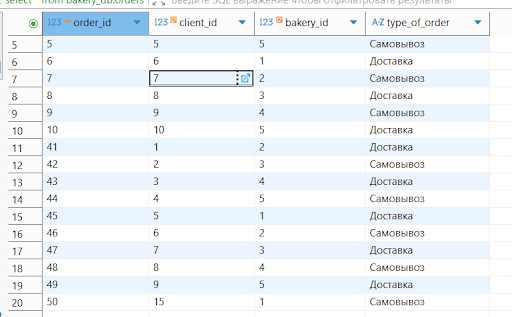

6)
 ``` sql
BEGIN;
INSERT INTO bakery_db.bakeries(name, address) values ('Жар свежар', 'ул Баумана');
UPDATE bakery_db.workers SET bakery_id = '10' WHERE worker_id = 6;
ROLLBACK;
```
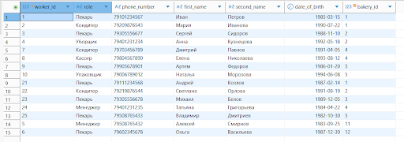

### READ UNCOMMITTED / READ COMMITTED
#### Проверяем, можно ли увидеть «грязные» данные.
#### Делаем UPDATE без COMMIT в T1 и пробуем прочитать в T2.
7) 

``` sql 
--T1
BEGIN TRANSACTION;
UPDATE bakery_db.bakeries SET address = 'ул Баумана, 16' where bakery_id = 41;

--T2
BEGIN TRANSACTION ISOLATION LEVEL READ COMMITTED;
select * from bakery_db.bakeries where bakery_id = 41;
COMMIT;


select * from bakery_db.bakeries;
```
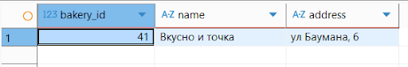
8)
``` sql
BEGIN TRANSACTION;
UPDATE bakery_db.clients set first_name = 'Михаил' where client_id = 1;

BEGIN TRANSACTION ISOLATION LEVEL READ COMMITTED;
select * from bakery_db.clients where client_id = 1;
COMMIT;


select * from bakery_db.clients;
```

#### Неповторяющееся чтение (T1 дважды SELECT, между ними T2 делает UPDATE+COMMIT)
9) 
``` sql
--T1 в первой консоли
begin TRANSACTION ISOLATION LEVEL READ COMMITTED;
	select * from bakery_db.couriers where couriers.courier_id  = 10;
	select * from bakery_db.couriers where couriers.courier_id  = 10;
  
end;

--выполняем часть:
begin TRANSACTION ISOLATION LEVEL READ COMMITTED;
	select * from bakery_db.couriers where couriers.courier_id  = 10;

```
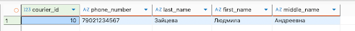

``` sql
-- Т2 (в консоли второй) 
begin TRANSACTION ISOLATION LEVEL READ COMMITTED;
   update bakery_db.couriers
   set first_name = 'Людмилочка'
   where courier_id = 10;
  	commit;
``` 
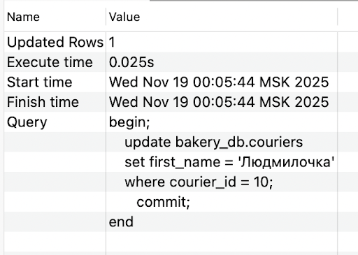

``` sql
--T1 в первой консоли продолжаем выполнение:
select * from bakery_db.couriers where couriers.courier_id  = 10;
end;
```
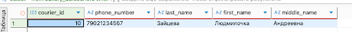

10)
``` sql
--T1
begin TRANSACTION ISOLATION LEVEL READ COMMITTED;
	select * from bakery_db.clients where client_id   = 11;
	select * from bakery_db.clients where client_id   = 11;
end;


– Т1 - выполняем часть:
begin TRANSACTION ISOLATION LEVEL READ COMMITTED;
	select * from bakery_db.clients where client_id   = 11;
```
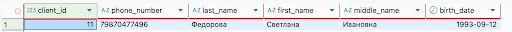
``` sql
-- Т2 (в консоли второй) 
begin TRANSACTION ISOLATION LEVEL READ COMMITTED;
   update bakery_db.clients
   set first_name = 'Светланочка'
   where client_id = 11;
 
  	commit;
end;
```
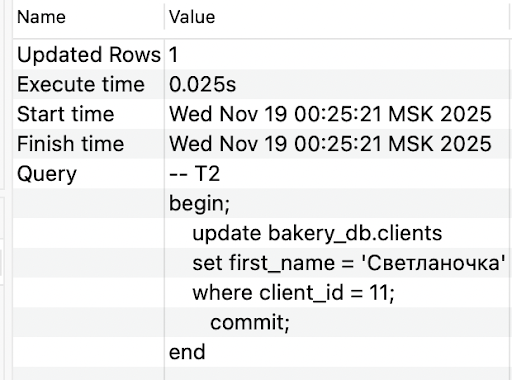
``` sql
--T1 в первой консоли продолжаем выполнение:
select * from bakery_db.clients where client_id   = 11;
end;
```
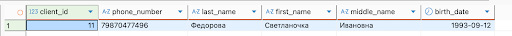
### REPEATABLE READ
#### Проверка, что T1 не видит изменений от T2, пока не завершится. Фантомное чтение через INSERT в T2.

11)
``` sql
-- T1
BEGIN TRANSACTION ISOLATION LEVEL REPEATABLE READ;
select * from bakery_db.clients where client_id   = 11;
end;


-- Т2
BEGIN TRANSACTION ISOLATION LEVEL REPEATABLE READ;
   update bakery_db.clients
   set first_name = 'Светлана'
   where client_id = 11;
  
end;


-- выполняем часть Т1
BEGIN TRANSACTION ISOLATION LEVEL REPEATABLE READ;
```
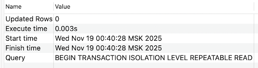

``` sql
-- выполняем часть Т2
BEGIN TRANSACTION ISOLATION LEVEL REPEATABLE READ;
   update bakery_db.clients
   set first_name = 'Светлана'
   where client_id = 11;	
```

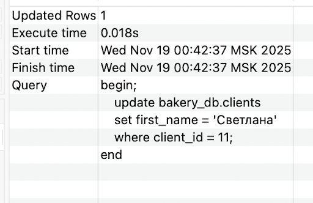

``` sql
-- продолжаем Т1
select * from bakery_db.clients where client_id   = 11;
```
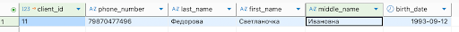
Изменения старые

12)
``` sql
-- Т1
BEGIN TRANSACTION ISOLATION LEVEL REPEATABLE READ;
select * from bakery_db.ingredients where calories > 500;
```
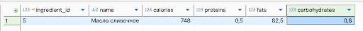
``` sql	
-- Т2
begin TRANSACTION ISOLATION LEVEL REPEATABLE READ;
	INSERT INTO bakery_db.ingredients
	("name", calories, proteins, fats, carbohydrates)
	VALUES( 'Орехи', 654.00, 15.00, 60.00, 14.00);
	commit;
```
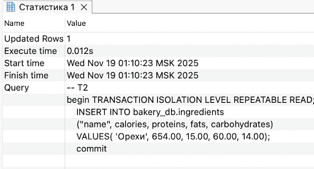
``` sql
-- Т1 продолжаем
	
select * from bakery_db.ingredients where calories > 500;
```
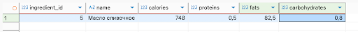
Получаем тот же результат, хоть и при выполнении в другой консоли получим: 

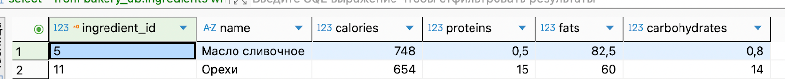

### SERIALIZABLE:
#### Конфликт: две транзакции вставляют одинаковые данные.
13)
``` sql
-- в Т1
BEGIN TRANSACTION ISOLATION LEVEL SERIALIZABLE;

INSERT INTO bakery_db.clients (phone_number, birth_date, last_name, first_name, middle_name)
VALUES ('79990001234', '2000-01-01', 'Новиков', 'Александр', 'Петрович');
```
``` sql
--в Т2 выполняем тот же запрос, но комитим
BEGIN TRANSACTION ISOLATION LEVEL SERIALIZABLE;

INSERT INTO bakery_db.clients (phone_number, birth_date, last_name, first_name, middle_name)
VALUES ('79990001234', '2000-01-01', 'Новиков', 'Александр', 'Петрович');
COMMIT;
```

Но Т2 ждет пока завершится Т1
``` sql
--выполняем в Т1 
COMMIT;
```


А в Т2 получаем ошибку:

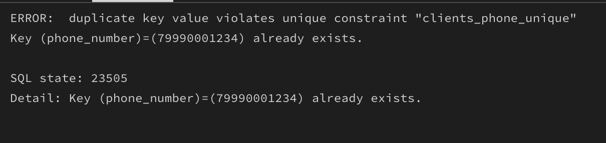

#### Ловим ошибку could not serialize access due to concurrent update и повторяем транзакцию.
14)
``` sql
--выполняем в первой консоли Т1
BEGIN TRANSACTION ISOLATION LEVEL SERIALIZABLE;
SELECT ingredient_id, name, calories
FROM bakery_db.ingredients
WHERE ingredient_id = 1;
```
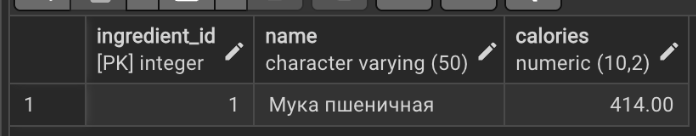

``` sql
--во второй консоли Т2 тот же запрос
BEGIN TRANSACTION ISOLATION LEVEL SERIALIZABLE;
SELECT ingredient_id, name, calories
FROM bakery_db.ingredients
WHERE ingredient_id = 1;
```

```sql
--продолжаем в Т2
UPDATE bakery_db.ingredients
SET calories = calories + 5
WHERE ingredient_id = 1;
COMMIT; 
```
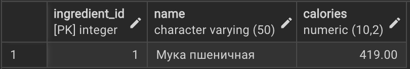
``` sql
--в Т1
UPDATE bakery_db.ingredients
SET calories = calories + 10
WHERE ingredient_id = 1;
```
и получаем на выводе ошибку:

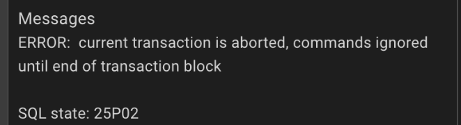

``` sql
--в Т1 обнуляем сломанную транзакцию
​​ROLLBACK;
--и пробуем еще раз
BEGIN TRANSACTION ISOLATION LEVEL SERIALIZABLE;

UPDATE bakery_db.ingredients
SET calories = calories + 10
WHERE ingredient_id = 1;

COMMIT;
```
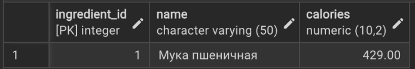

### SAVEPOINT

15) #### Создаём транзакцию с несколькими изменениями и точкой сохранения.
``` sql
--смотрим исходное состояние:
SELECT ingredient_id, name, calories
FROM bakery_db.ingredients
WHERE ingredient_id IN (1, 2, 3);
```
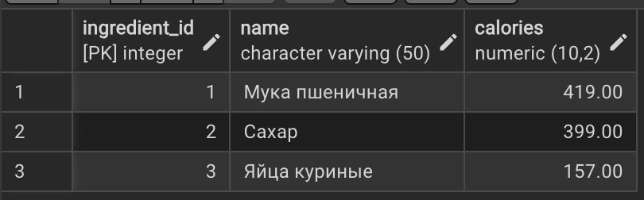

``` sql
BEGIN;

--Изменения, которые должны остаться
UPDATE bakery_db.ingredients
SET calories = calories + 10
WHERE ingredient_id = 1;

UPDATE bakery_db.ingredients
SET calories = calories + 20
WHERE ingredient_id = 2;

--Точка сохранения
SAVEPOINT sp_before_bad;

--Плохое изменение, которое отменим
UPDATE bakery_db.ingredients
SET calories = 9999
WHERE ingredient_id = 3;
```


``` sql
--Откат только части после SAVEPOINT,id=3 вернётся как был
ROLLBACK TO SAVEPOINT sp_before_bad;
COMMIT;
```
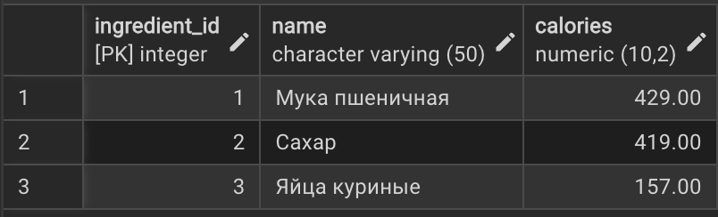

16) #### Добавляем два SAVEPOINT, пробуем вернуть на первый и второй.

``` sql
--исходные адреса:
SELECT bakery_id, name, address
FROM bakery_db.bakeries
WHERE bakery_id IN (1, 2);
```


``` sql
--Шаг 1: меняем пекарню 1
BEGIN;
UPDATE bakery_db.bakeries
SET address = address || ' (шаг1)'
WHERE bakery_id = 1;
```
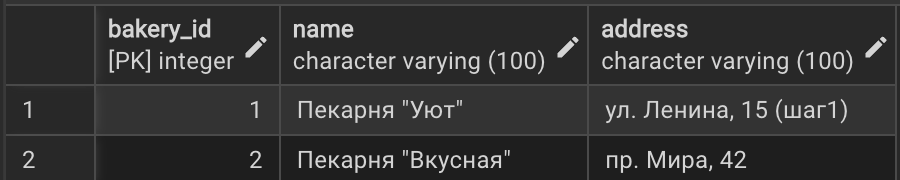

``` sql
SAVEPOINT s1;
-- Шаг 2: меняем пекарню 2
UPDATE bakery_db.bakeries
SET address = address || ' (шаг2)'
WHERE bakery_id = 2;
```

``` sql
SAVEPOINT s2;
-- Шаг 3: ещё один апдейт пекарни 1
UPDATE bakery_db.bakeries
SET address = address || ' (шаг3)'
WHERE bakery_id = 1;
```

``` sql
ROLLBACK TO SAVEPOINT s2;
```
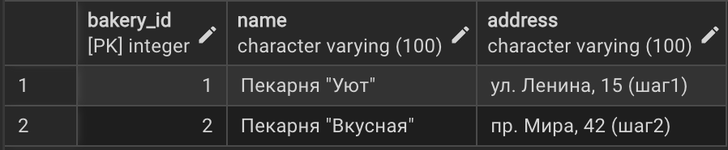
``` sql
ROLLBACK TO SAVEPOINT s1;
```

``` sql
ROLLBACK;
```
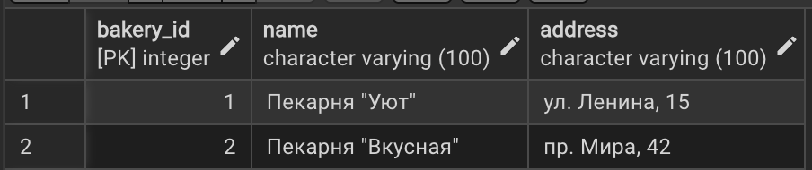

### EXCEPTION
17) #### Обработка исключения, если данных нет
``` sql
DO $$
DECLARE
    v_recipe_id INT := 999;
    v_description TEXT;
BEGIN
    SELECT description INTO STRICT v_description
    FROM bakery_db.recipes
    WHERE recipe_id = v_recipe_id;

    RAISE NOTICE 'Рецепт найден: %', v_description;

EXCEPTION
    WHEN NO_DATA_FOUND THEN
        RAISE NOTICE 'Рецепт с ID=% не существует.', v_recipe_id;
    WHEN OTHERS THEN
        RAISE NOTICE 'Неизвестная ошибка при поиске рецепта ID=%: %', v_recipe_id, SQLERRM;
END $$ LANGUAGE plpgsql;

```
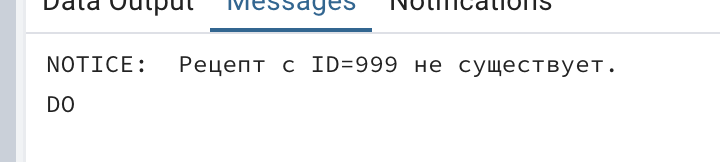
18)
``` sql
DO $$
BEGIN
    INSERT INTO bakery_db.orders (client_id, bakery_id, type_of_order)
    VALUES (999999, 1, 'Самовывоз');

EXCEPTION
    WHEN foreign_key_violation THEN
        RAISE NOTICE 'Клиент с ID=999999 не существует — заказ не создан.';
    WHEN others THEN 
        RAISE NOTICE 'Неизвестная ошибка при создании заказа.';
END $$ LANGUAGE plpgsql;

```
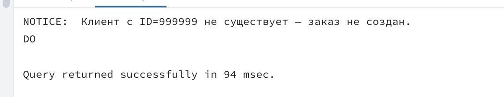

```sql
--Пытаемся добавить заказ на несуществующее изделие (например, baking_id = 999)

DO $$
BEGIN
    INSERT INTO bakery_db.order_baking_goods (order_id, baking_id, quantity, unit_id)
    VALUES (1, 999, 2, 3);  
EXCEPTION
    WHEN foreign_key_violation THEN
        RAISE NOTICE 'Ошибка: хлебобулочное изделие с ID=999 не найдено в каталоге.';
    WHEN OTHERS THEN
        RAISE NOTICE 'Произошла неожиданная ошибка при добавлении позиции в заказ.';
END $$ LANGUAGE plpgsql;
```


### RAISE
19) #### Выводим количество курьеров и клиентов в системе
``` sql
DO $$
DECLARE
    client_count INT;
    courier_count INT;
BEGIN
    SELECT COUNT(*) INTO client_count FROM bakery_db.clients;
    SELECT COUNT(*) INTO courier_count FROM bakery_db.couriers;

    RAISE NOTICE 'В базе данных % клиентов и % курьеров.', client_count, courier_count;
END $$ LANGUAGE plpgsql;
```
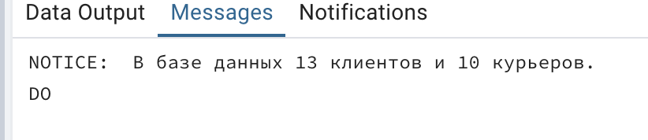

20)
``` sql
DO $$
DECLARE
    v_courier_id INT := 999;
    v_new_phone VARCHAR(11) := '79991234567';
    affected_rows INT;
BEGIN
    UPDATE bakery_db.couriers
    SET phone_number = v_new_phone
    WHERE courier_id = v_courier_id;

    GET DIAGNOSTICS affected_rows = ROW_COUNT;

    IF affected_rows = 0 THEN
        RAISE EXCEPTION 'Курьер с ID=% не найден. Обновление невозможно.', v_courier_id;
    END IF;

    RAISE NOTICE 'Телефон курьера % успешно обновлён.', v_courier_id;

EXCEPTION
    WHEN OTHERS THEN
        RAISE NOTICE 'Не удалось обновить данные курьера с ID=%.', v_courier_id;
END $$ LANGUAGE plpgsql;
```
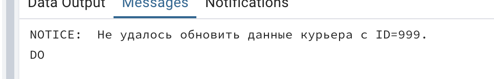