# Триггеры и кроны

## Триггеры

### NEW
1)  Проверка на кбжу ингредиента > 0  при insert
 ```sql
-- функция
CREATE OR REPLACE FUNCTION check_valid_ingredient()
RETURNS TRIGGER AS $$
BEGIN

	IF NEW.carbohydrates < 0 or NEW.calories < 0 or NEW.fats < 0 or NEW.proteins < 0 THEN
	RAISE EXCEPTION 'Кбжу ингредиента не может быть отрицательным.';
	END IF;
	
	RETURN NEW;
END;
$$ LANGUAGE plpgsql;

-- триггер
CREATE TRIGGER before_insert_ingredient
BEFORE INSERT ON bakery_db.ingredients
FOR EACH ROW
EXECUTE FUNCTION check_valid_ingredient();
```
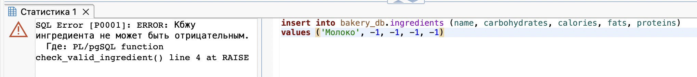

2) Проверка на цену изделия при update
 ```sql
-- функция
CREATE OR REPLACE FUNCTION check_valid_price()
RETURNS TRIGGER AS $$
BEGIN

	IF NEW.price < 0 or NEW.price > 50000 THEN
	RAISE EXCEPTION 'Цена продукта неверна.';
	END IF;
	
	RETURN NEW;
END;
$$ LANGUAGE plpgsql;

-- триггер
CREATE TRIGGER before_update_baking_goods
BEFORE UPDATE ON bakery_db.baking_goods
FOR EACH ROW
EXECUTE FUNCTION check_valid_price();

```
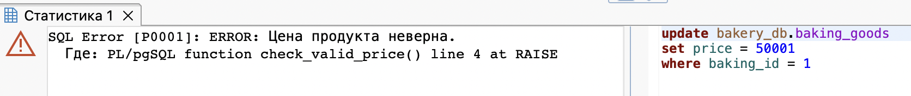
### OLD

3) Сохранение изменения цены выпечки в таблице price_history
 ```sql
-- создание таблицы
CREATE TABLE IF NOT EXISTS bakery_db.price_history (
    log_id SERIAL PRIMARY KEY,
    baking_id INT,
    old_price INT,
    new_price INT
);

-- функция
CREATE OR REPLACE FUNCTION bakery_db.log_price_change()
RETURNS TRIGGER AS $$
BEGIN
    INSERT INTO bakery_db.price_history (baking_id, old_price, new_price)
    VALUES (OLD.baking_id, OLD.price, NEW.price);
    
    RETURN NEW;
END;
$$ LANGUAGE plpgsql;

-- триггер
CREATE TRIGGER trigger_log_price_change
AFTER UPDATE ON bakery_db.baking_goods
FOR EACH ROW
WHEN (OLD.price IS DISTINCT FROM NEW.price)
EXECUTE FUNCTION bakery_db.log_price_change();

-- запрос 
update bakery_db.baking_goods
set price = 50
where baking_id = 1;
```
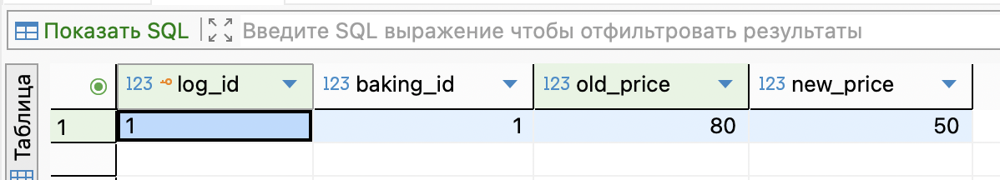

4) Сохранение удаленных заказов в таблице deleted_orders
 ```sql
-- создание таблицы
CREATE TABLE IF NOT EXISTS bakery_db.deleted_orders (
    archive_id SERIAL PRIMARY KEY,
    order_id INT,
    client_id INT,
    bakery_id INT,
    type_of_order VARCHAR(50),
    deleted_at TIMESTAMP DEFAULT NOW()
);

-- функция
CREATE OR REPLACE FUNCTION bakery_db.archive_deleted_order()
RETURNS TRIGGER AS $$
BEGIN
    INSERT INTO bakery_db.deleted_orders (order_id, client_id, bakery_id, type_of_order)
    VALUES (OLD.order_id, OLD.client_id, OLD.bakery_id, OLD.type_of_order);
    
    RETURN OLD;
END;
$$ LANGUAGE plpgsql;

-- триггер
CREATE TRIGGER trigger_archive_order
AFTER DELETE ON bakery_db.orders
FOR EACH ROW
EXECUTE FUNCTION bakery_db.archive_deleted_order();

delete from bakery_db.orders where order_id = 5; 
```
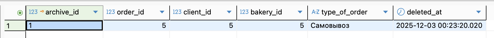

### BEFORE

5) Валидация номера телефона - начинается с 7 и состоит из 11 цифр
 ```sql
-- функция
CREATE OR REPLACE FUNCTION bakery_db.validate_worker_phone()
RETURNS TRIGGER AS $$
BEGIN

    IF NEW.phone_number !~ '^7[0-9]{10}$' THEN
        RAISE EXCEPTION 'Неверный формат телефона: %. Ожидается формат: 7XXXXXXXXXX', NEW.phone_number;
    END IF;
    RETURN NEW;
    
END;
$$ LANGUAGE plpgsql;

-- триггер
CREATE TRIGGER trigger_validate_phone
BEFORE INSERT OR UPDATE ON bakery_db.workers
FOR EACH ROW
EXECUTE FUNCTION bakery_db.validate_worker_phone();
```
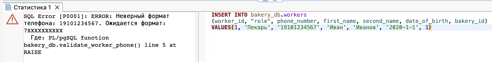

6) Проверка возраста работника - что он совершеннолетний, и его дата рождения не в будущем.
 ```sql
-- функция
CREATE OR REPLACE FUNCTION bakery_db.check_worker_age()
RETURNS TRIGGER AS $$
BEGIN
    IF NEW.date_of_birth > CURRENT_DATE THEN
        RAISE EXCEPTION 'Дата рождения не может быть в будущем! (%s)', NEW.date_of_birth;
    END IF;

    IF NEW.date_of_birth > (CURRENT_DATE - INTERVAL '18 years') THEN
        RAISE EXCEPTION 'Сотрудник слишком молод. Минимальный возраст - 18 лет. (Дата рождения: %)', NEW.date_of_birth;
    END IF;

    RETURN NEW;
END;
$$ LANGUAGE plpgsql;

-- триггер
CREATE TRIGGER trigger_check_worker_age
BEFORE INSERT OR UPDATE ON bakery_db.workers
FOR EACH ROW
EXECUTE FUNCTION bakery_db.check_worker_age();

```
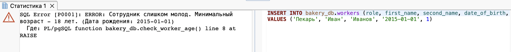

### AFTER

7) Логирование изменения адресов пекарен
 ``` sql
 --функция
CREATE OR REPLACE FUNCTION log_address_changes()
RETURNS TRIGGER AS $$
BEGIN
    RAISE NOTICE 'Операция: %', TG_OP;
    
    IF TG_OP = 'INSERT' THEN
        RAISE NOTICE 'Добавлена новая пекарня. ID: %, Адрес: %', 
                     NEW.id, NEW.address;
    ELSIF TG_OP = 'UPDATE' THEN
        RAISE NOTICE 'Изменена пекарня ID: %', NEW.id;
        RAISE NOTICE 'Старый адрес: %', OLD.address;
        RAISE NOTICE 'Новый адрес: %', NEW.address;
    ELSIF TG_OP = 'DELETE' THEN
        RAISE NOTICE 'Удалена пекарня ID: %, Адрес: %', 
                     OLD.id, OLD.address;
    END IF;
    
    RETURN NULL;
END;
$$ LANGUAGE plpgsql;

--триггер
CREATE TRIGGER after_bakery_address_change
AFTER INSERT OR UPDATE OR DELETE ON bakery_db.bakeries
FOR EACH ROW EXECUTE FUNCTION log_address_changes();

--запрос
UPDATE bakery_db.bakeries
SET address = 'проспект Беляева, 15'
WHERE bakery_id = 31;
```
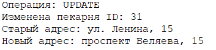

8) Логирование новых заказов
 ```sql
 --функция
CREATE OR REPLACE FUNCTION log_order_changes()
RETURNS TRIGGER AS $$
BEGIN
    RAISE NOTICE 'Операция: %', TG_OP;
    
    IF TG_OP = 'INSERT' THEN
        RAISE NOTICE 'Добавлен новый заказ: ID клиента: %, ID пекарни: %, Тип заказа: %', NEW.client_id, NEW.bakery_id, NEW.type_of_order;
    ELSIF TG_OP = 'UPDATE' THEN
        RAISE NOTICE 'Изменён заказ ID: %', NEW.order_id;
        RAISE NOTICE 'Старый заказ: ID клиента: %, ID пекарни: %, Тип заказа: %', OLD.client_id, OLD.bakery_id, OLD.type_of_order;
        RAISE NOTICE 'Новый заказ: ID клиента: %, ID пекарни: %, Тип заказа: %', NEW.client_id, NEW.bakery_id, NEW.type_of_order;
    ELSIF TG_OP = 'DELETE' THEN
        RAISE NOTICE 'Удален заказ ID: %', 
                     OLD.order_id;
    END IF;
    
    RETURN NULL;
END;
$$ LANGUAGE plpgsql;

--триггер
CREATE TRIGGER after_order_change
AFTER INSERT OR UPDATE OR DELETE ON bakery_db.orders
FOR EACH ROW EXECUTE FUNCTION log_order_changes();

--запрос
insert into bakery_db.orders(client_id, bakery_id, type_of_order)
values (1, 31, 'Самовывоз')

```
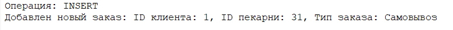

### ROW-LEVEL
9) Логирование добавления сотрудника
 ```sql
 --функция
CREATE OR REPLACE FUNCTION log_worker_insert()
RETURNS TRIGGER AS $$
BEGIN
    RAISE NOTICE 'Операция: %', TG_OP;
    
    IF TG_OP = 'INSERT' THEN
        RAISE NOTICE 'К нам присоединился новый сотрудник: %', NEW.first_name;
    END IF;
    
    RETURN NULL;
END;
$$ LANGUAGE plpgsql;

--триггер
CREATE TRIGGER after_worker_insert
AFTER INSERT  ON bakery_db.workers
FOR EACH ROW EXECUTE FUNCTION log_worker_insert();

--запрос
INSERT INTO bakery_db.workers (
    bakery_id,
    role,
    phone_number,
    first_name,
    second_name,
    date_of_birth
) VALUES (
    31,
    'Помощник пекаря',
    '7(916)5556677',
    'Алексей',
    'Смирнов',
    '1998-02-14'
);
```
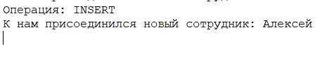

10) Логирование изменения цены
 ```sql
 --функция
CREATE OR REPLACE FUNCTION log_price_update()
RETURNS TRIGGER AS $$
BEGIN
    RAISE NOTICE 'Операция: %', TG_OP;
    
    IF OLD.price IS DISTINCT FROM NEW.price THEN
        RAISE NOTICE 'Изменение в цене продукта "%". Старая цена: %, Новая цена: %, ID: %', NEW.name, OLD.price, NEW.price, NEW.baking_id;
    END IF;
    
    RETURN NULL;
END;
$$ LANGUAGE plpgsql;

--триггер
CREATE TRIGGER after_baking_price_changed
AFTER update ON bakery_db.baking_goods
FOR EACH ROW EXECUTE FUNCTION log_price_update();

--запрос
UPDATE bakery_db.baking_goods
SET price = 100
WHERE baking_id = 1;
```


### Statement level
11) Считает количество сотрудников после изменения 
 ```sql
--функция
CREATE OR REPLACE FUNCTION update_row_counter()
RETURNS TRIGGER AS $$
DECLARE
    new_count INTEGER;
BEGIN
   
    EXECUTE format('SELECT COUNT(*) FROM %I', TG_TABLE_NAME)
    INTO new_count;
    
    RAISE NOTICE 'В таблице % теперь % строк', TG_TABLE_NAME, new_count;
    
    RETURN NULL;
END;
$$ LANGUAGE plpgsql;

--триггер
CREATE TRIGGER count_workers
AFTER INSERT OR UPDATE OR DELETE ON bakery_db.workers
FOR EACH STATEMENT EXECUTE FUNCTION update_row_counter();

--запрос
INSERT INTO bakery_db.workers (
    bakery_id,
    role,
    phone_number,
    first_name,
    second_name,
    date_of_birth
) VALUES (
    32,
    'Пекарь',
    '7(916)5556668',
    'Василий',
    'Галимов',
    '1998-10-24'
);
```
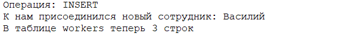

12) Создаём бэкап перед удалением
 ```sql
--функция
CREATE OR REPLACE FUNCTION quick_backup()
RETURNS TRIGGER AS $$
BEGIN
    RAISE NOTICE 'Триггер сработал на DELETE!';
    
    -- Создаем бэкапную таблицу
    CREATE TABLE IF NOT EXISTS workers_deleted_backup AS
    SELECT *, NOW() as deleted_at 
    FROM bakery_db.workers;
    
    RAISE NOTICE 'Бэкап создан: workers_deleted_backup';
    
    RETURN OLD;
END;
$$ LANGUAGE plpgsql;

--триггер
CREATE TRIGGER quick_backup_trigger
BEFORE DELETE ON bakery_db.workers
FOR EACH STATEMENT EXECUTE FUNCTION quick_backup();

--запрос
DELETE FROM bakery_db.workers WHERE bakery_id = 31;
```
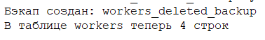

### Список триггеров
13)
 ```
SELECT *
FROM information_schema.triggers;
```
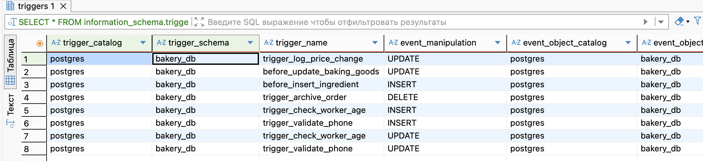


### Кроны
14) Чистка старых удалённых заказов
 ```
CREATE EXTENSION IF NOT EXISTS pg_cron;

-- задача: каждый день в 03:00 удалять из архива заказов записи старше 30 дней
SELECT cron.schedule(
    'cleanup_deleted_orders',          
    '0 3 * * *',                      
    $$
    DELETE FROM bakery_db.deleted_orders
    WHERE deleted_at < now() - interval '30 days';
    $$
);
```


15) Автоматически повышаем «Пекаря» до «Старшего пекаря» по возрасту
 ```
SELECT cron.schedule(
    'promote_senior_bakers',           
    '30 0 * * *',                     
    $$
    UPDATE bakery_db.workers
    SET role = 'Старший пекарь'
    WHERE date_of_birth < current_date - INTERVAL '50 years'
      AND role = 'Пекарь';
    $$
);

```


16) Ночная индексация цен
 ```
-- каждый день в 01:00 увеличиваем цены на 5%
SELECT cron.schedule(
    'nightly_increase_baking_prices',
    '0 1 * * *',
    $$
    UPDATE bakery_db.baking_goods
    SET price = round(price * 1.05); 
    $$
);
```


### Запрос на просмотр выполнения кронов
17)
 ```
SELECT
    jobid,
    jobname,
    status,
    run_start,
    run_end,
    return_message
FROM cron.job_run_details
ORDER BY run_start DESC
LIMIT 50;

```


### Запрос на просмотр списка кронов
18)
 ```
SELECT
    jobid,
    jobname,
    schedule,
    command,
    active
FROM cron.job
ORDER BY jobid;

```

