# GIN & GIST индексы
## Создание GIST
```postgresql
-- 1. GiST на диапазоне дат (delivery_area)
CREATE INDEX idx_bakeries_delivery_area_gist ON bakery_db.bakeries USING GIST (delivery_area);

-- 2. GiST на геометрических точках (coordinates)
CREATE INDEX idx_bakeries_coordinates_gist ON bakery_db.bakeries USING GIST (coordinates);

-- 3. GiST на временном диапазоне (delivery_time_range)
CREATE INDEX idx_orders_delivery_time_gist ON bakery_db.orders USING GIST (delivery_time_range);

-- 4. GiST на рабочем графике (work_schedule)
CREATE INDEX idx_workers_schedule_gist ON bakery_db.workers USING GIST (work_schedule);

-- 5. GiST для полнотекстового поиска (альтернатива GIN)
CREATE INDEX idx_recipes_search_gist ON bakery_db.recipes USING GIST (search_vector);

```
## Запросы с использованием GiST индексов
### Запрос 1: Поиск пересекающихся диапазонов (оператор &&)

```postgresql
EXPLAIN (ANALYZE, BUFFERS)
SELECT bakery_id, name, delivery_area
FROM bakery_db.bakeries
WHERE delivery_area && daterange('2026-03-15', '2026-03-20');
```
Ищет пекарни, работающие в указанный период доставки
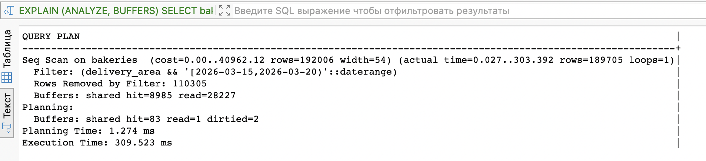

### Запрос 2: Поиск ближайших соседей (оператор <->)

```postgresql
EXPLAIN (ANALYZE, BUFFERS)
SELECT bakery_id, name, coordinates
FROM bakery_db.bakeries
WHERE coordinates IS NOT NULL
ORDER BY coordinates <-> point(55.7963, 49.1086)  -- координаты центра Казани
LIMIT 5;
```
Находит 5 ближайших пекарен к центру Казани

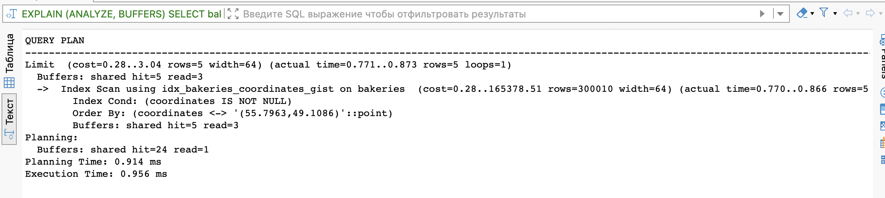

### Запрос 3: Вхождение в диапазон (оператор <@)

```postgresql
EXPLAIN (ANALYZE, BUFFERS)
SELECT order_id, client_id, delivery_time_range
FROM bakery_db.orders
WHERE delivery_time_range <@ tstzrange(
    '2026-03-18 10:00:00+03', 
    '2026-03-18 18:00:00+03'
);
```
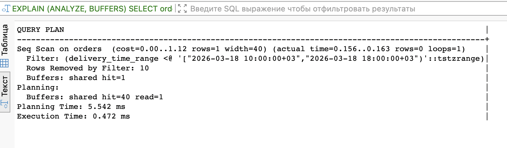

### Запрос 4: Поиск содержащихся диапазонов (оператор <@ для daterange)

```postgresql
EXPLAIN (ANALYZE, BUFFERS)
SELECT worker_id, first_name, second_name, work_schedule
FROM bakery_db.workers
WHERE work_schedule <@ daterange('2026-03-01', '2026-04-01');
```
Находит сотрудников, работающих полностью внутри марта 2026
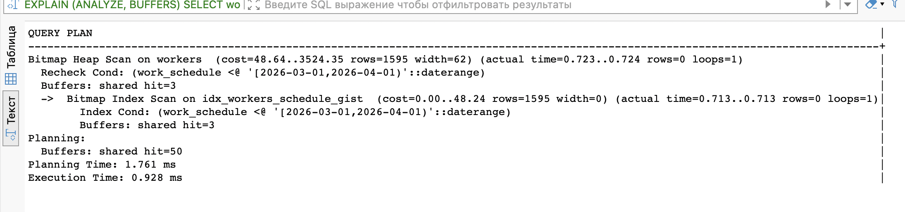

### Запрос 5: Полнотекстовый поиск через GiST (сравнение с GIN)

```postgresql
EXPLAIN (ANALYZE, BUFFERS)
SELECT recipe_id, description
FROM bakery_db.recipes
WHERE search_vector @@ to_tsquery('russian', 'хлеб');
```
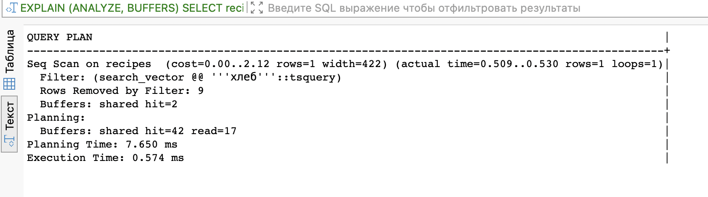
## GIN индексы 
```postgresql
-- 1. GIN на массиве (tags)
CREATE INDEX idx_recipes_tags_gin ON bakery_db.recipes USING GIN (tags);

-- 2. GIN на JSONB (nutrition_info)
CREATE INDEX idx_recipes_nutrition_gin ON bakery_db.recipes USING GIN (nutrition_info);

-- 3. GIN на tsvector (полнотекстовый поиск)
CREATE INDEX idx_recipes_search_gin ON bakery_db.recipes USING GIN (search_vector);

-- 4. GIN на массиве dietary_tags
CREATE INDEX idx_baking_dietary_tags_gin ON bakery_db.baking_goods USING GIN (dietary_tags);

-- 5. GIN на JSONB ingredients
CREATE INDEX idx_ingredients_properties_gin ON bakery_db.ingredients USING GIN (properties);
```

### Запрос 1: Поиск по массиву (оператор && - пересечение)

```sql
EXPLAIN (ANALYZE, BUFFERS)
SELECT recipe_id, description, tags
FROM bakery_db.recipes
WHERE tags && ARRAY['хлеб', 'булка'];
```
Ищет рецепты, содержащие хотя бы один из указанных тегов
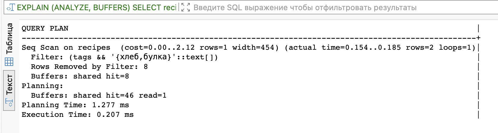

### Запрос 2: Поиск по JSONB (оператор @> - содержит)

```sql
EXPLAIN (ANALYZE, BUFFERS)
SELECT recipe_id, description, nutrition_info
FROM bakery_db.recipes
WHERE nutrition_info @> '{"is_vegan": true}';
```
Находит все веганские рецепты
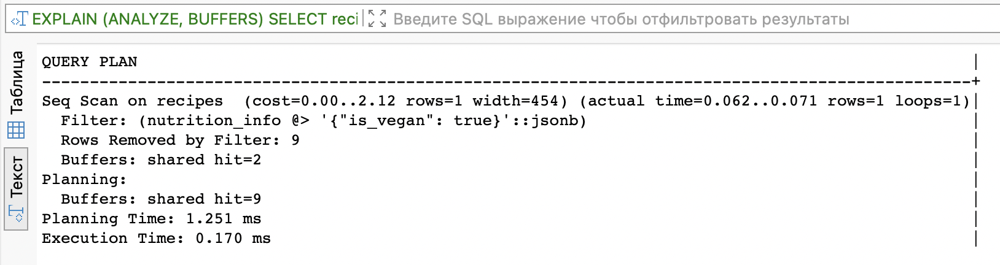

### Запрос 3: Полнотекстовый поиск (оператор @@)

```sql
EXPLAIN (ANALYZE, BUFFERS)
SELECT recipe_id, description
FROM bakery_db.recipes
WHERE search_vector @@ to_tsquery('russian', 'хлеб & ржаной');
```
Ищет рецепты, содержащие слова "хлеб" И "ржаной"
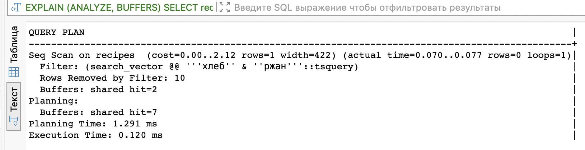

### Запрос 4: Поиск в массиве (оператор @> - содержит массив)

```sql
EXPLAIN (ANALYZE, BUFFERS)
SELECT baking_id, name, dietary_tags
FROM bakery_db.baking_goods
WHERE dietary_tags @> ARRAY['безглютеновый', 'веганский'];
```
Находит выпечку, подходящую для веганов и без глютена
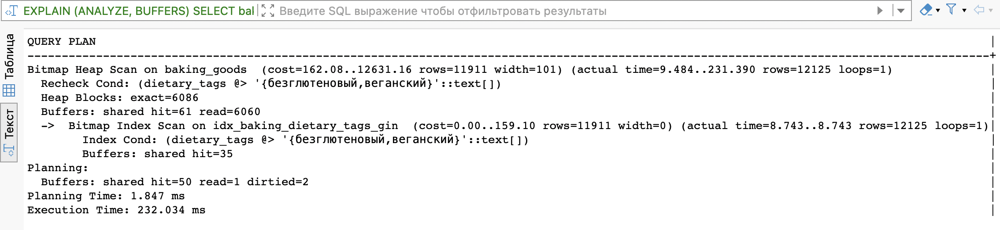

### Запрос 5: JSONB с поиском по ключу (оператор ?)

```sql
EXPLAIN (ANALYZE, BUFFERS)
SELECT ingredient_id, name, properties
FROM bakery_db.ingredients
WHERE properties ? 'allergens';
```
Находит ингредиенты, у которых есть ключ 'allergens' в JSONB
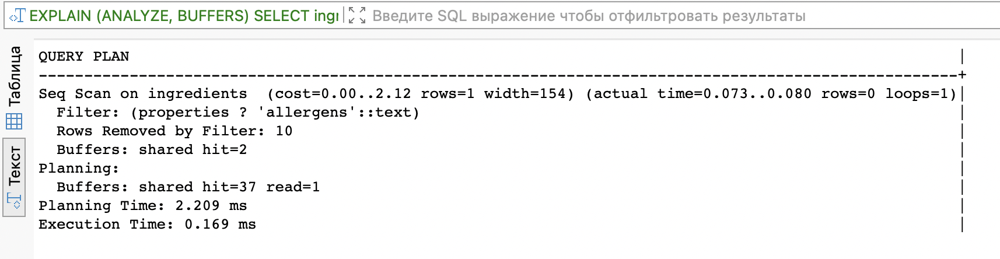

# Join запросы 

## Запрос 1: Работники и их пекарни (INNER JOIN)
```sql
EXPLAIN (ANALYZE, BUFFERS)
SELECT 
    w.first_name,
    w.second_name,
    w.role,
    b.name AS bakery_name,
    b.address
FROM bakery_db.workers w
JOIN bakery_db.bakeries b ON w.bakery_id = b.bakery_id
ORDER BY b.name, w.role;
```
Связь работников с пекарнями, сортировка по пекарне и роли.

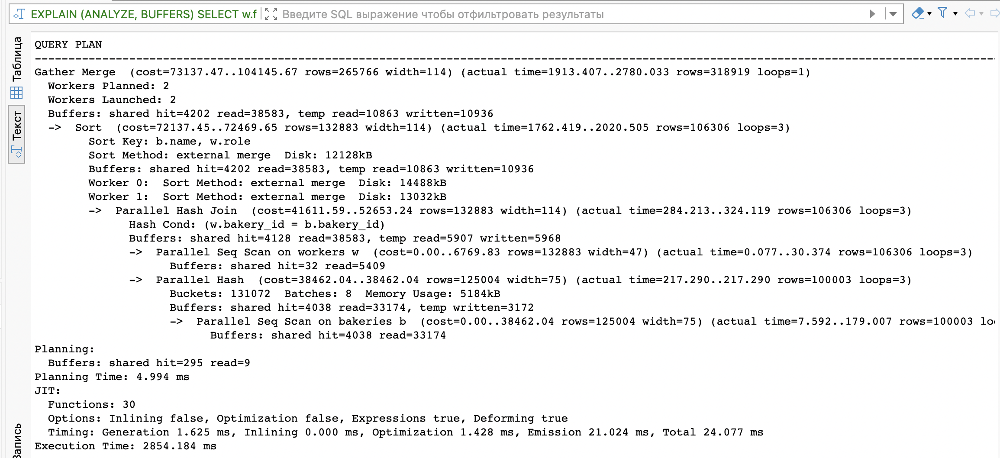

## Запрос 2: Состав заказов (2 JOIN'а)
```sql
EXPLAIN (ANALYZE, BUFFERS)
SELECT 
    o.order_id,
    o.type_of_order,
    bg.name AS product_name,
    obg.quantity,
    u.unit_name
FROM bakery_db.orders o
JOIN bakery_db.order_baking_goods obg ON o.order_id = obg.order_id
JOIN bakery_db.baking_goods bg ON obg.baking_id = bg.baking_id
JOIN bakery_db.units u ON obg.unit_id = u.unit_id
WHERE o.order_id BETWEEN 1 AND 200
ORDER BY o.order_id;
```
Что именно купили в заказах с 1 по 200.
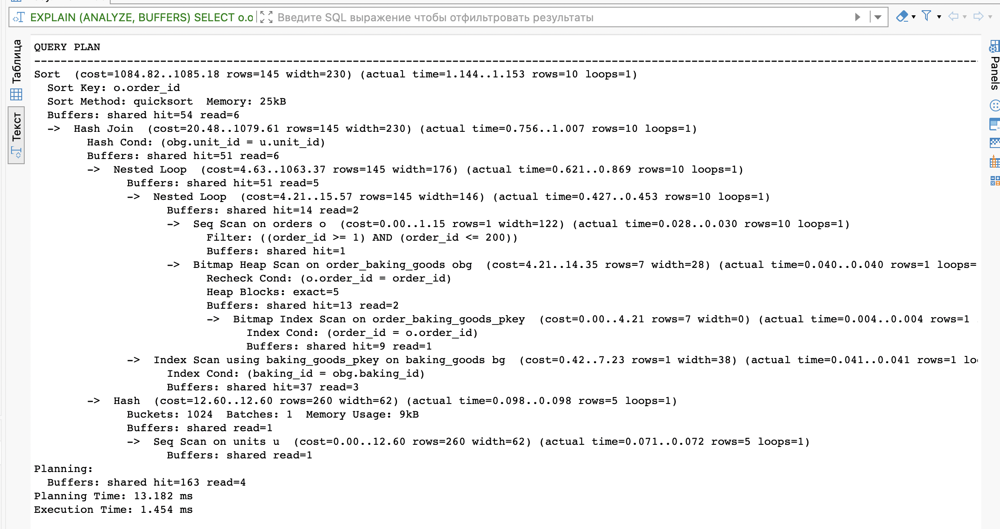

## Запрос 3: Рецепты и их ингредиенты (3 JOIN'а)
```sql
EXPLAIN (ANALYZE, BUFFERS)
SELECT 
    r.description AS recipe_description,
    i.name AS ingredient_name,
    ri.quantity,
    u.unit_name
FROM bakery_db.recipes r
JOIN bakery_db.recipes_ingredients ri ON r.recipe_id = ri.recipe_id
JOIN bakery_db.ingredients i ON ri.ingredient_id = i.ingredient_id
JOIN bakery_db.units u ON ri.unit_id = u.unit_id
WHERE ri.quantity > 100
ORDER BY r.recipe_id, i.name;
```
Рецепты, где ингредиентов больше 100 единиц.
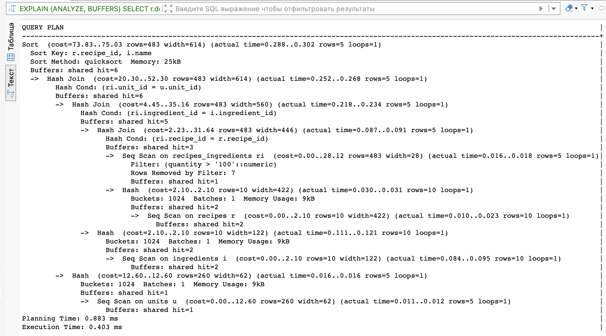

## Запрос 4: Заказы с доставкой (LEFT JOIN)
```sql
EXPLAIN (ANALYZE, BUFFERS)
SELECT 
    o.order_id,
    o.type_of_order,
    d.address AS delivery_address,
    c.last_name AS courier_last_name,
    c.first_name AS courier_first_name
FROM bakery_db.orders o
LEFT JOIN bakery_db.delivery_orders d ON o.order_id = d.order_id
LEFT JOIN bakery_db.couriers c ON d.courier_id = c.courier_id
WHERE o.type_of_order = 'доставка'
ORDER BY o.order_id;
```
Все заказы с доставкой и кто их доставляет (если есть курьер).
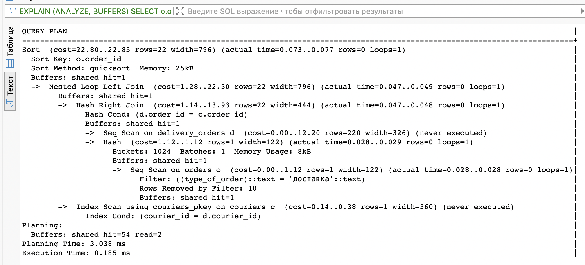

## Запрос 5: Клиенты и их заказы (агрегация)
```sql
EXPLAIN (ANALYZE, BUFFERS)
SELECT 
    cl.last_name || ' ' || cl.first_name AS client_name,
    COUNT(o.order_id) AS orders_count,
    COUNT(DISTINCT o.bakery_id) AS different_bakeries
FROM bakery_db.clients cl
LEFT JOIN bakery_db.orders o ON cl.client_id = o.client_id
GROUP BY cl.client_id, cl.last_name, cl.first_name
HAVING COUNT(o.order_id) > 0
ORDER BY orders_count DESC;
```
Клиенты, у которых есть заказы, и сколько пекарен они посетили.
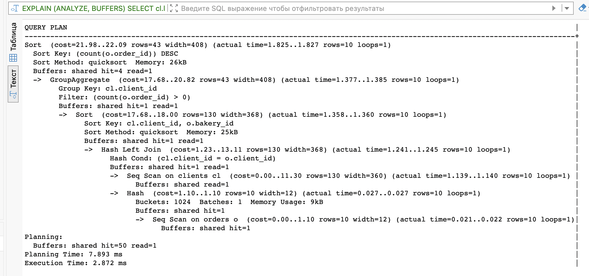

# Графики Grafana

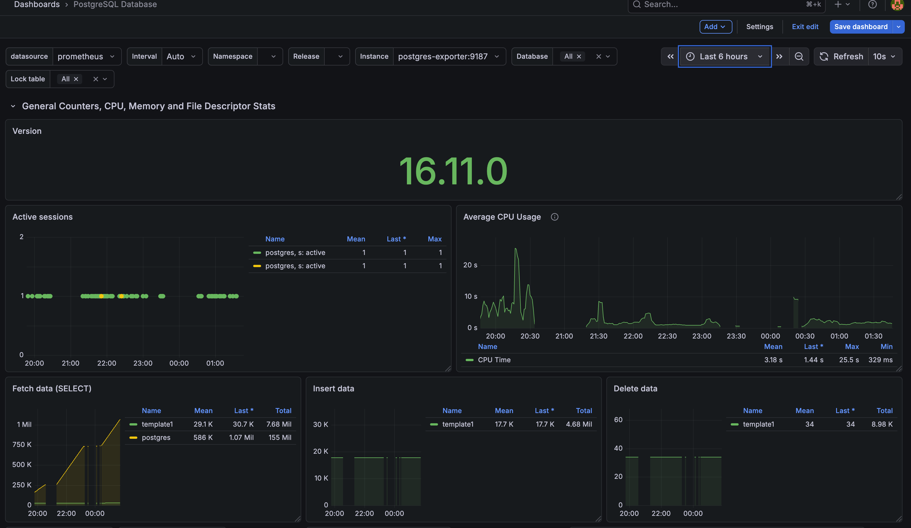