## 1. Пекарни, в которых время открытия раньше 10 утра
### Без индекса
```postgresql
explain (analyse, buffers)
select * from bakery_db.bakeries where opening_time < '10:00:00';
```
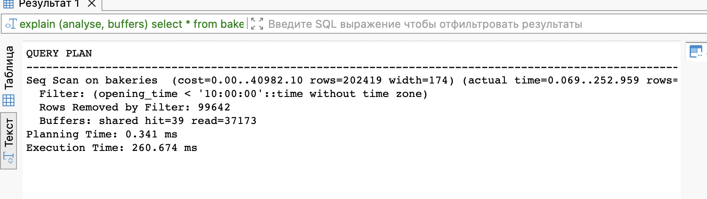

### C B-tree индексом

```postgresql
create index opening_time_index on bakery_db.bakeries(opening_time);
```

```postgresql
explain (analyse, buffers)
select * from bakery_db.bakeries where opening_time < '10:00:00';
```

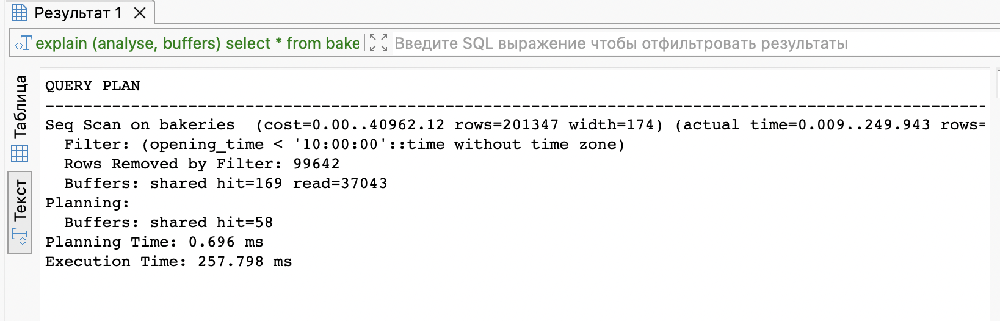

### C Hash индексом

```postgresql
drop index bakery_db.opening_time_index;

create index opening_time_index on bakery_db.bakeries USING HASH (opening_time);
```

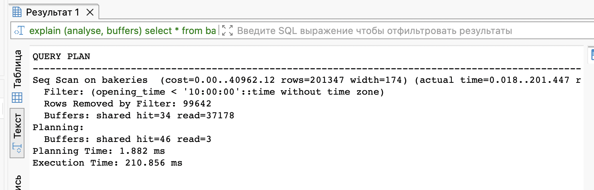


## 2. Обновление фамилии работников
### Без индекса
```postgresql
explain (analyse, buffers)
update bakery_db.workers set second_name = 'Иванов' where second_name = 'Кузнецов'
```
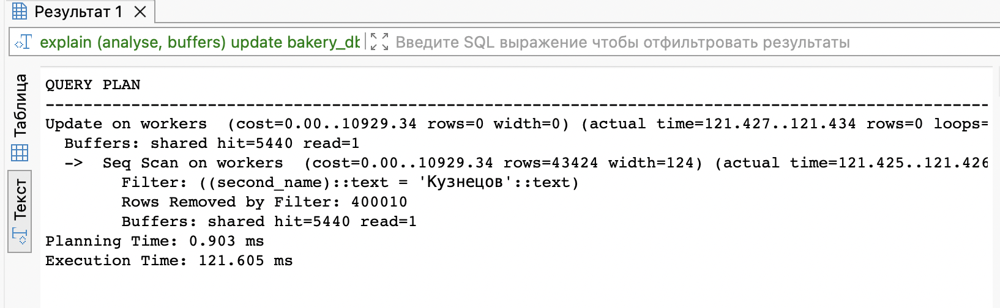

### C B-tree индексом
```postgresql
create index second_name_index on bakery_db.workers(second_name);

explain (analyse, buffers)
update bakery_db.workers set second_name = 'Иванов' where second_name = 'Кузнецов'
```
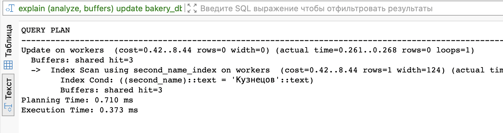

### C Hash индексом

```postgresql
drop index bakery_db.second_name_index;

create index second_name_index on bakery_db.workers using hash(second_name);
```

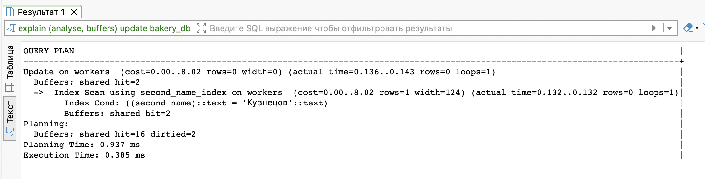

## 3. Поиск пекарни по адресу
### Без индекса
```postgresql
drop index bakery_db.opening_time_index;

explain (analyse, buffers)
select * from bakery_db.bakeries
where address = 'ул. Молодёжная, дом 197';
```
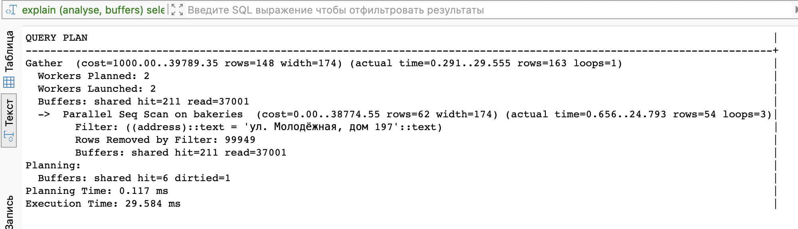

### C B-tree индексом

```postgresql
create index address_index on bakery_db.bakeries(address);
```

```postgresql
explain (analyse, buffers)
select * from bakery_db.bakeries
where address = 'ул. Молодёжная, дом 197';
```

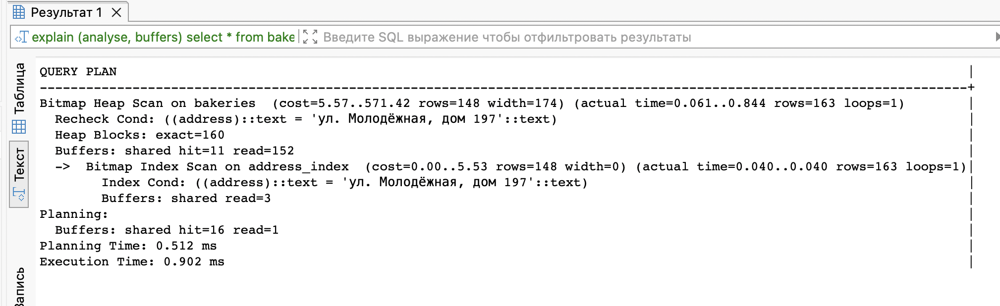

### C Hash индексом

```postgresql
drop index bakery_db.address_index;

create index address_index on bakery_db.bakeries using hash(address);
```

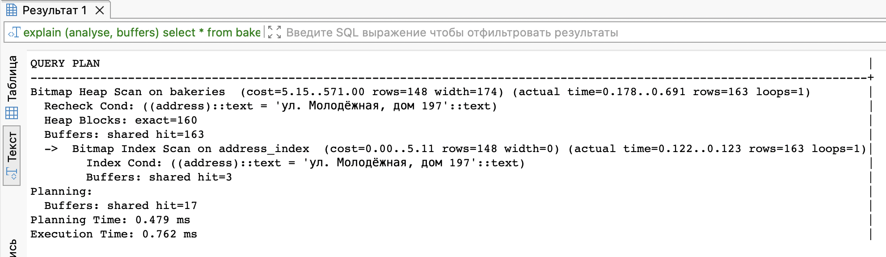

## 4. Увольнение всех уборщиков
### Без индекса
```postgresql
explain (analyse, buffers)
delete from bakery_db.workers
where role = 'Уборщик';
```
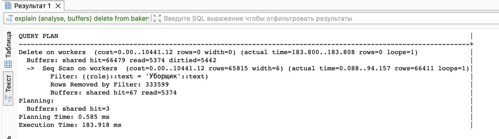

### C B-tree индексом

```postgresql
create index role_index on bakery_db.workers(role);
```

```postgresql
explain (analyse, buffers)
delete from bakery_db.workers
where role = 'Уборщик';
```
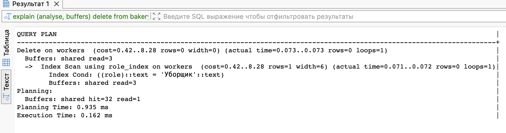

### C Hash индексом

```postgresql
drop index bakery_db.role_index;

create index role_index on bakery_db.workers using hash(role);
```

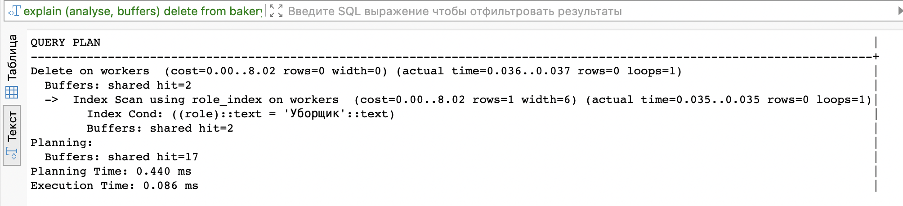

## 5. Поиск всех изюмных кексов
### Без индекса
```postgresql
explain (analyse, buffers)
select * from bakery_db.baking_goods
where name like 'Кекс изюмный #%'
```
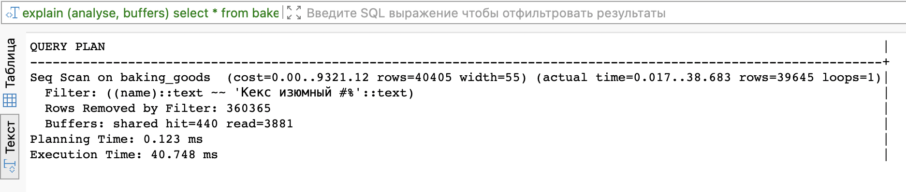

### C B-tree индексом

```postgresql
create index bg_name_index on bakery_db.baking_goods(name);
```

```postgresql
explain (analyse, buffers)
select * from bakery_db.baking_goods
where name like 'Кекс изюмный #%'
```
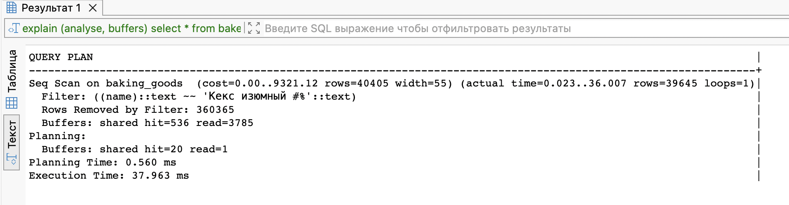

### C Hash индексом

```postgresql
drop index bakery_db.bg_name_index;

create index bg_name_index on bakery_db.baking_goods using hash(name);
```

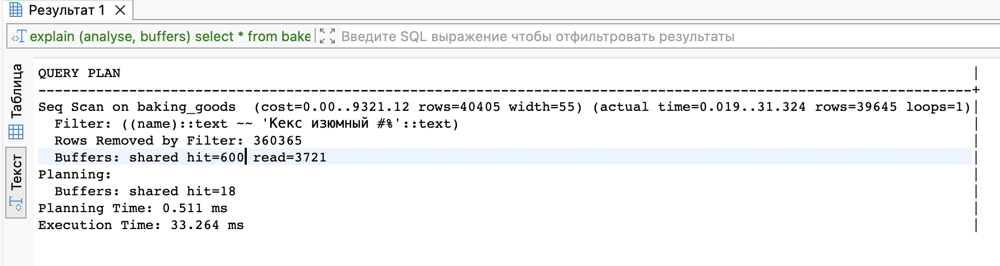

## Составной B-tree индекс
```postgresql
explain (analyse, buffers)
delete from bakery_db.workers
where date_of_birth = '2004-08-12' and phone_number like '%96';
```


```postgresql
drop index bakery_db.role_index;

create index workers_complex_index on bakery_db.workers(phone_number, date_of_birth);

explain (analyse, buffers)
delete from bakery_db.workers
where date_of_birth = '2004-08-12' and phone_number like '%96';

```
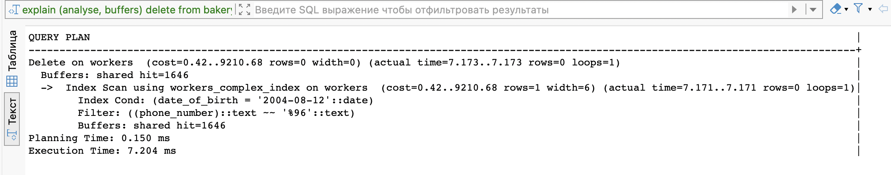


