## Параметры xmin, xmax, ctid, t_infomask
INSERT INTO bakery_db.couriers (phone_number, last_name, first_name) 
VALUES ('79991234567', 'Иванов', 'Иван');

CREATE EXTENSION IF NOT EXISTS pageinspect;

SELECT 
    ctid,                                   -- физический адрес (страница, строка)
    xmin::text::bigint as xmin,            -- ID создавшей транзакции
    xmax::text::bigint as xmax,            -- ID удалившей (0 = живая)
    last_name
FROM bakery_db.couriers;

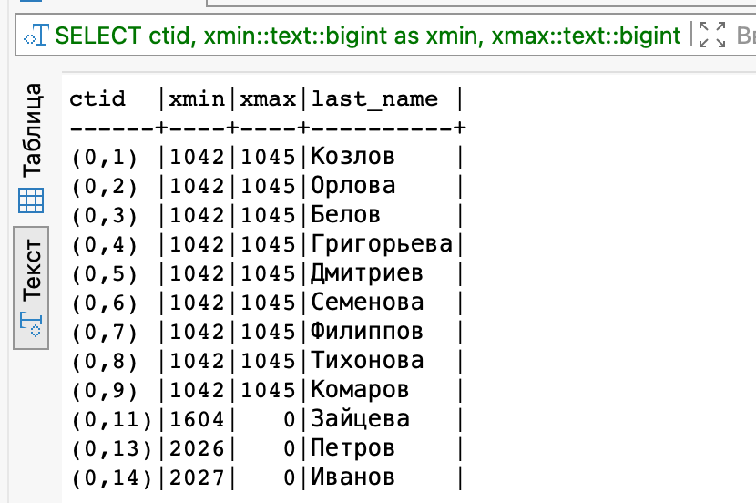

2. Делаем UPDATE
sql
BEGIN;
UPDATE bakery_db.couriers SET last_name = 'Петров' WHERE last_name = 'Иванов';

SELECT 
    ctid,
    xmin::text::bigint as xmin,
    xmax::text::bigint as xmax,
    last_name
FROM bakery_db.couriers;
COMMIT;

Старая версия: xmax = ID транзакции (помечена как удаленная)
Новая версия: xmin = тот же XID, ctid новый

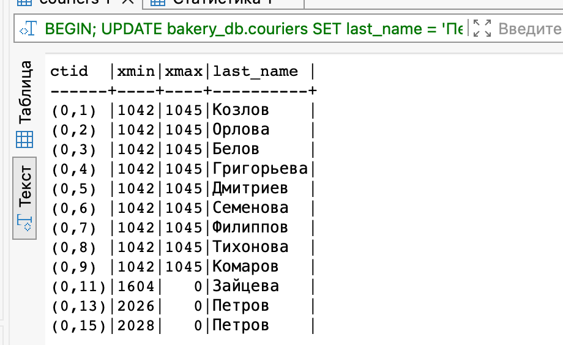

-- Смотрим все версии строк на странице
SELECT 
    lp as номер_строки,
    t_xmin as создатель,
    t_xmax as удалитель,
    t_ctid as ссылка_на_новую,
    t_infomask
FROM heap_page_items(get_raw_page('bakery_db.couriers', 0));

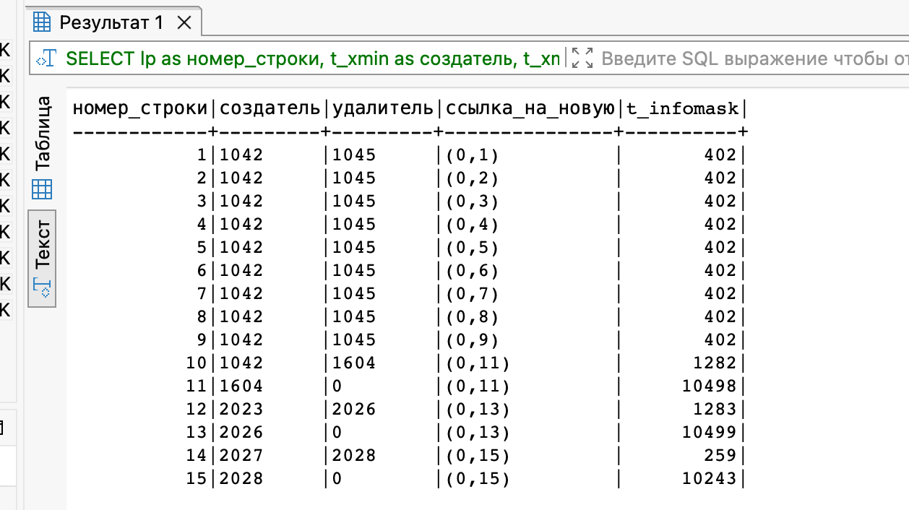

t_infomask — битовая маска с флагами состояния строки:

Флаг	Значение
0200	HEAP_UPDATED — строка была обновлена
0010	HEAP_XMIN_INVALID — xmin недействителен
0020	HEAP_XMAX_COMMITTED — xmax закоммичен
0800	HEAP_XMIN_COMMITTED — xmin закоммичен

## Параметры в разных транзакциях

### 1: READ COMMITTED (по умолчанию)

Терминал 1 (обновляем)

BEGIN;
-- Смотрим текущее состояние
SELECT 'T1: до UPDATE' as этап, ctid, xmin, xmax, last_name FROM bakery_db.couriers;

-- Обновляем
UPDATE bakery_db.couriers SET last_name = 'Петров' WHERE last_name = 'Иванов';

-- Смотрим после UPDATE
SELECT 'T1: после UPDATE' as этап, ctid, xmin, xmax, last_name FROM bakery_db.couriers;

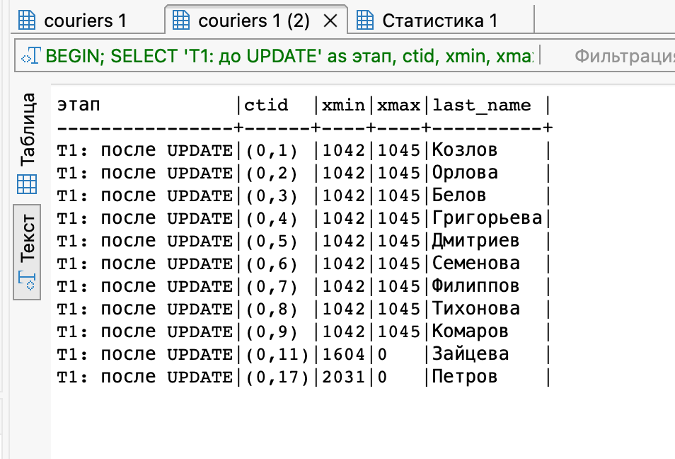
Терминал 2 (читаем)

BEGIN;
SELECT 'T2: чтение' as этап, ctid, xmin, xmax, last_name FROM bakery_db.couriers;
COMMIT;
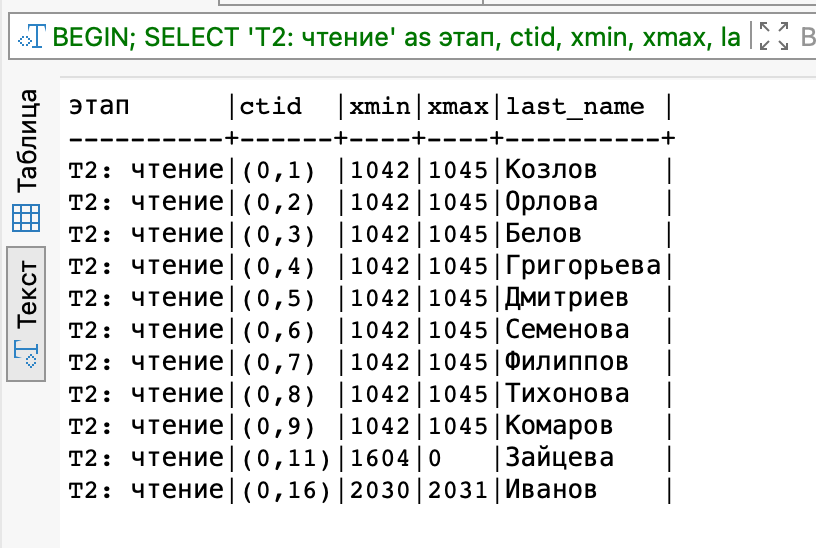

Терминал 1 (завершаем)
COMMIT;

Терминал 2 

BEGIN;
SELECT 'T2: после COMMIT T1' as этап, ctid, xmin, xmax, last_name FROM bakery_db.couriers;
COMMIT;
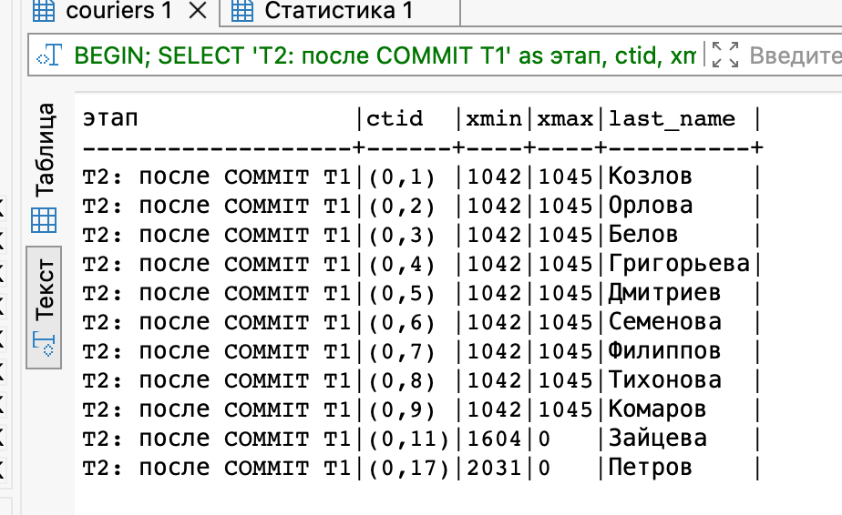
Результат:

T2 не видит изменений до COMMIT в T1
T2 видит изменения после COMMIT в T1

### 2: REPEATABLE READ (снапшот фиксирован)
Терминал 1 (обновляем)
BEGIN TRANSACTION ISOLATION LEVEL REPEATABLE READ;
SELECT 'T1: начало' as этап, ctid, xmin, xmax, last_name FROM bakery_db.couriers;
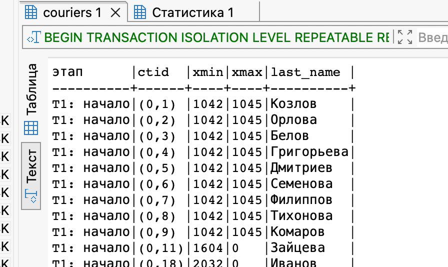

Терминал 2 (обновляем и коммитим)
BEGIN;
UPDATE bakery_db.couriers SET last_name = 'Сидоров' WHERE last_name = 'Иванов';
SELECT 'T2: после UPDATE' as этап, ctid, xmin, xmax, last_name FROM bakery_db.couriers;
COMMIT;
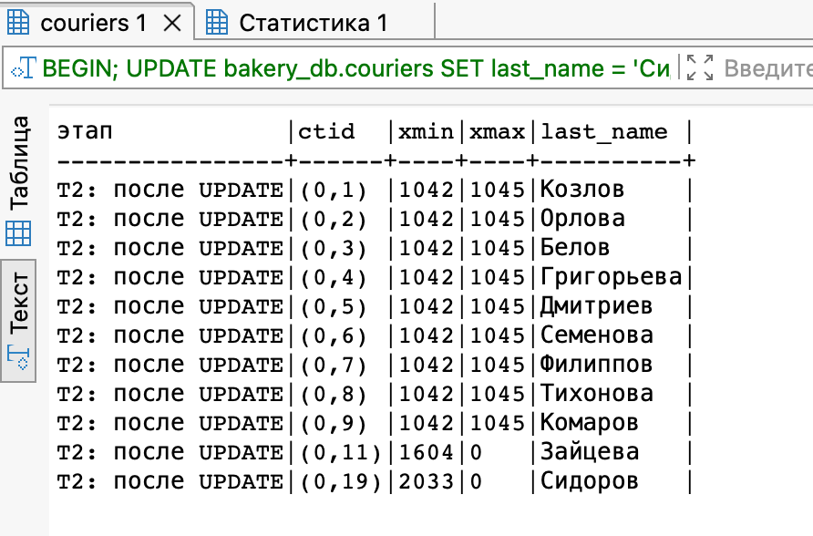

Терминал 1 
SELECT 'T1: после COMMIT T2' as этап, ctid, xmin, xmax, last_name FROM bakery_db.couriers;
COMMIT;
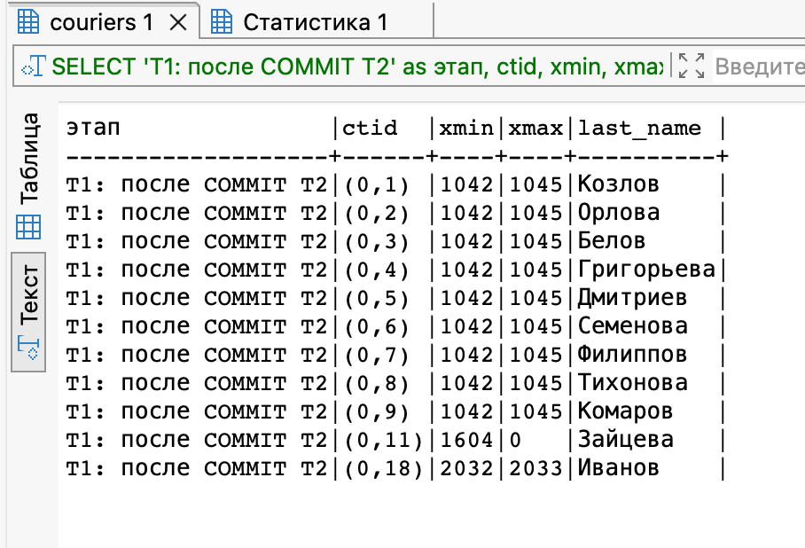

-- После завершения T1
SELECT 'T1: после COMMIT' as этап, ctid, xmin, xmax, last_name FROM bakery_db.couriers;
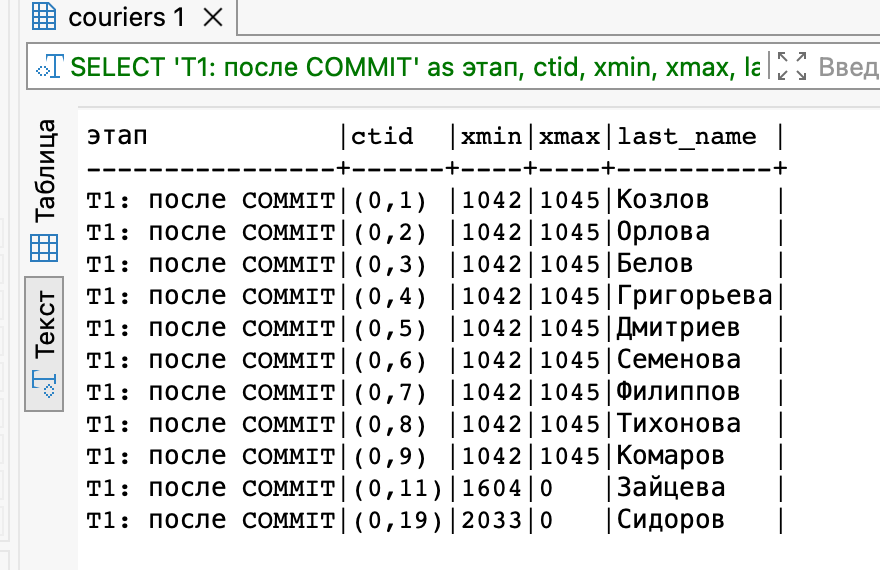

Результат: T1 видит старые данные (снапшот на момент начала), хотя T2 уже закоммитил изменения

### 3: Конфликт обновлений

Терминал 1 (блокируем)

BEGIN;
UPDATE bakery_db.couriers SET last_name = 'Петров' WHERE last_name = 'Иванов';
SELECT 'T1: заблокировал' as этап, ctid, xmin, xmax FROM bakery_db.couriers;
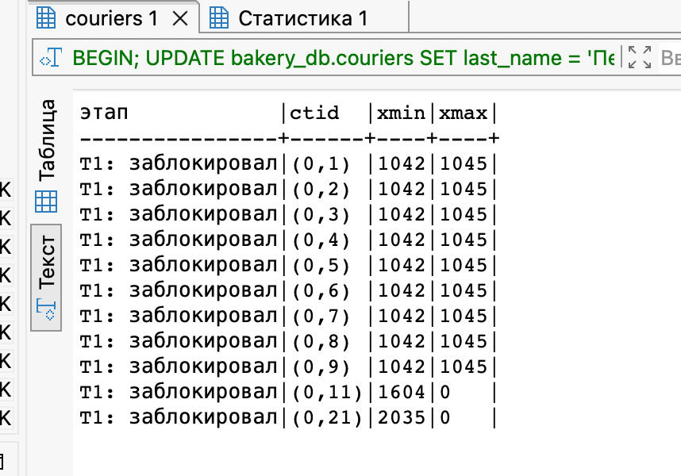

Терминал 2 (пытаемся обновить то же)

BEGIN;
-- будет ждать освобождения блокировки
UPDATE bakery_db.couriers SET last_name = 'Сидоров' WHERE last_name = 'Иванов';
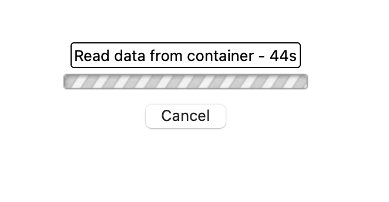

Терминал 1 (отпускаем)

COMMIT;

-- Терминал 2 сразу выполнится
Терминал 2 (после завершения)

SELECT 'T2: после ожидания' as этап, ctid, xmin, xmax, last_name FROM bakery_db.couriers;
COMMIT;
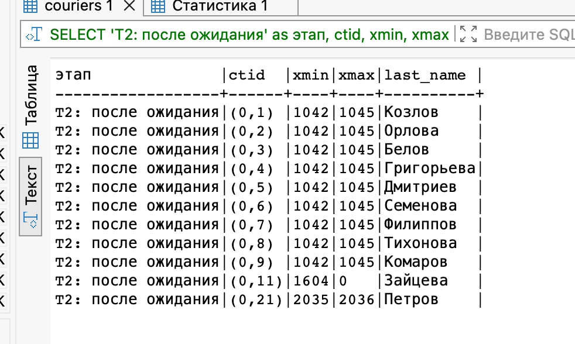

### Deadlock

Терминал 1

BEGIN;
UPDATE bakery_db.couriers SET phone_number = '11111111111' WHERE courier_id = 1;

Терминал 2
BEGIN;
UPDATE bakery_db.couriers SET phone_number = '22222222222' WHERE courier_id = 2;

Терминал 1
-- T1 пытается обновить курьера, который заблокирован T2 и засыпает в ожидании
UPDATE bakery_db.couriers SET phone_number = '33333333333' WHERE courier_id = 2;
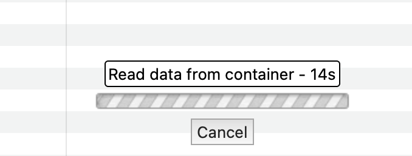

Терминал 2
-- T2 пытается обновить курьера, который заблокирован T1
UPDATE bakery_db.couriers SET phone_number = '44444444444' WHERE courier_id = 1;

### Явные блокировки
Эксперимент 1: Блокировка FOR UPDATE
T1: Явно блокируем строку
BEGIN;
SELECT * FROM bakery_db.couriers WHERE courier_id = 1 FOR UPDATE;
Результат: T1 получила блокировку FOR UPDATE на строку с id=1.

T2: Пытаемся обновить заблокированную строку

sql
BEGIN;
-- Этот UPDATE повиснет в ожидании
UPDATE bakery_db.couriers SET phone_number = '88888888888' WHERE courier_id = 1;
Результат: T2 ждет освобождения блокировки T1.

T1: Завершаем транзакцию

COMMIT;
-- COMMIT в T1 снимет блокировку
Результат: UPDATE в T2 сразу выполнится.

SELECT * FROM bakery_db.couriers WHERE courier_id = 1;
COMMIT;

Эксперимент 2: Конфликт FOR UPDATE и FOR SHARE
T1: Блокируем строку на запись
BEGIN;
SELECT * FROM bakery_db.couriers WHERE courier_id = 2 FOR UPDATE;

T2: Пытаемся заблокировать для чтения
BEGIN;
-- Эта блокировка FOR SHARE будет ждать T1
SELECT * FROM bakery_db.couriers WHERE courier_id = 2 FOR SHARE;
Результат: T2 ждет.

T1: Завершаем
COMMIT;
Результат: FOR SHARE в T2 получает блокировку и выполняется.

Т2:
COMMIT;

Эксперимент 3: Конфликт двух UPDATE (неявная блокировка)
UPDATE сам по себе получает блокировку FOR UPDATE.

T1: Начинаем изменение
BEGIN;
UPDATE bakery_db.couriers SET first_name = 'T1_name' WHERE courier_id = 3;

T2: Пытаемся изменить ту же строку
BEGIN;
-- Этот UPDATE будет ждать T1
UPDATE bakery_db.couriers SET first_name = 'T2_name' WHERE courier_id = 3;
Результат: T2 ждет.

T1: Завершаем
COMMIT;
Результат: UPDATE в T2 выполняется, перезаписывая изменения T1. Проверка:

sql
SELECT * FROM bakery_db.couriers WHERE courier_id = 3;
COMMIT;

## Очистка

-- Размер таблицы
SELECT pg_size_pretty(pg_total_relation_size('bakery_db.couriers'));

-- Статистика по мертвым строкам
SELECT 
    schemaname,
    tablename,
    n_live_tup as живых_строк,
    n_dead_tup as мертвых_строк,
    last_vacuum,
    last_autovacuum
FROM pg_stat_user_tables 
WHERE tablename = 'couriers';

2. Создаем "мусор"
-- Нагенерируем мертвых строк
UPDATE bakery_db.couriers SET first_name = 'Test' WHERE courier_id > 0;
DELETE FROM bakery_db.couriers WHERE courier_id > 5;

3. Смотрим результат
-- Видим рост мертвых строк
SELECT n_dead_tup FROM pg_stat_user_tables WHERE tablename = 'couriers';

4. Запускаем очистку
VACUUM bakery_db.couriers;

5. Смотрим эффект
SELECT n_dead_tup FROM pg_stat_user_tables WHERE tablename = 'couriers';
-- Размер таблицы 
SELECT pg_size_pretty(pg_total_relation_size('bakery_db.couriers'));

6. Полная очистка 

VACUUM FULL bakery_db.couriers;