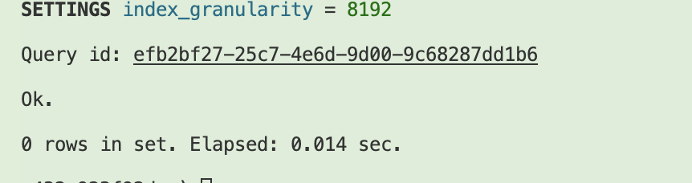
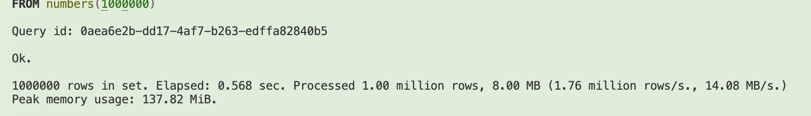
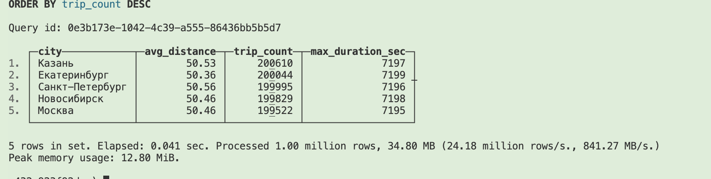

# Clickhouse 

docker exec -it clickhouse clickhouse-client
## 2. Создание таблицы
Создать таблицу `trips` со следующей структурой:
- `trip_id UInt32`
- `start_time DateTime`
- `end_time DateTime`
- `distance_km Float32`
- `city String`
```
CREATE TABLE IF NOT EXISTS trips (
    trip_id UInt32,
    start_time DateTime,
    end_time DateTime,
    distance_km Float32,
    city String
)
ENGINE = MergeTree()
PARTITION BY toYYYYMM(start_time)
ORDER BY (city, trip_id)
SETTINGS index_granularity = 8192;
```
  

## 3. Наполнение данными
```
  INSERT INTO trips
SELECT
    number AS trip_id,
    now() - INTERVAL (rand() % 30) DAY + INTERVAL (rand() % 86400) SECOND AS start_time,
    now() - INTERVAL (rand() % 30) DAY + INTERVAL (rand() % 86400) SECOND + INTERVAL (rand() % 7200) SECOND AS end_time,
    1 + rand() % 99 + (rand() % 100) / 100.0 AS distance_km,
    arrayElement(['Москва', 'Санкт-Петербург', 'Казань', 'Новосибирск', 'Екатеринбург'], (rand() % 5) + 1) AS city
FROM numbers(1000000);
```
  


## 4. Написание аналитического запроса
Составить SQL-запрос, который для каждого города выводит:
- среднюю дистанцию поездки (`avg_distance`)
- общее количество поездок (`trip_count`)
- максимальную длительность поездки в секундах (`max_duration_sec`)

```
SELECT
    city,
    round(avg(distance_km), 2) AS avg_distance,
    count() AS trip_count,
    max(dateDiff('second', start_time, end_time)) AS max_duration_sec
FROM trips
GROUP BY city
ORDER BY trip_count DESC;
```

