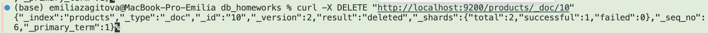
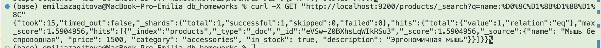
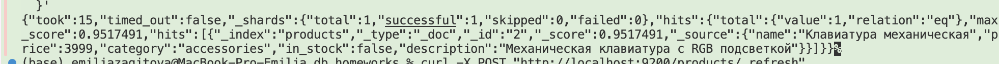
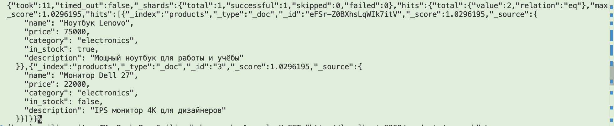
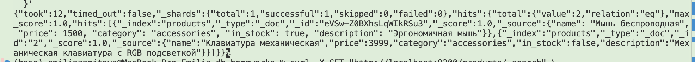
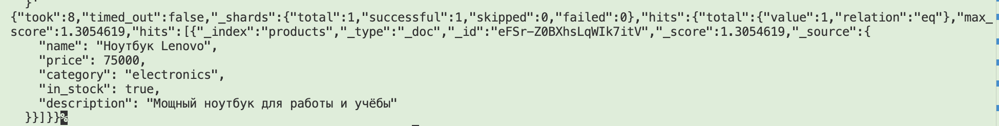

# Elasticsearch
```
docker run -p 9200:9200 -e "discovery.type=single-node" elasticsearch:7.17.22
```
## Создать индекс products.
```
curl -X PUT "http://localhost:9200/products" \
  -H 'Content-Type: application/json' \
  -d '{
    "mappings": {
      "properties": {
        "name":        { "type": "text" },
        "price":       { "type": "float" },
        "category":    { "type": "keyword" },
        "in_stock":    { "type": "boolean" },
        "description": { "type": "text" }
      }
    }
  }'
```


## 3.Заполнить индекс тестовыми данными с помощью методов PUT или POST.
```
curl -X POST "http://localhost:9200/products/_doc" \
  -H 'Content-Type: application/json' \
  -d '{
    "name": "Ноутбук Lenovo",
    "price": 75000,
    "category": "electronics",
    "in_stock": true,
    "description": "Мощный ноутбук для работы и учёбы"
  }'

curl -X PUT "http://localhost:9200/products/_doc/2" \
  -H 'Content-Type: application/json' \
  -d '{
    "name": "Клавиатура механическая",
    "price": 4500,
    "category": "accessories",
    "in_stock": true,
    "description": "Механическая клавиатура с RGB подсветкой"
  }'

  curl -X PUT "http://localhost:9200/products/_doc/3" \
  -H 'Content-Type: application/json' \
  -d '{
    "name": "Монитор Dell 27",
    "price": 22000,
    "category": "electronics",
    "in_stock": false,
    "description": "IPS монитор 4K для дизайнеров"
  }'

```
## 4.Выполнить операции с документами:

### создать документ;
```
curl -X POST "http://localhost:9200/products/_doc" \
  -H 'Content-Type: application/json' \
  -d '{"name": "Мышь беспроводная", "price": 1500, "category": "accessories", "in_stock": true, "description": "Эргономичная мышь"}'
```
### добавить документ с указанным id;
```
curl -X PUT "http://localhost:9200/products/_doc/10" \
  -H 'Content-Type: application/json' \
  -d '{"name": "SSD 1TB", "price": 8000, "category": "storage", "in_stock": true, "description": "NVMe накопитель"}'
```
### обновить документ;
```
curl -X POST "http://localhost:9200/products/_update/2" \
  -H 'Content-Type: application/json' \
  -d '{
    "doc": {
      "price": 3999,
      "in_stock": false
    }
  }'
```
### удалить документ;
```
curl -X DELETE "http://localhost:9200/products/_doc/10"
```

## Написать и выполнить запросы:
### поиск по названию товара
```
curl -X GET "http://localhost:9200/products/_search?q=name:%D0%9C%D1%8B%D1%88%D1%8C"
```



### запрос с использованием match (полнотекстовый поиск с анализом)
```
curl -X GET "http://localhost:9200/products/_search" \
  -H 'Content-Type: application/json' \
  -d '{
    "query": {
      "match": {
        "description": "механическая подсветка"
      }
    }
  }'
```


### запрос с использованием term (точное совпадение, без анализа)
  ```
curl -X GET "http://localhost:9200/products/_search" \
  -H 'Content-Type: application/json' \
  -d '{
    "query": {
      "term": {
        "category": "electronics"
      }
    }
  }'
  ```

### запрос с использованием range

```
curl -X GET "http://localhost:9200/products/_search" \
  -H 'Content-Type: application/json' \
  -d '{
    "query": {
      "range": {
        "price": {
          "gte": 1000,
          "lte": 5000
        }
      }
    }
  }'
```

### запрос с использованием bool с комбинацией условий.
  ```
curl -X GET "http://localhost:9200/products/_search" \
  -H 'Content-Type: application/json' \
  -d '{
    "query": {
      "bool": {
        "must": [
          { "match": { "description": "ноутбук" } }
        ],
        "filter": [
          { "range": { "price": { "gte": 3000 } } },
          { "term": { "category": "electronics" } },
          { "term": { "in_stock": true } }
        ]
      }
    }
  }'
  ```
  