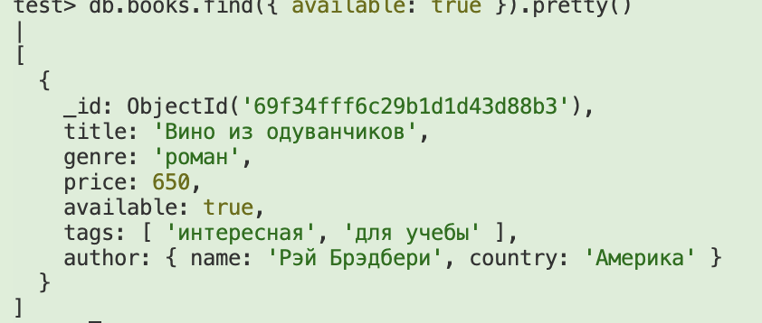
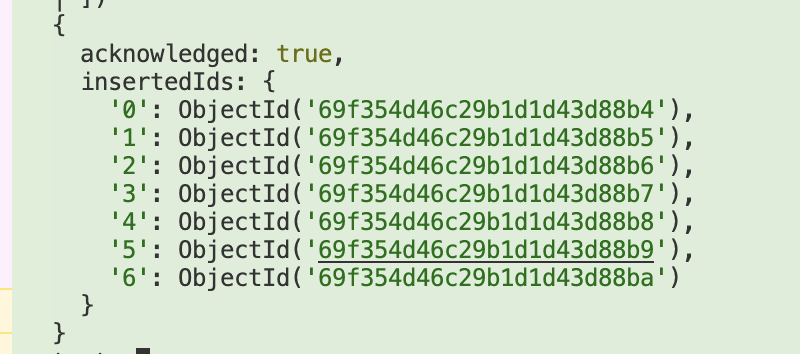
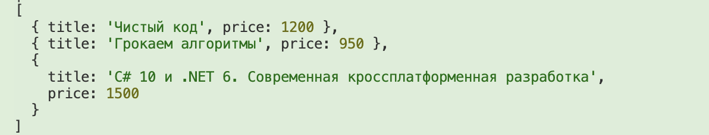
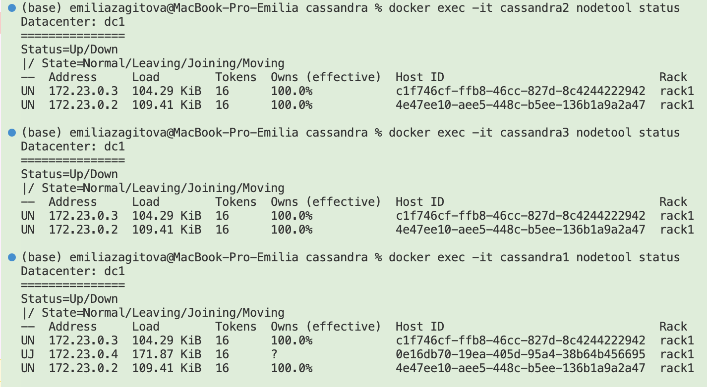
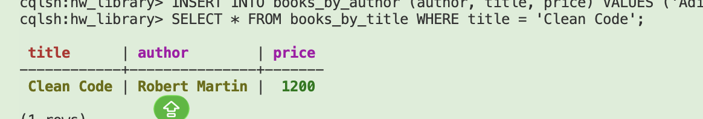
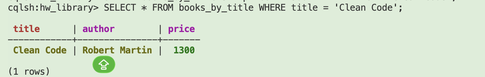
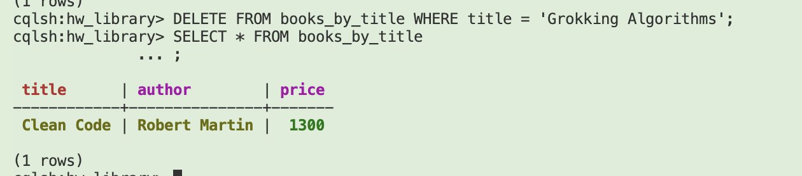
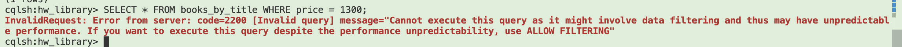
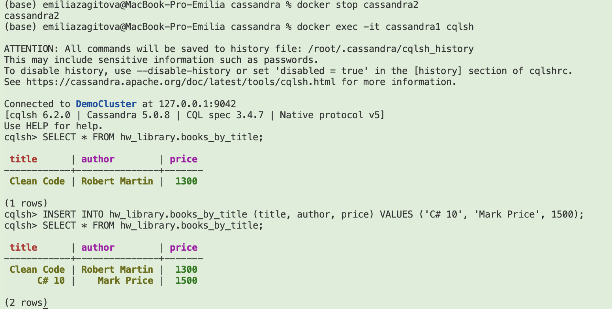

# MongoDB

1. Создание коллекции с добавкой сущности

```
db.createCollection("books")

db.books.insertOne({
  title: "Вино из одуванчиков",
  genre: "роман",
  price: 650,
  available: true,
  tags: ["интересная", "для учебы"],
  author: {
    name: "Рэй Брэдбери",
    country: "Америка"
  }
})
```

2. Простой поиск по одному условию

db.books.find({ available: true }).pretty()


3. Добавление нескольких документов
Нужно добавить в коллекцию ещё несколько книг.
Среди них должны быть книги:
из разных жанров
с разной ценой
как доступные, так и недоступные
с разными тегами
с разными авторами
Важно, чтобы структура у всех документов оставалась одинаковой:
основные поля книги
массив тегов
вложенный объект автора

```
db.books.insertMany([{
  title: "Над пропастью во ржи",
  genre: "роман",
  price: 800,
  available: true,
  tags: ["о трудном подростке", "роман воспитания"],
  author: {
    name: "Джером Сэлинджер",
    country: "Америка"
  }
}, {
    title: "1984",
    genre: "антиутопия",
    price: 575,
    available: false,
    tags: ["политика", "социальная"],
    author: {
        name: "Джордж Оруэлл",
        country: "Индия"
  }
}, { title: "Таинственный остров",
  genre: "научная фантастика",
  price: 1100,
  available: false,
  tags: ["приключенческая"],
  author: {
    name: "Жюль Верн",
    country: "Франция"
  }
}, { title: "Сумерки",
  genre: "ужасы",
  price: 650,
  available: true,
  tags: ["о вампирах", "романтическая"],
  author: {
    name: "Стефани Майер",
    country: "Америка"
  }
}, {
    title: "Чистый код",
    genre: "программирование",
    price: 1200,
    available: true,
    tags: ["разработка", "бестселлер"],
    author: {
      name: "Роберт Мартин",
      country: "США"
    }
  },
  {
    title: "Грокаем алгоритмы",
    genre: "программирование",
    price: 950,
    available: true,
    tags: ["алгоритмы", "для новичков"],
    author: {
      name: "Адитья Бхаргава",
      country: "США"
    }
  },
  {
    title: "C# 10 и .NET 6. Современная кроссплатформенная разработка",
    genre: "программирование",
    price: 1500,
    available: true,
    tags: ["c#", "dotnet", "backend"],
    author: {
      name: "Марк Прайс",
      country: "Великобритания"
    }
  }
])
```


4. Запрос посложнее
Нужно найти все книги, которые одновременно:
относятся к жанру programming
стоят дороже заданной суммы
есть в наличии
В результате нужно вывести не весь документ, а только:
название книги
цену книги

```
db.books.find(
  {
    genre: "программирование",
    price: { $gt: 500 },
    available: true
  },
  {
    _id: 0,
    title: 1,
    price: 1
  }
).pretty()

```



# Cassandra



```
CREATE KEYSPACE IF NOT EXISTS hw_library 
WITH replication = {'class': 'SimpleStrategy', 'replication_factor': 3};

USE hw_library;

CREATE TABLE books_by_title (
    title text PRIMARY KEY,
    author text,
    price int
);

CREATE TABLE books_by_author (
    author text,
    title text,
    price int,
    PRIMARY KEY (author, title)
);
```

## Select, insert, delete
```
INSERT INTO books_by_title (title, author, price) VALUES ('Clean Code', 'Robert Martin', 1200);
INSERT INTO books_by_author (author, title, price) VALUES ('Robert Martin', 'Clean Code', 1200);

INSERT INTO books_by_title (title, author, price) VALUES ('Grokking Algorithms', 'Aditya Bhargava', 950);
INSERT INTO books_by_author (author, title, price) VALUES ('Aditya Bhargava', 'Grokking Algorithms', 950);

SELECT * FROM books_by_title WHERE title = 'Clean Code';
```


```
UPDATE books_by_title SET price = 1300 WHERE title = 'Clean Code';
SELECT * FROM books_by_title WHERE title = 'Clean Code';
```


```
DELETE FROM books_by_title WHERE title = 'Grokking Algorithms';
```

```
 SELECT * FROM books_by_title WHERE price = 1300;

```
Остановление одной ноды и проверка
