# Redis

## Часть 1
docker run -d --name redis -p 6379:6379 redis

docker ps

docker exec -it redis redis-cli ping

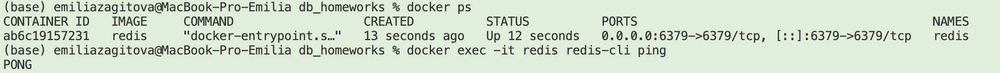

## Часть 2 
```
redis-cli 
INCR article:10:views
INCR article:10:views
INCR article:10:views
```
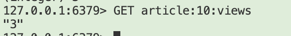

## Часть 3 
```
ZADD articles:leaderboard 300 article:1 200 article:2 150 article:3 1000 article:4

ZREVRANGE articles:leaderboard 0 2

ZREVRANGE articles:leaderboard 0 2 WITHSCORES
```
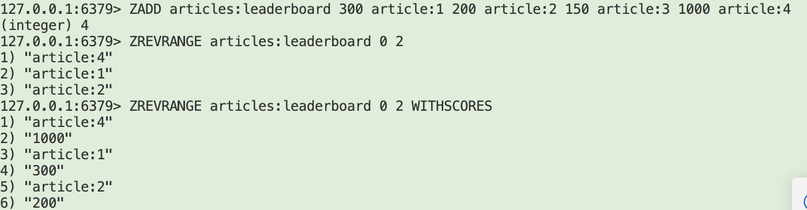
```
ZINCRBY articles:leaderboard 5000 article:3

ZREVRANGE articles:leaderboard 0 2 WITHSCORES
```
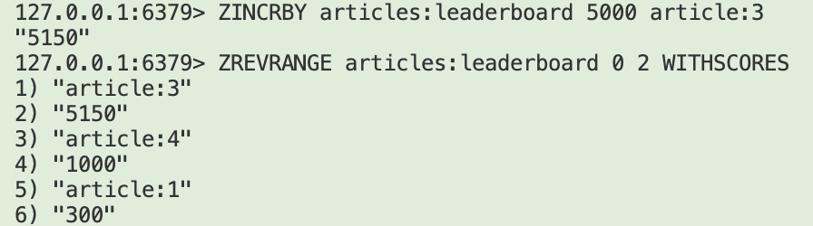

## Часть 4 

```
INCR user:123:likes
INCR user:123:likes
INCR user:123:likes

EXPIRE user:123:likes 60

GET user:123:likes
TTL user:123:likes
```
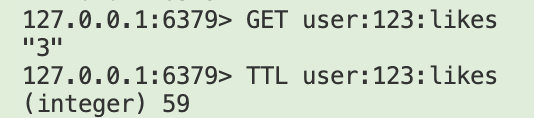

# Neo4j

## Подготовка
```cypher
MATCH (n)
OPTIONAL MATCH (n)-[r]-()
RETURN n, r;
```

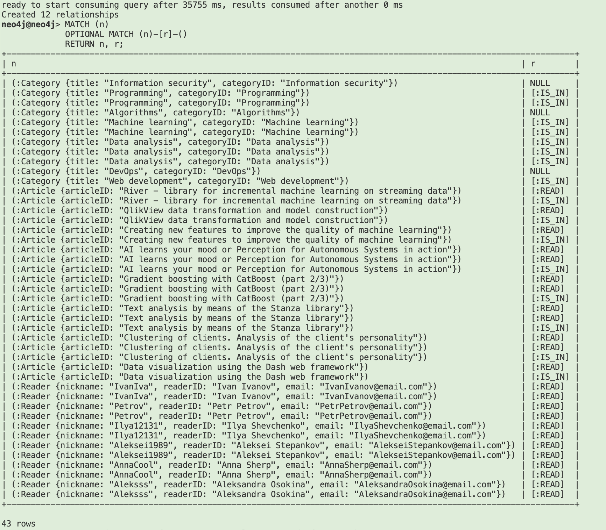

## Вставка
```cypher
CREATE (с:Category {
    categoryID: "Казанские новости",
    title: "Новости за последние 24 часа"
})
RETURN c;

CREATE (a:Article {
    articleID: "В Казани подняли цены на 34 платных парковках",
    title: "В Казани подняли цены на 34 платных парковках",
    publishedAt: datetime()
})
WITH a
MATCH (c:Category {categoryID: "Казанские новости"})
CREATE (a)-[:IS_IN]->(c)
RETURN a, c;

CREATE (r:Reader {
    nickname: "Emiliyameow",
    readerID: "Emiliia Zagitova",
    email: "emiliyameow@mail.ru"
})
WITH r
UNWIND [
  "River - library for incremental machine learning on streaming data",
  "Data visualization using the Dash web framework",
  "Gradient boosting with CatBoost (part 2/3)"
] AS articleTitle
MATCH (a:Article {articleID: articleTitle})
MERGE (r)-[rel:READ]->(a)
ON CREATE SET rel.firstRead = timestamp()
RETURN r, count(a) AS articlesLinked;
```

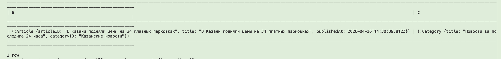

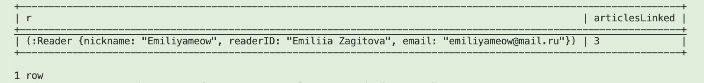
## Запросы
Все пользователи, статьи и связи между ними

```
MATCH (r:Reader) -[:READ]->(a:Article)-[:IS_IN]->(c:Category)
RETURN r.nickname, a.articleID, c.title AS category;
```

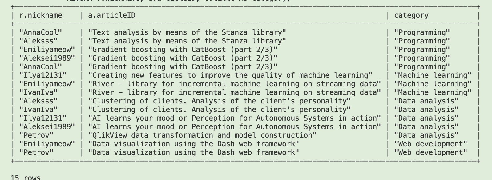
Выбрать пользователя и найти категории, которые он читает

```
MATCH (r:Reader {readerID: "Emiliia Zagitova"})
      -[:READ]->(a:Article)
      -[:IS_IN]->(c:Category)
RETURN DISTINCT c.categoryID AS category, 
       count(a) AS articlesRead
ORDER BY articlesRead DESC;
```
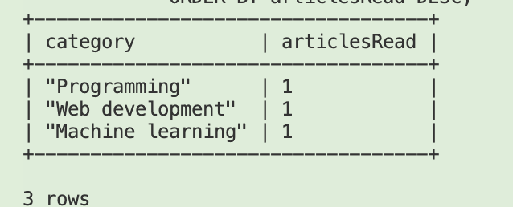

Найти самых активных читателей (посчитать, кто читает больше всего статей)
```
MATCH (r:Reader)- [:READ]->(a:Article)
RETURN r.nickname, COUNT(a) AS reads
ORDER BY reads DESC;
```
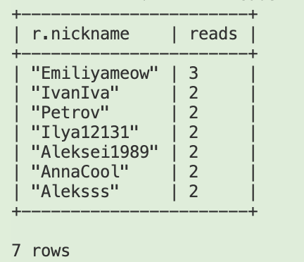

Выбрать статью и найти похожие статьи (статьи, которые читают те же пользователи)

```
MATCH (target:Article {articleID: "Gradient boosting with CatBoost (part 2/3)"})
MATCH (target)<-[:READ]-(r:Reader)
MATCH (r)-[:READ]->(similar:Article)
WHERE similar <> target
RETURN 
  similar.articleID AS recommendation,
  count(DISTINCT r) AS sharedReaders
ORDER BY sharedReaders DESC;
```
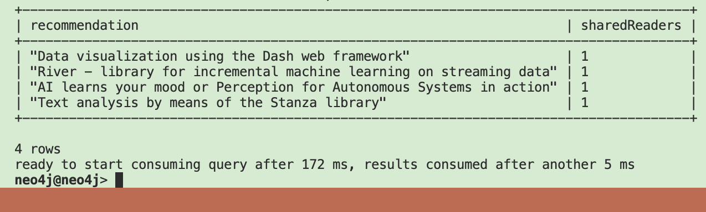

Рекомендации по категориям
    - найти категории, которые читает пользователь
    - предложить статьи из этих категорий, которые он ещё не читал

```
MATCH (r:Reader {readerID: "Emiliia Zagitova"})
MATCH (r)-[:READ]->(:Article)-[:IS_IN]->(targetCat:Category)
MATCH (rec:Article)-[:IS_IN]->(targetCat)
WHERE NOT (r)-[:READ]->(rec)
RETURN DISTINCT rec.articleID AS recommendation, 
       targetCat.categoryID AS category;
```

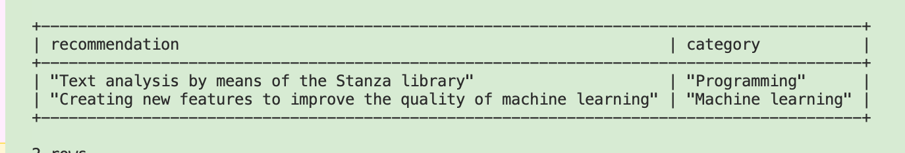