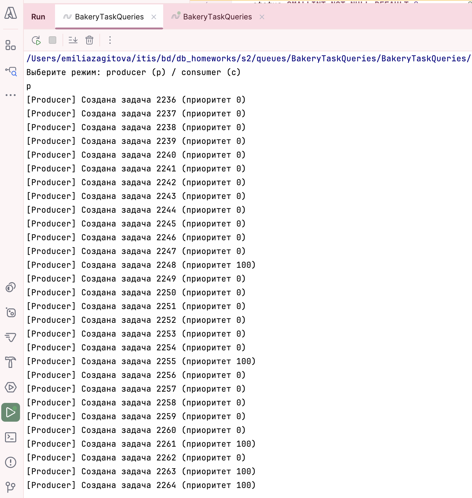
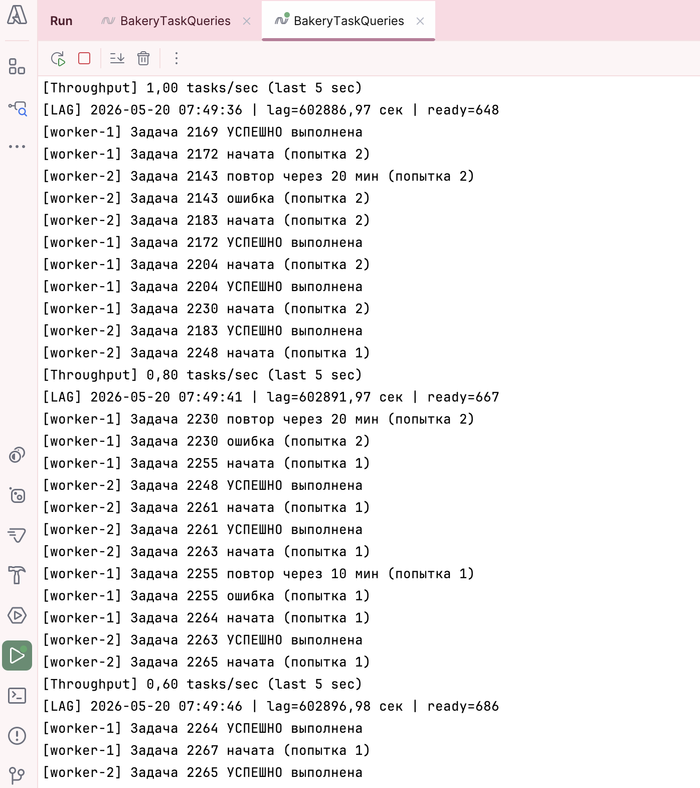
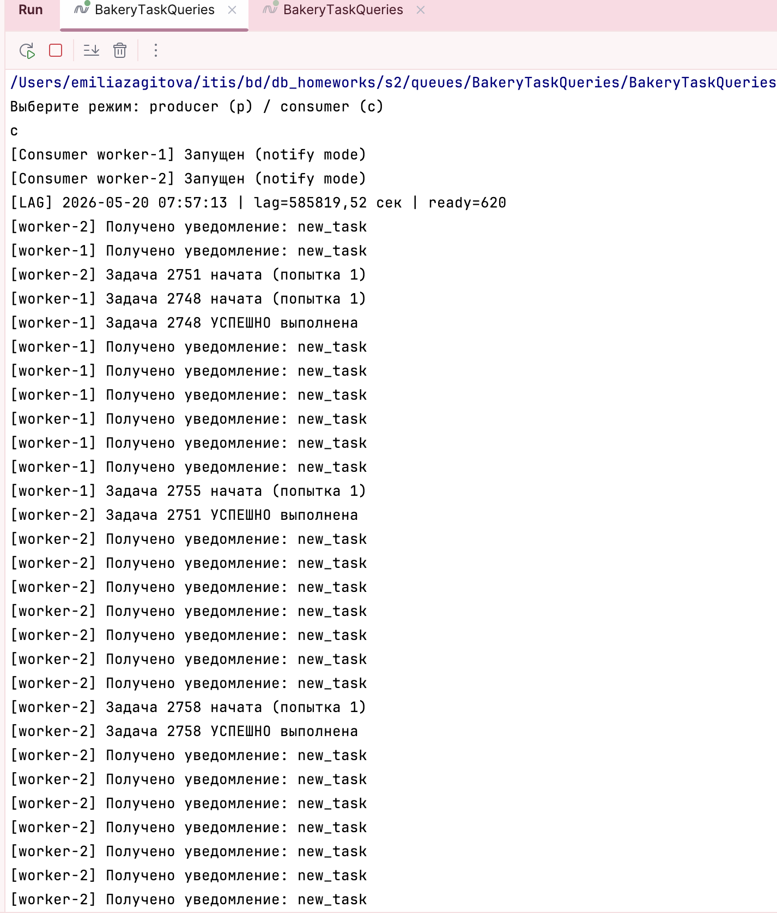
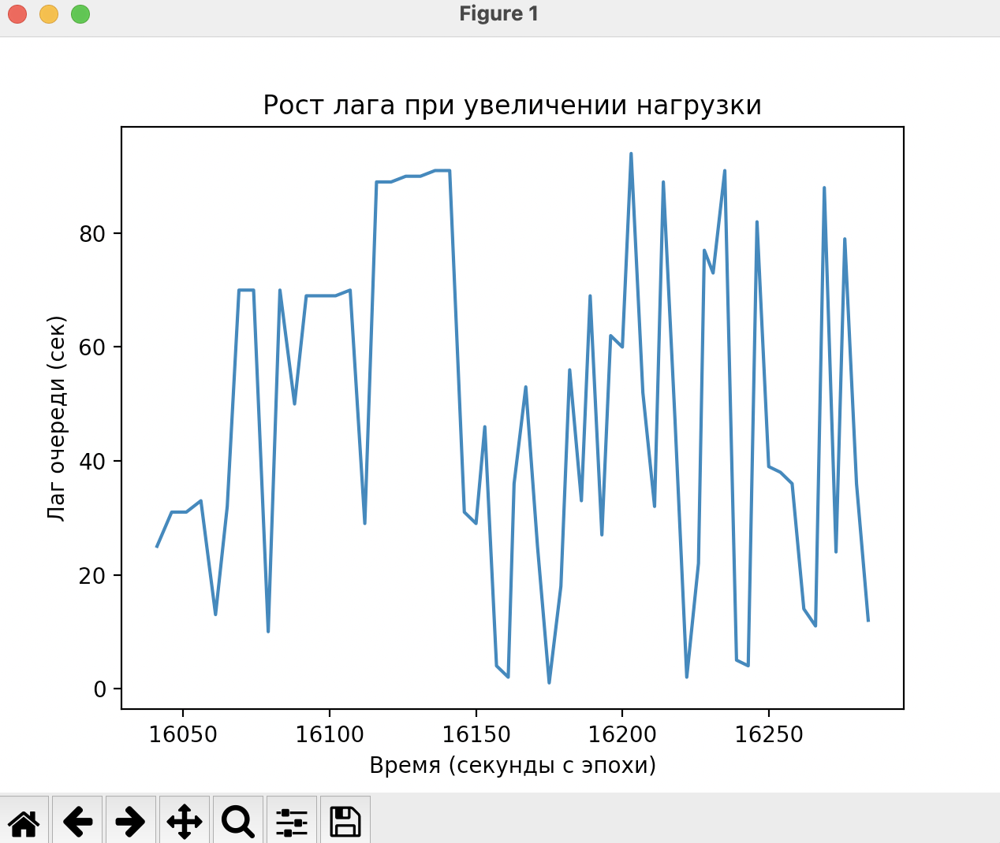

# Очередь задач

## Таблица задач

```sql
CREATE TABLE IF NOT EXISTS bakery_db.tasks (
    id BIGSERIAL PRIMARY KEY,
    task_type VARCHAR(50) NOT NULL,          -- тип задачи: 'baking', 'delivery', 'notification' и т.п.
    payload JSONB NOT NULL,                  -- данные задачи (например, { "order_id": 123 })
    status SMALLINT NOT NULL DEFAULT 0,      -- 0 = Ready, 1 = Running, 2 = Completed, 3 = Failed
    priority INT NOT NULL DEFAULT 0,         -- 0 = обычная, 100 = критическая
    scheduled_at TIMESTAMPTZ NOT NULL DEFAULT NOW(),
    attempts INT NOT NULL DEFAULT 0,
    max_attempts INT NOT NULL DEFAULT 3,
    last_error TEXT,
    created_at TIMESTAMPTZ NOT NULL DEFAULT NOW(),
    updated_at TIMESTAMPTZ NOT NULL DEFAULT NOW(),
    worker_id TEXT                           -- идентификатор воркера, выполняющего задачу
);

-- Индексы для быстрого поиска задач
CREATE INDEX idx_tasks_status_scheduled ON bakery_db.tasks (status, scheduled_at) WHERE status = 0;
CREATE INDEX idx_tasks_priority_created ON bakery_db.tasks (priority DESC, created_at) WHERE status = 0;
CREATE INDEX idx_tasks_worker_status ON bakery_db.tasks (worker_id, status) WHERE status = 1;

-- Частичный индекс только для готовых задач (экономит место)
CREATE INDEX idx_tasks_ready_partial ON bakery_db.tasks (priority DESC, created_at) WHERE status = 0;
```

### Мониторинг лага очереди
Разница между текущим временем и временем создания самой старой задачи в статусе Ready:

```sql
SELECT 
    EXTRACT(EPOCH FROM (NOW() - MIN(created_at))) AS lag_seconds
FROM bakery_db.tasks
WHERE status = 0 AND scheduled_at <= NOW();
```

### Измерение пропускной способности (tasks/sec)
Количество успешно завершённых задач за последние 10 секунд:

```sql
SELECT COUNT(*) AS completed_last_10_seconds
FROM bakery_db.tasks
WHERE status = 2
  AND updated_at > NOW() - INTERVAL '10 seconds';
```


### Агрессивная настройка autovacuum для борьбы с bloat

```sql
ALTER TABLE bakery_db.tasks SET (
    autovacuum_enabled = true,
    autovacuum_vacuum_scale_factor = 0.05,      -- запускать при 5% изменений
    autovacuum_vacuum_threshold = 500,          -- минимум 500 мёртвых строк
    autovacuum_vacuum_cost_delay = 5,
    autovacuum_vacuum_cost_limit = 1000,
    autovacuum_analyze_scale_factor = 0.02,
    autovacuum_analyze_threshold = 250
);
```

---

## Реализация на C#

### Producer
Генерирует задачи в цикле. 80% – обычный приоритет (0), 20% – критический (100). Вставляет задачу в рамках транзакции с фиктивной бизнес-логикой (в order_log).

```csharp
public class Producer
{
    public async Task RunAsync(int taskCount = 1000, int delayMs = 100)
    {
        // ... подключение, цикл, формирование payload
        using var tx = await conn.BeginTransactionAsync();
        // INSERT в tasks
        //
        // NOTIFY tasks_channel, 'new_task' (если используется notify)
        await tx.CommitAsync();
    }
}
```


### Consumer
Две реализации:  
- **`RunAsync`** – polling (проверка каждые 500 мс)  
- **`RunWithNotifyAsync`** – с использованием `LISTEN/NOTIFY` (воркер засыпает до появления новой задачи)

Ключевые особенности:
- Захват задачи через `SELECT ... FOR UPDATE SKIP LOCKED`
- Обновление статуса на `Running`
- Имитация обработки (случайная задержка 1–3 сек)
- 80% успеха / 20% ошибки
- Retry с exponential backoff (при ошибке попытка увеличивается, scheduled_at сдвигается: 5 мин, 10 мин, 20 мин)
- После исчерпания max_attempts задача переводится в статус Failed (Dead Letter Queue)

```csharp
private async Task RetryOrDLQAsync(long taskId, int currentAttempts, string errorMsg)
{
    int newAttempts = currentAttempts + 1;
    int maxAttempts = 3;
    if (newAttempts >= maxAttempts)
    {
        // статус 3 = Failed (DLQ)
    }
    else
    {
        int delaySeconds = (int)Math.Pow(2, newAttempts) * 300;
        // scheduled_at = NOW() + delaySeconds, статус 0 (Ready)
    }
}
```


### Мониторинг лага в реальном времени
Фоновая задача, записывающая лаг и количество готовых задач в CSV-файл каждые 5 секунд.

```csharp
_ = Task.Run(async () => {
    using var writer = new StreamWriter("lag_metrics.csv");
    await writer.WriteLineAsync("timestamp_iso,unix_seconds,lag_seconds,ready_tasks_count");
    while (!cts.Token.IsCancellationRequested)
    {
        await Task.Delay(5000);
    }
});
```


---

## Результаты тестирования

### Рост лага при увеличении нагрузки
Ниже представлен график изменения лага очереди (секунды) во времени при интенсивности вставки 500 задач/сек.

>   

  
- При старте лаг близок к 0.  
- По мере накопления задач лаг растёт до 50+ секунд.  
- Колебания связаны с периодическим опустошением очереди воркерами и приоритетами задач.
