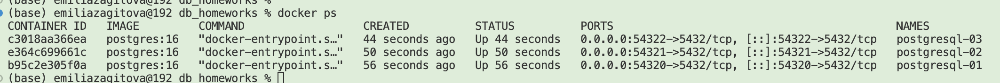
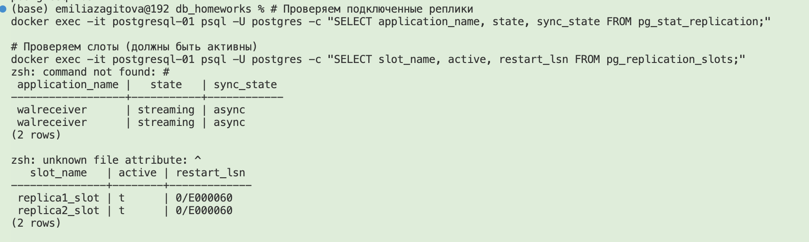

## Настройка потоковой репликации

Создаем сеть
docker network create pg-network

Запускаем мастер ( порт 54320)

docker run -d \
  --name postgresql-01 \
  --network pg-network \
  -e POSTGRES_PASSWORD=secretpass \
  -e POSTGRES_USER=postgres \
  -p 54320:5432 \
  postgres:16 \
  -c 'wal_level=replica' \
  -c 'max_wal_senders=10' \
  -c 'max_replication_slots=10' \
  -c 'listen_addresses=*'

Запускаем реплику 1

docker run -d \
  --name postgresql-02 \
  --network pg-network \
  -e POSTGRES_PASSWORD=secretpass \
  -e POSTGRES_USER=postgres \
  -p 54321:5432 \
  postgres:16

Запускаем реплику 2

docker run -d \
  --name postgresql-03 \
  --network pg-network \
  -e POSTGRES_PASSWORD=secretpass \
  -e POSTGRES_USER=postgres \
  -p 54322:5432 \
  postgres:16

3 контейнера:
| Контейнер | Внутренний IP | Внешний порт |
|-----------|---------------|--------------|
| postgresql-01 | 172.x.x.2 | 54320 |
| postgresql-02 | 172.x.x.3 | 54321 |
| postgresql-03 | 172.x.x.4 | 54322 |


---
### Настройка physical streaming replication
docker exec -it postgresql-01 psql -U postgres -c "CREATE ROLE replicator WITH REPLICATION LOGIN PASSWORD 'replicator_pass';"


Настройка мастер
```bash
docker exec -it postgresql-01 bash

echo "host replication replicator 0.0.0.0/0 md5" >> /var/lib/postgresql/data/pg_hba.conf

tail -2 /var/lib/postgresql/data/pg_hba.conf

su - postgres
/usr/lib/postgresql/16/bin/pg_ctl reload -D /var/lib/postgresql/data

exit
exit

# Создаем слоты для обеих реплик
docker exec -it postgresql-01 psql -U postgres -c "SELECT pg_create_physical_replication_slot('replica1_slot');"
docker exec -it postgresql-01 psql -U postgres -c "SELECT pg_create_physical_replication_slot('replica2_slot');"

# Проверяем, что слоты созданы
docker exec -it postgresql-01 psql -U postgres -c "SELECT slot_name, active, restart_lsn FROM pg_replication_slots;"
```

Настройка реплики 1
```bash
docker exec -it postgresql-02 bash

rm -rf /var/lib/postgresql/data/*

/usr/lib/postgresql/16/bin/pg_basebackup -h postgresql-01 -D /var/lib/postgresql/data -U replicator -P -R

```
Настройка реплики 2
```bash
docker exec -it postgresql-03 bash

rm -rf /var/lib/postgresql/data/*

/usr/lib/postgresql/16/bin/pg_basebackup -h postgresql-01 -D /var/lib/postgresql/data -U replicator -P -R
```



### Проверка репликации данных 

docker exec -it postgresql-01 psql -U postgres -c "CREATE DATABASE testdb;"
docker exec -it postgresql-01 psql -U postgres -d testdb -c "CREATE TABLE users (id SERIAL PRIMARY KEY, name TEXT);"
docker exec -it postgresql-01 psql -U postgres -d testdb -c "INSERT INTO users (name) VALUES ('Alice'), ('Bob'), ('Charlie');"

### Проверяем на реплике 1
docker exec -it postgresql-02 psql -U postgres -d testdb -c "SELECT * FROM users;"
 id |  name   
----+---------
  1 | Alice
  2 | Bob
  3 | Charlie
(3 rows)

### Проверяем на реплике 2
docker exec -it postgresql-03 psql -U postgres -d testdb -c "SELECT * FROM users;"

 id |  name   
----+---------
  1 | Alice
  2 | Bob
  3 | Charlie
(3 rows)

### Проверка вставки данных на реплику
docker exec -it postgresql-02 psql -U postgres -d testdb -c "INSERT INTO users (name) VALUES ('Emi');" 

> ERROR:  cannot execute INSERT in a read-only transaction


### Проверка lag

docker exec -it postgresql-01 psql -U postgres -c "CREATE DATABASE lag_test;"


while true; do
  docker exec -it postgresql-01 psql -U postgres -d lag_test -c "INSERT INTO test_data (data) VALUES (md5(random()::text));"
  sleep 0.1
done


### Logical replication
```
docker stop postgresql-01 postgresql-02 postgresql-03


docker rm postgresql-02 postgresql-03


docker rm postgresql-01

# Создаем мастер с wal_level logical

docker run -d \
  --name postgresql-01 \
  --network pg-network \
  -e POSTGRES_PASSWORD=secretpass \
  -e POSTGRES_USER=postgres \
  -p 54320:5432 \
  postgres:16 \
  -c 'wal_level=logical' \
  -c 'max_wal_senders=10' \
  -c 'max_replication_slots=10' \
  -c 'listen_addresses=*'

# контейнер logical_replica
docker run -d \
  --name logical_replica \
  --network pg-network \
  -e POSTGRES_PASSWORD=secretpass \
  -e POSTGRES_USER=postgres \
  -p 54323:5432 \
  postgres:16

```

```sql
-- Таблица с PRIMARY KEY
CREATE TABLE users_pk (
    id SERIAL PRIMARY KEY,
    name TEXT NOT NULL,
    email TEXT,
    created_at TIMESTAMP DEFAULT NOW()
);

-- Таблица БЕЗ PRIMARY KEY
CREATE TABLE users_no_pk (
    id SERIAL,
    name TEXT NOT NULL,
    email TEXT,
    created_at TIMESTAMP DEFAULT NOW()
);

-- Вставляем начальные данные
INSERT INTO users_pk (name, email) VALUES 
    ('Alice', 'alice@example.com'),
    ('Bob', 'bob@example.com');

INSERT INTO users_no_pk (name, email) VALUES 
    ('Diana', 'diana@example.com'),
    ('Eve', 'eve@example.com');
```


docker exec -it logical_replica psql -U postgres -c "CREATE DATABASE logical_test;"

docker exec -it logical_replica psql -U postgres -d logical_test

```
CREATE TABLE users_pk (
    id SERIAL PRIMARY KEY,
    name TEXT NOT NULL,
    email TEXT,
    created_at TIMESTAMP DEFAULT NOW()
);

CREATE TABLE users_no_pk (
    id SERIAL,
    name TEXT NOT NULL,
    email TEXT,
    created_at TIMESTAMP DEFAULT NOW()
);

-- Проверяем, что таблицы пустые
SELECT COUNT(*) FROM users_pk;   -- 0
SELECT COUNT(*) FROM users_no_pk; -- 0
\q
```

docker exec -it logical_replica psql -U postgres -d logical_test

```
CREATE SUBSCRIPTION my_subscription 
CONNECTION 'host=postgresql-01 port=5432 dbname=logical_test user=postgres password=secretpass' 
PUBLICATION my_publication;

-- Проверяем статус
SELECT * FROM pg_stat_subscription;
\q
```


Добавляем новый столбец на мастере
```

ALTER TABLE users_pk ADD COLUMN phone TEXT;

UPDATE users_pk SET phone = '+123456789' WHERE name = 'Alice';
UPDATE users_pk SET phone = '+987654321' WHERE name = 'Bob';

\d users_pk
SELECT * FROM users_pk;
\q
```


Проверяем на логической реплике

docker exec -it logical_replica psql -U postgres -d logical_test

```
-- Структура таблицы (столбца phone НЕТ!)
\d users_pk

-- Данные реплицируются, но без нового столбца
SELECT * FROM users_pk;

```


### Проверка replication status


docker exec -it postgresql-01 psql -U postgres -c "SELECT slot_name, slot_type, database, active, restart_lsn, confirmed_flush_lsn FROM pg_replication_slots;"
