# Практическая контрольная работа — вариант 2

## Формат

## Задание 1. Оптимизация простого запроса
Исходный запрос:

```sql
SELECT id, shop_id, total_sum, sold_at
FROM store_checks
WHERE shop_id = 77
  AND sold_at >= TIMESTAMP '2025-02-14 00:00:00'
  AND sold_at < TIMESTAMP '2025-02-15 00:00:00';
```

```sql
explain (analyse, buffers)
SELECT id, shop_id, total_sum, sold_at
FROM store_checks
WHERE shop_id = 77
  AND sold_at >= TIMESTAMP '2025-02-14 00:00:00'
  AND sold_at < TIMESTAMP '2025-02-15 00:00:00';
```
Тип сканирования: Seq Scan
Созданные индексы: idx_store_checks_payment_type - по типу платежа  (B-tree), idx_store_checks_total_sum_hash - по сумме платежа - не по тем колонкам, по которым мы проверяем условия 

Такой план, т.к. индексов по полям shop_id, sold_at нет
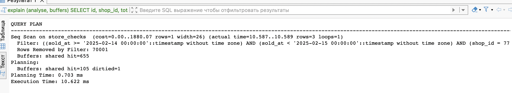

```sql
CREATE INDEX idx_store_checks_shop_sold ON store_checks (shop_id, sold_at);
```
Анализируем снова - теперь есть составной индекс, по которому доступ будет быстрее чем последовательное чтение 

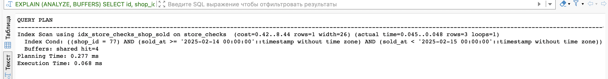

Да - нужно выполнить ANALYZE store_check или дождаться autovacuum. Это соберет статистику о распределении данных в новом индексе. Без этой статистики планировщик может не знать об индексе и все еще выбирать последовательное сканирование, если статистика устарела.

## Задание 2. Анализ и улучшение JOIN-запроса

Исходный запрос:

```sql
SELECT m.id, m.member_level, v.spend, v.visit_at
FROM club_members m
JOIN club_visits v ON v.member_id = m.id
WHERE m.member_level = 'premium'
  AND v.visit_at >= TIMESTAMP '2025-02-01 00:00:00'
  AND v.visit_at < TIMESTAMP '2025-02-10 00:00:00';
```

```sql
EXPLAIN (ANALYZE, BUFFERS)
SELECT m.id, m.member_level, v.spend, v.visit_at
FROM club_members m
JOIN club_visits v ON v.member_id = m.id
WHERE m.member_level = 'premium'
  AND v.visit_at >= TIMESTAMP '2025-02-01 00:00:00'
  AND v.visit_at < TIMESTAMP '2025-02-10 00:00:00';
```

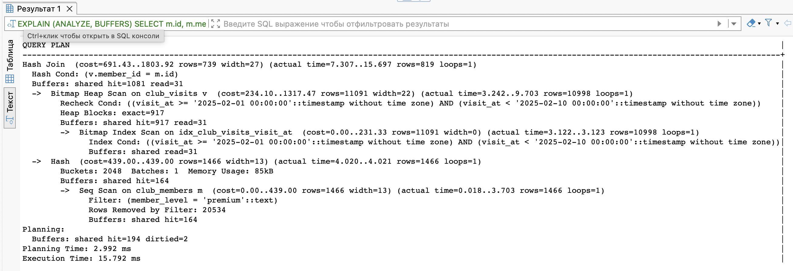
Тип join - Hash Join - Планировщик решает сначала создать хэш версию club_members - так как мы joinим по четкому равенству поля member_id 

Индекс idx_club_visits_visit_at помогает отфильтровать по правильному периоду времени, испоьзуя Bitmap Index Scan. 

Индекс idx_club_members_full_name - не полезен.


```
create INDEX idx_members_id_at ON club_visits (member_id, visit_at);

create index idx_member_level on club_members using hash(member_level);

analyze club_visits;
analyze club_members;
```
Создаем составной индекс - на club_visits, и hash index на поле member_level (т.к. смотрим по нему в where).

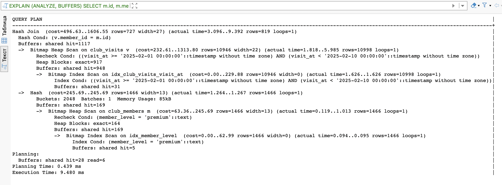

Время выполнения уменьшилось почти в полтора раза - за счет добавленных индексов - во втором случае теперь тоже используется Bitmap Index Scan, а не Seq Scan - как до этого.

Преобладание shared hit  read в BUFFERS - больше взято страниц из буфера, а не из диска.


## Задание 3. MVCC и очистка

Используйте таблицу `warehouse_items`.

Последовательно выполните:

```sql
SELECT xmin, xmax, ctid, id, title, stock
FROM warehouse_items
ORDER BY id;
```
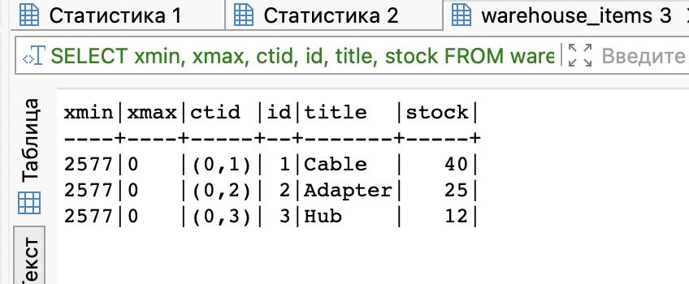
```
UPDATE warehouse_items
SET stock = stock - 2
WHERE id = 1;

SELECT xmin, xmax, ctid, id, title, stock
FROM warehouse_items
ORDER BY id;
```


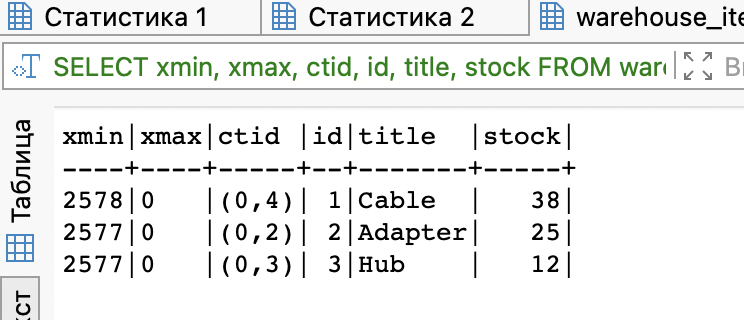
Изменились xmin - номер операции, которая последняя добавила строку (Физический адрес ctid не изменился)
```
DELETE FROM warehouse_items
WHERE id = 3;

SELECT xmin, xmax, ctid, id, title, stock
FROM warehouse_items
ORDER BY id;
```


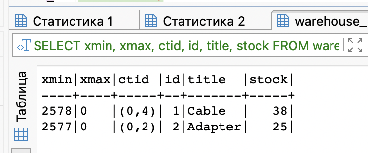
Удалилась строчка

MVCC UPDATE - для поддержки версий - мы сохраняем номер операции - чтобы она прошла успешно - она сначала помечается, удаляется и создается новая. Так же у нас заносится физ адрес - ctid

Vacuum Full - полностью блокирует таблицу, vacuum и autovacuum - работают в фоне

## Задание 4. Блокировки строк

Используйте таблицу `booking_slots`.

Откройте две сессии к базе данных: `A` и `B`.

В сессии `A` выполните:

```sql
BEGIN;
SELECT * FROM booking_slots WHERE id = 1 FOR KEY SHARE;
```
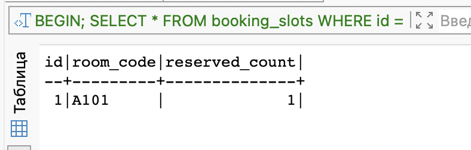
В сессии `B` выполните:

```sql
DELETE FROM booking_slots
WHERE id = 1;
```

- У нас происходит блокировка - невозможно удалить потому что данные заблокированы A


```sql
ROLLBACK;
```

Затем повторили эксперимент.
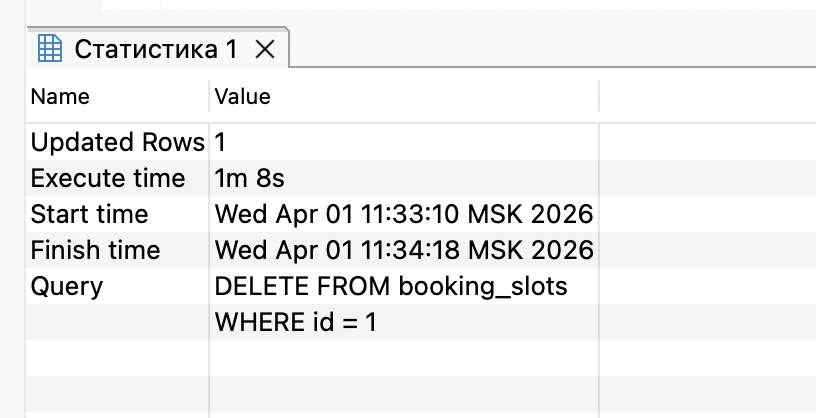 - Удаление сразу произрошло
В сессии `A` выполните:

```sql
BEGIN;
SELECT * FROM booking_slots WHERE id = 1 FOR NO KEY UPDATE;
```
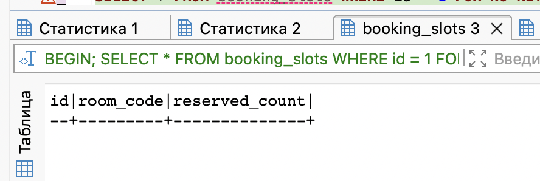

В сессии `B` выполните:

```sql
UPDATE booking_slots
SET reserved_count = reserved_count + 1
WHERE id = 1;
```
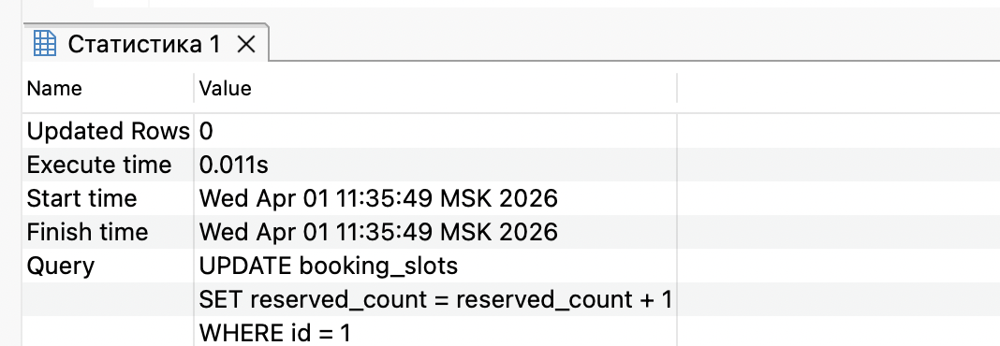

После наблюдения результата завершите сессию `A`:

```sql
ROLLBACK;
```

Update - происхожит спокойно. 
SELECT без FOR KEY SHARE/FOR NO KEY UPDATE - обычный select, который не меняет доступа к данным - когда нам надо просто обратиться и получить значения 

FOR NO KEY UPDATE - когда нам не очень важно, чтобы данные не менялись во время процесса - например мы выводим деньги со счета какую то неважную сумму - и она может измениться
Что нужно сделать:

```text
1. Опишите, что происходит с DELETE и UPDATE в сессии B в двух экспериментах.
2. Объясните, чем FOR KEY SHARE отличается от FOR NO KEY UPDATE по смыслу и по силе блокировки.
3. Укажите, почему обычный SELECT без FOR KEY SHARE/FOR NO KEY UPDATE ведет себя иначе.
4. Кратко поясните, где в прикладных сценариях может использоваться FOR NO KEY UPDATE.
```

## Задание 5. Секционирование и partition pruning

Используйте таблицу-источник `shipment_stats_src`.

Сначала самостоятельно создайте секционированную таблицу `shipment_stats`:

CREATE TABLE shipment_stats (
    order_id SERIAL,
    order_date DATE NOT NULL
) PARTITION BY RANGE (region_code);

```text
1. Таблица должна быть секционирована по LIST по полю region_code.
2. Создайте секции:
   - north;
   - south;
   - west;
   - DEFAULT.
3. Перенесите данные из shipment_stats_src в shipment_stats.
```

Постройте планы для двух запросов:

```sql
explain (analyse, buffers)
SELECT region_code, shipped_on, packages
FROM shipment_stats
WHERE region_code = 'north';
```

```sql
explain (analyse, buffers)
SELECT region_code, shipped_on, packages
FROM shipment_stats
WHERE shipped_on >= DATE '2025-02-10'
  AND shipped_on < DATE '2025-02-15';
```

Что нужно сделать:

```text
1. Для каждого запроса укажите, есть ли partition pruning.
2. Для каждого запроса укажите, сколько секций участвует в плане.
3. Объясните, почему в одном случае планировщик может отсечь секции, а в другом — нет.
4. Ответьте, связан ли pruning напрямую с наличием обычного индекса.
5. Кратко объясните, зачем в этом задании нужна секция DEFAULT.
```