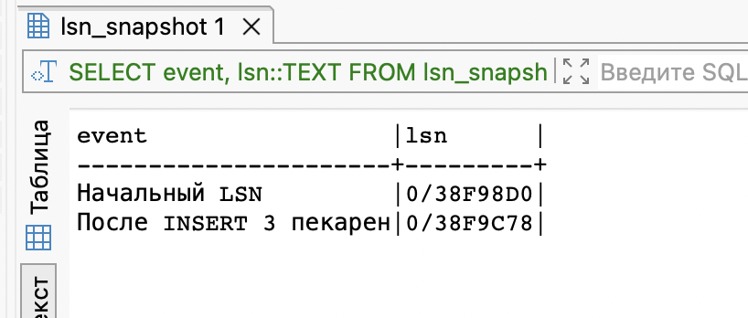
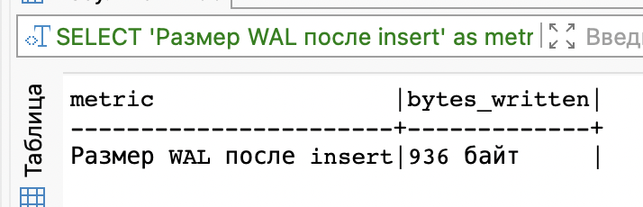
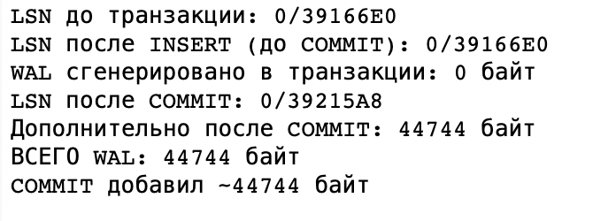
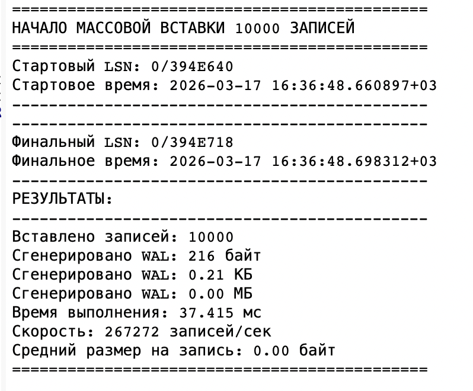
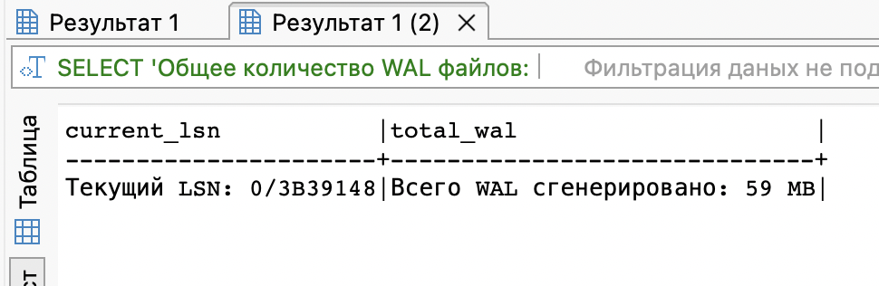
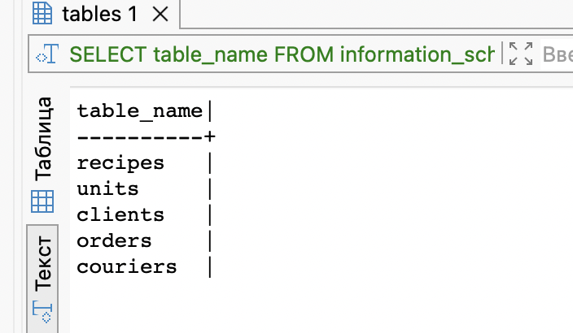
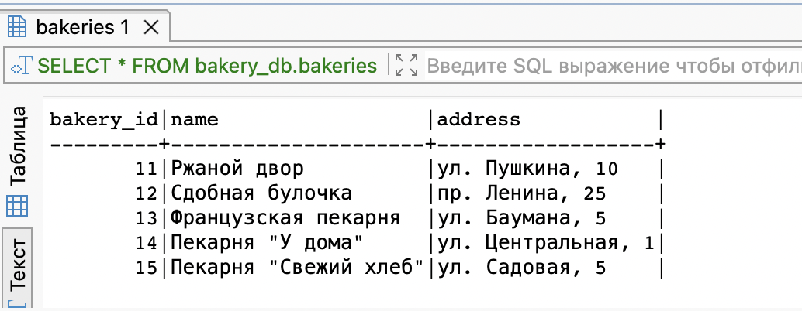
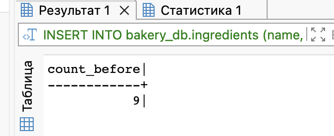
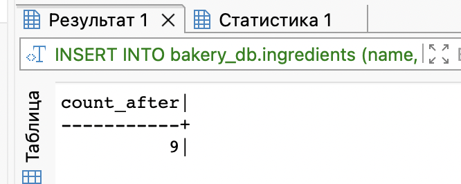

```sql
CREATE DATABASE bakery_db_test;


TRUNCATE bakery_db.bakeries CASCADE;

-- Временная таблица для хранения LSN
DROP TABLE IF EXISTS lsn_snapshot;
CREATE TEMP TABLE lsn_snapshot (
    event TEXT,
    lsn pg_lsn,
    created_at TIMESTAMP DEFAULT NOW()
);

INSERT INTO lsn_snapshot (event, lsn) 
VALUES ('Начальный LSN', pg_current_wal_lsn());

INSERT INTO bakery_db.bakeries (name, address) VALUES 
    ('Ржаной двор', 'ул. Пушкина, 10'),
    ('Сдобная булочка', 'пр. Ленина, 25'),
    ('Французская пекарня', 'ул. Баумана, 5');


INSERT INTO lsn_snapshot (event, lsn) 
VALUES ('После INSERT 3 пекарен', pg_current_wal_lsn());

SELECT event, lsn::TEXT FROM lsn_snapshot ORDER BY created_at;
```


## Сравнение WAL до и после commit

```
SELECT 
    'Размер WAL после insert' as metric,
    pg_wal_lsn_diff(
        (SELECT lsn FROM lsn_snapshot WHERE event = 'После INSERT 3 пекарен'),
        (SELECT lsn FROM lsn_snapshot WHERE event = 'Начальный LSN')
    )::TEXT || ' байт' as bytes_written;
```



## Сравнение WAL до и после COMMIT

```sql
-- Создадим функцию для анализа WAL в транзакции
DO $$
DECLARE
    lsn_before pg_lsn;
    lsn_after_insert pg_lsn;
    lsn_after_commit pg_lsn;
    diff_insert BIGINT;
    diff_commit BIGINT;
    diff_total BIGINT;
BEGIN
    -- Очищаем таблицу ингредиентов
    TRUNCATE bakery_db.ingredients CASCADE;
    
    -- LSN до транзакции
    lsn_before := pg_current_wal_lsn();
    RAISE NOTICE 'LSN до транзакции: %', lsn_before;
    
    -- Начинаем транзакцию
    START TRANSACTION;
    
    -- Добавляем несколько записей
    INSERT INTO bakery_db.ingredients (name, calories, proteins, fats, carbohydrates) VALUES 
        ('Мука пшеничная', 364, 10.3, 1.1, 76.5);
    
    INSERT INTO bakery_db.ingredients (name, calories, proteins, fats, carbohydrates) VALUES 
        ('Сахар', 387, 0, 0, 99.8);
    
    INSERT INTO bakery_db.ingredients (name, calories, proteins, fats, carbohydrates) VALUES 
        ('Масло сливочное', 717, 0.9, 81.1, 0.1);
    
    lsn_after_insert := pg_current_wal_lsn();
    diff_insert := pg_wal_lsn_diff(lsn_after_insert, lsn_before);
    RAISE NOTICE 'LSN после INSERT (до COMMIT): %', lsn_after_insert;
    RAISE NOTICE 'WAL сгенерировано в транзакции: % байт', diff_insert;
    
    -- Делаем COMMIT
    COMMIT;
    
    lsn_after_commit := pg_current_wal_lsn();
    diff_commit := pg_wal_lsn_diff(lsn_after_commit, lsn_after_insert);
    diff_total := pg_wal_lsn_diff(lsn_after_commit, lsn_before);
    
    RAISE NOTICE 'LSN после COMMIT: %', lsn_after_commit;
    RAISE NOTICE 'Дополнительно после COMMIT: % байт', diff_commit;
    RAISE NOTICE 'ВСЕГО WAL: % байт', diff_total;
    RAISE NOTICE 'COMMIT добавил ~% байт', diff_commit;
END;
$$;
```



##  Анализ WAL размера после массовой операции
```sql
DO $$
DECLARE
    start_lsn pg_lsn;
    end_lsn pg_lsn;
    start_time timestamptz;
    end_time timestamptz;
    total_records INT := 10000;
    wal_bytes BIGINT;
    wal_mb NUMERIC;
BEGIN
    -- Начальные значения
    start_time := clock_timestamp();
    start_lsn := pg_current_wal_lsn();
    
    RAISE NOTICE '=============================================';
    RAISE NOTICE 'НАЧАЛО МАССОВОЙ ВСТАВКИ % ЗАПИСЕЙ', total_records;
    RAISE NOTICE '=============================================';
    RAISE NOTICE 'Стартовый LSN: %', start_lsn;
    RAISE NOTICE 'Стартовое время: %', start_time;
    RAISE NOTICE '---------------------------------------------';
    
    -- МАССОВАЯ ВСТАВКА
    INSERT INTO bakery_db.wal_test_simple (code, name, value)
    SELECT 
        'CODE_' || LPAD(g::TEXT, 6, '0'),
        'Тестовый продукт ' || g,
        (random() * 1000)::NUMERIC(10,2)
    FROM generate_series(1, total_records) AS g;
    
    -- Финальные значения
    end_lsn := pg_current_wal_lsn();
    end_time := clock_timestamp();
    wal_bytes := pg_wal_lsn_diff(end_lsn, start_lsn);
    wal_mb := wal_bytes / 1024.0 / 1024.0;
    
    RAISE NOTICE '---------------------------------------------';
    RAISE NOTICE 'Финальный LSN: %', end_lsn;
    RAISE NOTICE 'Финальное время: %', end_time;
    RAISE NOTICE '---------------------------------------------';
    RAISE NOTICE 'РЕЗУЛЬТАТЫ:';
    RAISE NOTICE '---------------------------------------------';
    RAISE NOTICE 'Вставлено записей: %', total_records;
    RAISE NOTICE 'Сгенерировано WAL: % байт', wal_bytes;
    RAISE NOTICE 'Сгенерировано WAL: % КБ', (wal_bytes / 1024.0)::NUMERIC(10,2);
    RAISE NOTICE 'Сгенерировано WAL: % МБ', wal_mb::NUMERIC(10,2);
    RAISE NOTICE 'Время выполнения: % мс', EXTRACT(millisecond FROM (end_time - start_time));
    RAISE NOTICE 'Скорость: % записей/сек', (total_records / (EXTRACT(epoch FROM (end_time - start_time))))::INT;
    RAISE NOTICE 'Средний размер на запись: % байт', (wal_bytes / total_records)::NUMERIC(10,2);
    RAISE NOTICE '=============================================';
END;
$$;
```

```sql

-- Посмотрим информацию о WAL файлах
SELECT 
    'Общее количество WAL файлов: ' || COUNT(*)::TEXT as info,
    'Общий размер: ' || pg_size_pretty(SUM(size)) as total_size,
    'Минимальный размер: ' || pg_size_pretty(MIN(size)) as min_size,
    'Максимальный размер: ' || pg_size_pretty(MAX(size)) as max_size
FROM pg_ls_waldir();

-- Текущая позиция LSN
SELECT 
    'Текущий LSN: ' || pg_current_wal_lsn()::TEXT as current_lsn,
    'Всего WAL сгенерировано: ' || pg_size_pretty(pg_wal_lsn_diff(pg_current_wal_lsn(), '0/0')) as total_wal;

```


## Dump БД

### вся база данных 
```bash 
pg_dump -U postgres -s postgres -s > /tmp/bakery_db_structure.sql

pg_dump -U postgres -s postgres > /tmp/bakery_db_structure_and_data.sql
 ```
### одной таблицы (структура + данные)
```bash 
pg_dump -U postgres -s postgres -t bakery_db.ingredients > /tmp/bakery_db_ingredients.sql
```
### одной таблицы только структура
```bash 
pg_dump -U postgres -s postgres -t bakery_db.ingredients -s > /tmp/bakery_db_ingredients_structure.sql
```
## накат на новую

```bash 
createdb -U postgres bakery_db_new
psql -U postgres -d bakery_db_new -f /tmp/bakery_db_structure_and_data.sql
```

```sql
-- Проверить таблицы
SELECT table_name 
FROM information_schema.tables 
WHERE table_schema = 'bakery_db'
LIMIT 5;
```



## Создание нескольких seed
```sql
-- Добавляем пекарни, но только если их нет
INSERT INTO bakery_db.bakeries (name, address)
SELECT 'Пекарня "У дома"', 'ул. Центральная, 1'
WHERE NOT EXISTS (SELECT 1 FROM bakery_db.bakeries WHERE name = 'Пекарня "У дома"');

INSERT INTO bakery_db.bakeries (name, address)
SELECT 'Пекарня "Свежий хлеб"', 'ул. Садовая, 5'
WHERE NOT EXISTS (SELECT 1 FROM bakery_db.bakeries WHERE name = 'Пекарня "Свежий хлеб"');

-- Проверка
SELECT * FROM bakery_db.bakeries;
```



```sql
-- Добавляем ингредиенты, пропускаем существующие
INSERT INTO bakery_db.ingredients (name, calories) VALUES
    ('Мука', 342),
    ('Сахар', 387),
    ('Масло', 748),
    ('Дрожжи', 109),
    ('Соль', 0),
    ('Яйца', 155),
    ('Молоко', 60)
ON CONFLICT (name) DO NOTHING;

-- Сколько получилось?
SELECT COUNT(*) as count_before FROM bakery_db.ingredients;
```



```sql
INSERT INTO bakery_db.ingredients (name, calories) VALUES
    ('Мука', 342),
    ('Сахар', 387),
    ('Масло', 748)
ON CONFLICT (name) DO NOTHING;

-- количество не изменилось
SELECT COUNT(*) as count_after FROM bakery_db.ingredients;
```

